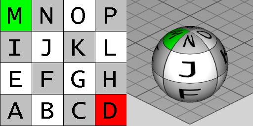

# IfcSphere

The _IfcSphere_ is a Construction Solid Geometry (CSG) 3D primitive. It is a solid where all points at the surface have the same distance from the center point. The inherited _Position_ attribute defines the _IfcAxisPlacement3D_ and provides:

* _SELF\IfcCsgPrimitive3D.Position_: The location and orientation of the axis system for the primitive.
* _SELF\IfcCsgPrimitive3D.Position.Location_: The center of the sphere.
* _SELF\IfcCsgPrimitive3D.Position.Position[3]:_ The z axis points at its positive direction towards the north pole, and by its negative directions towards the south pole.

Figure 1 &mdash; Sphere geometry

> EXAMPLE  Figure 1 illustrates geometric parameters of the sphere. The sphere is positioned within its own placement coordinate system relative to the object coordinate system. The origin is the center of the sphere.

{ .extDef}
> NOTE  Definition according to ISO/CD 10303-42:1992
> A sphere is a CSG primitive with a spherical shape defined by a centre and a radius.

> NOTE  Entity adapted from **sphere** defined in ISO 10303-42.

> HISTORY  New entity in IFC2x3.

{ .use-head}
Texture Use Definition

Textures are aligned facing upright with origin at the back (+Y direction) revolving counter-clockwise. Textures are stretched or repeated to the extent of the circumference at the equator according to RepeatS and RepeatT.

Figure 2 illustrates default texture mapping with a clamped texture (RepeatS=False and RepeatT=False). The image on the left shows the texture where the S axis points to the right and the T axis points up. The image on the right shows the texture applied to the geometry where the X axis points back to the right, the Y axis points back to the left, and the Z axis points up.

{ .gridtable}

Figure 2 &mdash; Sphere textures

|Side|Normal|Origin X|Origin Y|Origin Z|S Axis|T Axis|
|--- |--- |--- |--- |--- |--- |--- |
|Side|+Y|0|+Radius|0|(-X, then curving counter-clockwise)|(+Z, then curving towards top)|

Table 3 &mdash; Texture parameters

## Attributes

### Radius
The radius of the sphere.
