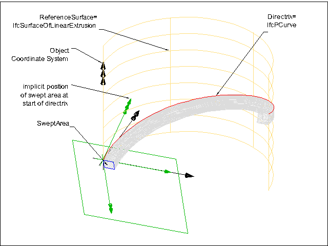
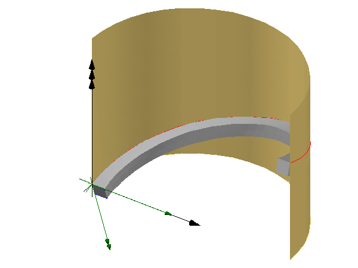

# IfcSurfaceCurveSweptAreaSolid

The _IfcSurfaceCurveSweptAreaSolid_ is the result of sweeping an area along a directrix that lies on a reference surface. The swept area is provided by a subtype of _IfcProfileDef_. The profile is placed by an implicit cartesian transformation operator at the start point of the sweep, where the profile normal agrees to the tangent of the directrix at this point, and the profile''s x-axis agrees to the surface normal. At any point along the directrix, the swept profile origin lies on the directrix, the profile''s normal points towards the tangent of the directrix, and the profile''s x-axis is identical to the surface normal at this point.
<!-- end of short definition -->

> NOTE The profile area''s normal has to be identical to the tangent of the directrix at any given point. In case of a directrix having a linear segment at the start point, the segment has to be perpendicular to the profile at start.

The _Directrix_ and the _ReferenceSurface_ are positioned within the object coordinate system. The start of the sweeping operation is at the _StartParam_, the parameter value is provided based on the curve parameterization. If no _StartParam_ is provided the start defaults to the begin of the directrix. The end of the sweeping operation is at the _EndParam_, the parameter value is provided based on the curve parameterization. If no _EndParam_ is provided the end defaults to the end of the directrix. The geometric shape of the solid is not dependent upon the curve parameterization; the volume depends upon the area swept and the length of the _Directrix_.

> NOTE The _StartParam_ and the _EndParam_ are not normalized by default, they depend upon the parameterization of the curve. However using the _IfcReparametrisedCompositeCurveSegment_ within an _IfcCompositeCurve_ as the directrix allows to explicitly reparameterize the underlying sweeping curve. In case of a closed curve, such as _IfcCircle_ or _IfcEllipse_, as the directrix, _StartParam_ and the _EndParam_ shall not exceed the parametric range, they shall not be > 360°.

> EXAMPLE The reference surface is any surface (plane, cylindric, composite) situated in 3D space and positioned in the object coordinate system. In most cases, it is a plane or a surface of extrusion. The directrix lies on the surface, in case of a plane it might be defined as a polyline or composite curve, in case of a cylindrical or other non-planer reference surface it might often be defined as a p-curve on this reference surface.

At any point of the directrix, a plane can be constructed. The origin of the position coordinate system of the implicit plane lies at the directrix. The Axis3 (the z-axis, or normal) of the position coordinate system is identical to the tangent of the directrix at this point, the Axis1 (the x axis, or u) of the position coordinate system is identical to the normal of the reference surface at this point. The Axis2 (the y axis, or v) is constructed.

The resulting body of the swept solid is not repositioned if the inherited _Position_ attribute is omitted. Otherwise the coordinate system established by the _Position_ attribute is used to reposition the body relative to the object coordinate system.

Figure 1 — Surface curve wept area solid parameter

> EXAMPLE Figure 1 illustrates an example using a cylindrical reference surface and a p-curve for sweeping a rectangle. The <em>Position</em> is not provided and therefore it does not reposition the resulting swept solid. Figure 2 shows the expected result.

> NOTE The start of the directrix lies at the origin of the object coordinate system, as shown in the illustration, only by coincidence. The start of the directrix and thereby the start of the sweeping operation might be at any point within the object coordinate system and only depends on the position of the directrix.

Figure 2 — Surface curve wept area solid results

{ .extDef}
> NOTE Definition according to ISO/CD 10303-42:1992
> A surface curve swept area solid is a type of swept area solid which is the result of sweeping a face along a _Directrix_ lying on a _ReferenceSurface_. The orientation of the _SweptArea_ is related to the direction of the surface normal.
>
> The _SweptArea_ is required to be a curve bounded surface lying in the plane z = 0 and this is swept along the _Directrix_ in such a way that the origin of the local coordinate system used to define the _SweptArea_ is on the _Directrix_ and the local x-axis is in the direction of the normal to the _ReferenceSurface_ at the current point. The resulting solid has the property that the cross section of the surface by the normal plane to the _Directrix_ at any point is a copy of the _SweptArea_.
>
> The orientation of the _SweptArea_ as it sweeps along the _Directrix_ is precisely defined by a Cartesian Transformation Operator 3D with attributes: > \* Local origin as point (0., 0., 0),
> \* Axis 1 as the normal N to the reference surface at the point of the directrix with parameter u.
> \* Axis 3 as the direction of the tangent vector t at the point of the directrix with parameter u.  The remaining attributes are defaulted to define a corresponding transformation matrix T(u), which varies with the directrix parameter u.

> NOTE Entity adapted from \*\*surface_curve_swept_area_solid\*\* defined in ISO 10303-42.

> HISTORY New entity in IFC2x2.

**Informal Propositions**

1. The _SweptArea_ shall lie in the implicit plane z = 0.
2. The _Directrix_ shall lie on the _ReferenceSurface_.

## Attributes

### ReferenceSurface

