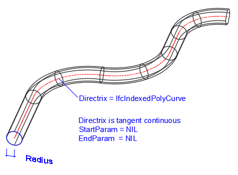

An _IfcSweptDiskSolid_ represents the 3D shape by a sweeping representation scheme allowing a two dimensional circularly bounded plane to sweep along a three dimensional _Directrix_ through space.

<!-- end of short definition -->

The _StartParam_ and _EndParam_ parameter are optional, if not provided they default to the start and end of the _Directrix_. Only if the _Directrix_ is given by a bounded or by a closed curve, it is permissible to omit the values of _StartParam_ and _EndParam_.

If the transitions between consecutive segments of the _Directrix_ are not tangent continuous, the resulting solid is created by a miter at half angle between the two segments. Informal proposition restricts the permissible angle between two non-tangent continuous segments.

Figure 1 illustrates an example.

* _Directrix_ given as _IfcIndexedPolyCurve_, having linear and circular arc segments, that are tangent continuous between each segments
* _Directrix_ being a bounded and open curve
* No _StartParam_ and _EndParam_ are provided, start and end default to start and end of the bounded curve of the _Directrix_

> NOTE Although the example shows a _Directrix_ as a poly curve on a planar reference surface, the definition of _IfcSweptDiskSolid_ is not restricted to be based on planer curves. However view definitions or implementer agreements may provide restrictions.

> NOTE The geometric item _IfcIndexedPolyCurve_ provides a more compact representation compared with _IfcCompositeCurve_ as is therefore the preferred curve representation for the _Directrix_.

{ .extDef}
> NOTE Definition according to ISO/CD 10303-42:1992
> A swept disk solid is the solid produced by sweeping a circular disk along a three dimensional curve. During the sweeping operation the normal to the plane of the circular disk is in the direction of the tangent to the directrix curve and the center of the disk lies on the directrix. The circular disk may, optionally, have a central hole, in this case the resulting solid has a through hole, or, an internal void when the directrix forms a close curve.

> NOTE Entity adapted from **swept_disk_solid** defined in ISO 10303-42.

> HISTORY New entity in IFC2x2.

{ .change-ifc2x4}
> IFC4 CHANGE The attribute _StartParam_ and _EndParam_ have been made optional.

**Informal Propositions**

1. If the _Directrix_ curve definition is not tangent continuous, the transition between the segments has to be within an acceptable limit of tangent discontinuity. Very sharp edges may result in nearly impossible miter. Implementer agreements may define acceptable limits for tangent discontinuity.
2. The segments of the _Directrix_ shall be long enough to apply the _Radius_. In case of an arc segment forming part of the _Directrix_, its radius shall be greater then the disk _Radius_
3. The _Directrix_ shall not be based on an intersecting curve.

## Attributes

### Directrix
The curve used to define the sweeping operation. The solid is generated by sweeping a circular disk along the _Directrix_.

### Radius
The _Radius_ of the circular disk to be swept along the _directrix_. Denotes the outer radius, if an _InnerRadius_ is applied.

### InnerRadius
This attribute is optional, if present it defines the radius of a circular hole in the centre of the disk.

### StartParam
The parameter value on the _Directrix_ at which the sweeping operation commences. If no value is provided the start of the sweeping operation is at the start of the _Directrix_.

{ .change-ifc2x4}
> IFC4 CHANGE The attribute has been changed to OPTIONAL with upward compatibility for file-based exchange.

### EndParam
The parameter value on the _Directrix_ at which the sweeping operation ends. If no value is provided the end of the sweeping operation is at the end of the _Directrix_.

{ .change-ifc2x4}
> IFC4 CHANGE The attribute has been changed to OPTIONAL with upward compatibility for file-based exchange.

## Formal Propositions

### DirectrixDim
The _Directrix_ shall be a curve in three dimensional space.

### InnerRadiusSize
If _InnerRadius_ exists then _Radius_ denoting the outer radius shall be greater than _InnerRadius_.

### DirectrixBounded
If the values for _StartParam_ or _EndParam_ are omitted, then the _Directrix_ has to be a bounded or closed curve.

{ .change-ifc2x4}
> IFC4 CHANGE New WHERE rule.
