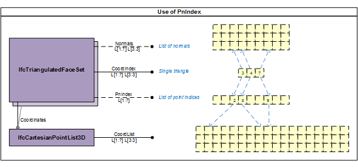
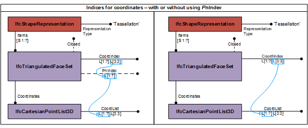
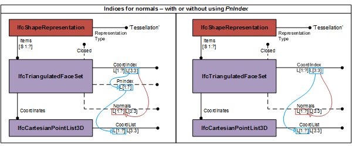
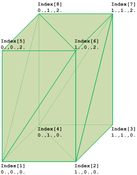

# IfcTriangulatedFaceSet

The _IfcTriangulatedFaceSet_ is a tessellated face set with all faces being bound by triangles. The faces are constructed by implicit polylines defined by three Cartesian points. Depending on the value of the inherited attribute _Closed_ the instance of _IfcTriangulatedFaceSet_ represents:

* if TRUE, a boundary represention (or B-rep);
* if FALSE, a face based surface representation.

The coordinates of each point are provided by a one-based index into an ordered list of Cartesian points provided by the two-dimensional list _CoordIndex_, where

* the first dimension of the two-dimensional list addresses the list of triangular faces;
* the second dimension of the two-dimensional list provides exactly three indices. Each index points to a Cartesian point being a vertex of the triangle.

Depending on the provision of _PnIndex_ the indices point either directly into the _IfcCartesianPointList3D_ referenced by _Coordinates_ defined at the supertype _IfcTessellatedFaceSet_, or they point into the _PnIndex_ where the integer values at that position provides the location of the coordinate values within the _IfcCartesianPointList3D_. See Figure 1 for the handling of point index.



See Figure 2 for using the _IfcTriangulatedFaceSet_ without (as default) and with using the _PnIndex_.



Optionally normals can be provided. Only normals per vector are supported allowing for visually curved triangles when the three normals of the corresponding three vertices of a triangle are not co-linear to the normal of the triangular face. If they are identical, normals shall be omited.

> NOTE  In case of a body representation having triangular faces with curvature, different normals for all three vertices in context of this triangles are exported, describing the curvature for smooth visualisation. In case of triangular faces with no curvature, the three vertex-based normals are identical and could always be computed from the face. Therefore vertices should only be exported to support smooth visualisation by curvature of triangles. In case of faceted representation no vertices should be exported.

Normals are provided by the two-dimensional list _Normals_, where

* the first dimension of the two-dimensional list addresses the corresponding list of vertex indices of the triangular faces;
* the second dimension of the two-dimensional list provides exactly three real values to determine the direction of the normal at this vertex of the triangle.

The indices in the _CoordIndex_ point into the list of _Normals_. The indices of _CoordIndex_ are applied to both points, either directly directly, or via the _PnIndex_ and normals. See Figure 3 for handling of normals.



> NOTE  Using corresponding lists of points and normals allows to use only a single list of indices into both at the expense of having non-unique collections of vertices.

Figure 4 shows the use of _IfcTriangulatedFaceSet_ without annotation. The diagram of the _IfcTriangulatedFaceSet_ represents the indices and the ordered list into which the indices point. The index starts with 1 (indexed as 1 to N), if the greatest index in _CoordIndex_ in N, then the _IfcCartesianPointList_ shall have N lists of 3:3 coordinates.



Figure 4 &mdash; Triangulated face set geometry

Figure 4 shows an <em>IfcTriangulatedFaceSet</em> represented by:

```
CoordIndex:
((1,6,5), (1,2,6), (6,2,7), (7,2,3), (7,8,6), (6,8,5), (5,8,1), (1,8,4), (4,2,1), (2,4,3), (4,8,7), (7,3,4))

IfcCartesianPointList3D:
((0.,0.,0.), (1.,0.,0.), (1.,1.,0.), (0.,1.,0.), (0.,0.,2.), (1.,0.,2.), (1.,1.,2.), (0.,1.,2.))
```

> NOTE  The definition of _IfcTriangulatedFaceSet_ is based on the **indexedFaceSet** and **indexedTriangleSet** defined in ISO/IEC 19775-1. The use of _PnIndex_ has been adopted from **triangulated_surface_set** defined in ISO-10303-42.

> HISTORY  New entity in IFC4.

{ .spec-head}
Informal Propositions:

1. If _Closed_ = TRUE, the same topological constraints as imposed by an faceted boundary representation shall be safisfied. In particular:
    * each face shall be unique;
    * each edge shall be used by exactly two boundaries of faces;
    * the topological normal at each point on the boundary of the triangulated face set shall point away from the mater ial of the solid.

## Attributes

### Normals
An ordered list of three directions for normals. It is a two-dimensional list of directions provided by three parameter
values.
* The first dimension corresponds to the vertex indices of the _Coordindex_
* The second dimension has exactly three values, [1] the x-direction, [2] the y-direction and [3] the z-directions

### CoordIndex
Two-dimensional list for the indexed-based triangles, where
* The first dimension represents the triangles (from 1 to N)
* The second dimension has exactly three values representing the indices to three vertex points (from 1 to 3).

> NOTE  The coordinates of the vertices are provided by the indexed list of _SELF\IfcTessellatedFaceSet.Coordinates.CoordList_.

### PnIndex
The list of integers defining the locations in the _IfcCartesianPointList3D_ to obtain the point coordinates for the indices withint the _CoordIndex_. If the _PnIndex_ is not provided the indices point directly into the _IfcCartesianPointList3D_.

### NumberOfTriangles
Derived number of triangles used for this triangulation.
