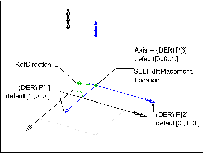

# IfcAxis2Placement3D

The _IfcAxis2Placement3D_ provides location and orientations to place items in a three-dimensional space. The attribute _Axis_ defines the Z direction, _RefDirection_ the X direction. The Y direction is derived.
<!-- end of short definition -->

> NOTE The _RefDirection_ does not have to be orthogonal to _Axis_.

If the attribute values for _Axis_ and _RefDirection_ are not given, the placement defaults to P[1] (x-axis) as [1.,0.,0.], P[2] (y-axis) as [0.,1.,0.] and P[3] (z-axis) as [0.,0.,1.].

Figure 1 — Axis2 placement 3D

Figure 1 illustrates the definition of the <em>IfcAxis2Placement3D</em> within the three-dimensional coordinate system.

{ .extDef}
> NOTE Definition according to ISO/CD 10303-42:1992
> The location and orientation in three dimensional space of three mutually perpendicular axes. An axis2_placement_3D is defined in terms of a point (inherited from placement supertype) and two (ideally orthogonal) axes. It can be used to locate and orientate a non axi-symmetric object in space and to define a placement coordinate system. The entity includes a point which forms the origin of the placement coordinate system. Two direction vectors are required to complete the definition of the placement coordinate system. The axis is the placement Z axis direction and the ref_direction is an approximation to the placement X axis direction.

> NOTE Entity adapted from **axis2_placement_3d** defined in ISO10303-42.

> HISTORY New entity in IFC1.5.

## Attributes

### Axis
The exact direction of the local Z Axis.

### RefDirection
The direction used to determine the direction of the local X Axis. If necessary an adjustment is made to maintain orthogonality to the Axis direction. If Axis and/or RefDirection is omitted, these directions are taken from the geometric coordinate system.

### P
The normalized directions of the placement X Axis (P[1]) and the placement Y Axis (P[2]) and the placement Z Axis (P[3]).

## Formal Propositions

### LocationIs3D
The dimensionality of the placement location shall be 3.

### AxisIs3D
The Axis when given should only reference a three-dimensional IfcDirection.

### RefDirIs3D
The RefDirection when given should only reference a three-dimensional IfcDirection.

### AxisToRefDirPosition
The _Axis_ and _RefDirection_ shall not be parallel or anti-parallel.

### AxisAndRefDirProvision
Either both, _Axis_ and _RefDirection_ are not given and therefore defaulted, or both shall be given.

### LocationIsCP

