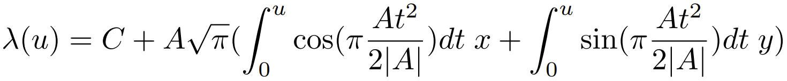
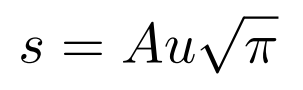
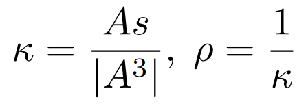

# IfcClothoid

A clothoid is a planar curve in the form of a spiral. This curve has the property that the curvature varies linearly with the arc length.
{ .extDef}
> NOTE Definition according to ISO 10303-42:2003
>
> Interpretation of the data shall be as follows:
>>
>> ```
>> C = SELF\IfcSpiral.Position.Location
>> x = SELF\IfcSpiral.Position.P[1]
>> y = SELF\IfcSpiral.Position.P[2]
>> A = ClothoidConstant
>> ```
> and the clothoid is parameterized as:
>
>>
>>> 

> and the parametric range is: -&infin; < _u_ < &infin;
>>
> The arc length _s_ of the curve, from the point C, is given by the formula:
>>
>>> 
>>
> The curvature _κ_ and radius of the curvature _ρ_, at any point of the curve, are related to the arc length _s_ by the formulae:
>>
>>> 
>>
{ .extDef}
> NOTE Formulae adapted from **clothoid** defined in ISO 10303-42

## Attributes

### ClothoidConstant
The constant which defines the relationship between curvature and arc length for the curve.
