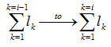

# IfcCompositeCurveOnSurface

The _IfcCompositeCurveOnSurface_ is a collection of segments, based on p-curves. i.e. a curve which lies on the basis of a surface and is defined in the parameter space of that surface. The p-curve segment is a special type of a composite curve segment and shall only be used to bound a surface.
<!-- end of short definition -->

{ .extDef}
> NOTE Definition according to ISO/CD 10303-42:1992
> A composite curve on surface is a collection of segments which are curves on a surface. Each segment shall lie on the basis surface.
>
> There shall be at least positional continuity between adjacent segments. The parameterization of the composite curve is obtained from the accumulation of the parametric ranges of the segments. The first segment is parameterized from _0_ to _l~1~_, and, for _i ≥ 2_, the _i^th^_ segment is parameterized from
>
>> 
> where _l~k~_ is the parametric length (that is, the difference between maximum and minimum parameter values) of the _k^th^_ curve segment.
>

{ .note}
> Entity adapted from **composite_curve_on_surface** defined in ISO 10303-42.

> HISTORY New entity in IFC4.

## Attributes

### BasisSurface
The surface on which the composite curve is defined.

## Formal Propositions

### SameSurface
The _BasisSurface_ shall contain at least one surface (and exactly one surface). This ensures that all segments reference curves on the same surface.
