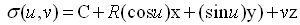
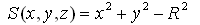
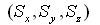
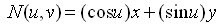

# IfcCylindricalSurface

The cylindrical surface is a surface unbounded in the direction of _z_. Bounded cylindrical surfaces are defined by using a subtype of _IfcBoundedSurface_ with _BasisSurface_ being a cylindrical surface.

> NOTE 1  A bounded cylindrical surface can be defined by an _IfcRectangularTrimmedSurface_ with _BasisSurface_ being the cylindrical surface and _U1_ = 0&deg;, _U2_ = 360&deg; and _V1_ = lower bound in **z**, _V2_ = upper bound in **z** (if the plane angle measure is degree). A bounded cylindrical arc surface is provided with |U1 - U2| < 360&deg; (assuming the Usense and Vsense agree to the sense of the basis surface).

> NOTE 2  A non-rectangular bounded cylindrical surface, e.g. the surface of a round wall underneath a sloped roof, cab be defined by an _IfcCurveBoundedSurface_ with _IfcBoundaryCurve_'s, being a collection of p-curve segments. A p-curve is curve which lies on the basis of a surface and is defined in the parameter space of that surface.

The inherited attributes are interpreted as

* _SELF\IfcElementarySurface.Position_ defines the location and orientation of the cylindrical surface.
* _SELF\IfcElementarySurface.Position.Location_ defines a point on the axis of the cylindrical surface.
* _SELF\IfcElementarySurface.Position.P[3]_ defines the direction of the axis of the cylindrical surface.

{ .extDef}
> NOTE Definition according to ISO/CD 10303-42:1992
> A cylindrical surface is a surface at a constant distance (the radius) from a straight line. A cylindrical surface is defined by its radius and its orientation and location. The data is to be interpreted as follows:
>
>> <pre style=" font-size:x-small;">
C = Position.Location
x = Position.P[1]
y = Position.P[2]
z = Position.P[3]
<em>R</em> = Radius
</pre>
> and the surface is parameterized as:
>
>> 
> where the parametric range is -&infin; < _u,v_ < &infin; .
>
> In the above parameterization the length unit for the unit vectors **z** is equal to that of the radius **_R_**. In the placement coordinate system defined above, the surface is represented by the equation _S_ = 0, where
>
>> 
> The positive direction of the normal to the surface at any point on the surface is given by
>
>> , or as unit normal by
>>
>> 
>>
> The direction of the normal is away from the axis of the cylinder.
>

> NOTE  Entity adapted from **cylindrical_surface** defined in ISO 10303-42.

> HISTORY  New entity in IFC4.

## Attributes

### Radius
The radius of the cylindrical surface.
