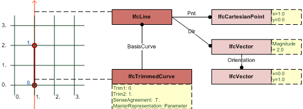

# IfcLine

The _IfcLine_ is an unbounded line parameterized by an _IfcCartesianPoint_ and an _IfcVector_. The magnitude of the _IfcVector_ affects the parameterization of the line, but it does not bound the line.
<!-- end of short definition -->

> NOTE A line segment is defined using either the _IfcPolyline_ with two _Points_, or the _IfcTrimmedCurve_ with _BasisCurve_ being an _IfcLine_.

> EXAMPLE Figure 1 illustrates an unbounded _IfcLine_ and a bounded _IfcTrimmedCurve_. A bounded line starting at 0.,0. and ending at 0.,2. can be defined by:

> 1. _IfcLine_ with _IfcVector_._Magnitude_: 2.0 AND _IfcTrimmedCurve_ with _Trim1_: 0. and _Trim2_: 1. (and trimming preference being parameter);
> 2. _IfcLine_ with _IfcVector_._Magnitude_: 1.0 AND _IfcTrimmedCurve_ with _Trim1_: 0. and _Trim2_: 2. (and trimming preference being parameter);
> 3. _IfcLine_ AND _IfcTrimmedCurve_ with _Trim1_::_IfcCartesianPoint_ [0.,0.] and _Trim2_::_IfcCartesianPoint_ [0.,2.] (and trimming preference being Cartesian) - the _IfcVector_._Magnitude_ has no effect;
> 4. _IfcPolyline_ with _Points[1]_ being 0.,0. and _Points[2]_ being 0.,2.
> 5. _IfcIndexedPolyCurve_ with two indices, pointing into a point list providing the coordinates (0.,0.) and (0.,2.).

{ .extDef}
> NOTE Definition according to ISO/CD 10303-42:1992
> A line is an unbounded curve with constant tangent direction. A line is defined by a point and a direction. The positive direction of the line is in the direction of the dir vector. The curve is parameterized as follows:
>> **P** = Pnt
>> **V** = Dir
>> λ(_u_) = **P** + _u_**V**
> and the parametric range is: -∞ < _u_ < ∞

{ .extDef}
> NOTE Entity adapted from **line** defined in ISO 10303-42

> HISTORY New entity in IFC1.0

## Attributes

### Pnt
The location of the _IfcLine_.

### Dir
The direction of the _IfcLine_, the magnitude and units of _Dir_ affect the parameterization of the line.

## Formal Propositions

### SameDim
The dimensionality of the _Pnt_, provided by _IfcCartesianPoint_, shall be the same as the dimensionality of the _Dir_, provided by _IfcVector_.
