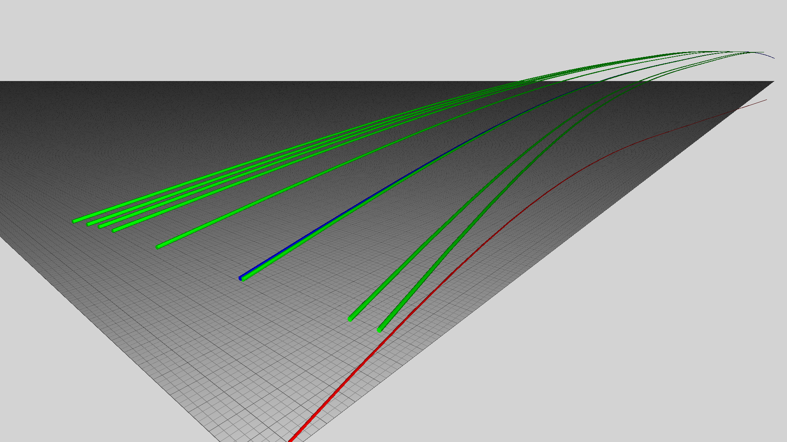
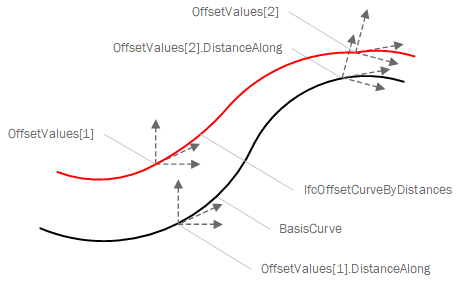

# IfcOffsetCurveByDistances

An _IfcOffsetCurveByDistances_ is a curve defined by a list of offsets along its _BasisCurve_. If only one offset is provided, it indicates a constant offset along the extents of the basis curve.<!-- end of definition -->

Figure 1 illustrates eight instances of _IfcOffsetCurveByDistances_ (in green) defined relative to an _IfcGradientCurve_ (in blue).

Figure 1 — Offset curve by distances

Figure 2 — Usage of OffsetValues

## Attributes

### OffsetValues
List of sequential points described relative to the basis curve. If the offsets do not span the full extent of the basis curve (e.g. if the list contains only one item), then the lateral and vertical offsets implicitly continue with the same value towards the head and tail of the basis curve.

### Tag
Optional identifier of the curve, which may be used to correlate points from a variable cross-section.
