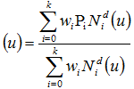

# IfcRationalBSplineCurveWithKnots

A rational B-spline curve with knots is a B-spline curve described in terms of control points and basic functions. It describes weights in addition to the control points defined at the supertype _IfcBSplineCurve_.<!-- end of definition -->

All weights shall be positive and the curve is given by:

where:

Variable | Definition
--- | ---
<em>k</em>+1 | number of control points
P<em>i</em> | control points
<em>wi</em> | weights
<em>d</em> | degree

> NOTE Entity adapted from **rational_b_spline_curve** in ISO 10303-42.

> HISTORY New entity in IFC4.

## Attributes

### WeightsData
The supplied values of the weights.

### Weights
The array of weights associated with the control points. This is derived from the weights data.

## Formal Propositions

### SameNumOfWeightsAndPoints
There shall be the same number of weights as control points.

### WeightsGreaterZero
All the weights shall have values greater than 0.0.
