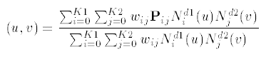

# IfcRationalBSplineSurfaceWithKnots

A rational B-spline surface with knots is a piecewise parametric rational surface described in terms of control points, and associated weight values.
<!-- end of short definition -->

The surface is to be interpreted as follows:

> <big>σ</big>

> NOTE Entity adapted from **rational_b_spline_surface** in ISO 10303-42.

> HISTORY New entity in IFC4.

## Attributes

### WeightsData
The weights associated with the control points in the rational case.

### Weights
Array (two-dimensional) of weight values constructed from the _WeightsData_.

## Formal Propositions

### CorrespondingWeightsDataLists
The array dimensions for the weights shall be consistent with the control points data.

### WeightValuesGreaterZero
The weight value associated with each control point shall be greater than zero.
