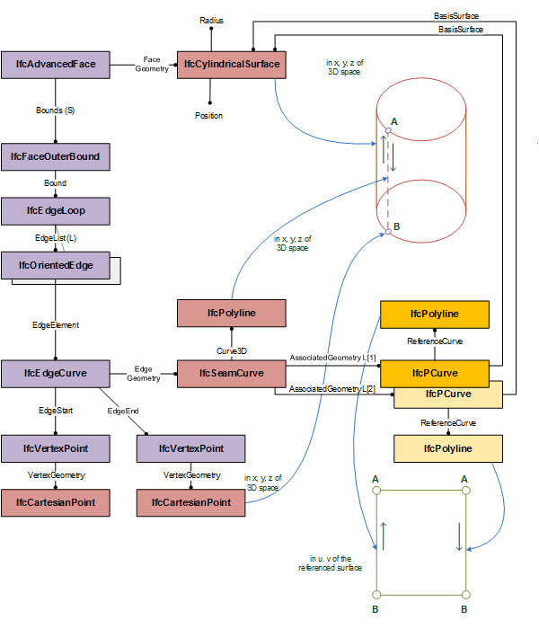

# IfcSeamCurve

An _IfcSeamCurve_ is a 3-dimensional curve that has additional representations provided by exactly two distinct pcurves describing the same curve at the two extreme ends of a closed parametric surface.
<!-- end of short definition -->

> NOTE&bbsp; The `seam' on a cylinder has representations as the lines u = 0 or u = 360 degrees in parameter space.

Figure 1 shows an instance diagram explaining the use of _IfcSeamCurve_ as a boundary curve of an _IfcCylindricalSurface_.

{ .extDef}
> NOTE Definition according to ISO/CD 10303-42:1992
> A seam curve is a type of surface curve, that is a curve on a closed parametric surface which has two distinct representations as constant parameter curves at the two extremes of the parameter range for the surface.

> NOTE Entity adapted from **surface_curve** defined in ISO 10303-42.

> HISTORY New entity in IFC4 Add2.

## Formal Propositions

### TwoPCurves
The intersection curve shall have precisely two associated geometry elements.

### SameSurface
The two associated geometries shall be related to the same surface.
