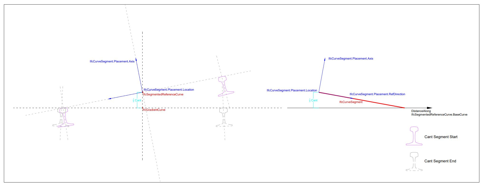

# IfcSegmentedReferenceCurve

The _IfcSegmentedReferenceCurve_ is a curve defined in the linear parameter space of its base curve that is set in the attribute _BaseCurve_. The base curve provides a basis for the positioning of the collection of _IfcCurveSegment_ occurrences. A deviating explicit position of a curve segment (_IfcCurveSegment_.Placement) from the axis of the base curve produces a superelevation i.e. depression or elevation from the axis of the base curve. The superelevation rate of change is directly proportionate to the curve segment parent curve curvature gradient equation (_IfcCurveSegment_._ParentCurve_) in the linear parameter space of the base curve. If no deviation in the position of the curve segment to the base curve axis is specified, the axes (Axis and RefDirection) directions of _IfcAxis2Placement_ are interpolated between the initial curve segment placement and the placement of the subsequent curve segment.

The parametrization of _IfcSegmentReferenceCurve_ is based on the parametrization of _BaseCurve_ and is not altered by the _Segments_.

Figure 1 shows a cross section of a _IfcSegmentedReferenceCurve_ usage for an alignmnent representation featuring cant

## Attributes

### BaseCurve
The basis curve providing a linear reference system for the segmented curve definition.

### EndPoint
An explicit end placement providing a location and orientation of the segmented reference curve termination point.
