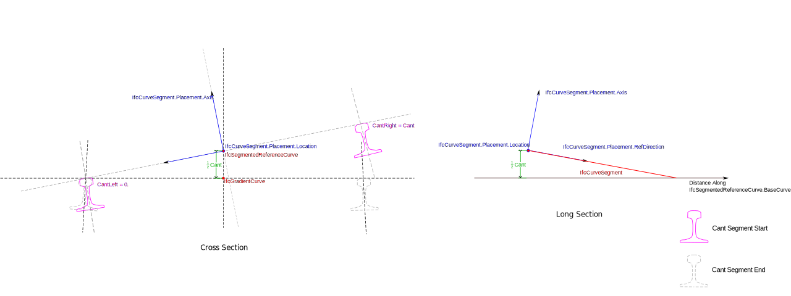
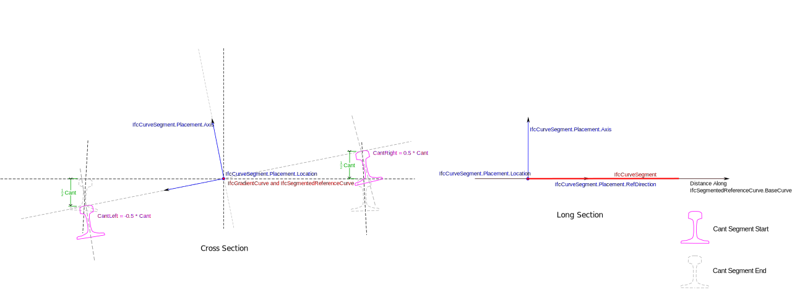

# IfcSegmentedReferenceCurve

The _IfcSegmentedReferenceCurve_ is a curve defined in the linear parameter space of its base curve that is set in the attribute _BaseCurve_. The base curve provides a basis for the positioning of the collection of _IfcCurveSegment_ occurrences. A deviating explicit position of a curve segment (_IfcCurveSegment.Placement_) from the axis of the basis curve produces a superelevation (i.e. depression or elevation from the axis of the base curve). The deviating elevation is defined by the _IfcCurveSegment.ParentCurve_ in the linear parameter space of the base curve. If no deviation in the position of the curve segment to the base curve axis is specified, the axes (_Axis_ and _RefDirection_) directions of _IfcAxis2Placement_ are interpolated between the initial curve segment placement and the placement of the subsequent curve segment.
<!-- end of short definition -->

The parameterization of _IfcSegmentedReferenceCurve_ is based on the parameterization of the _BaseCurve_ and is not altered by the _Segments_.

Figure 1 shows a cross section of a _IfcSegmentedReferenceCurve_ usage for an alignment representation featuring cant with rotation about the low rail and varying superelevation.

Figure 1 — use of a segmented reference curve on a cant segment based on a gradient curve.

Figure 2 shows a cross section of a _IfcSegmentedReferenceCurve_ usage for an alignment representation feature cant with rotation about the track centerline with no deviating position.

Figure 2 — use of a segmented reference curve on a cant segment based on a gradient curve with rotation about track centerline and no superelevation.

Informally, a _IfcSegmentedReferenceCurve_ is a curve defined in a “horizontal distance along base curve, deviating elevation” coordinate system. The _IfcCurveSegment.ParentCurve_ defines the change in cross slope between rail heads over the length of the segment. When the _IfcCurveSegment.Placement.Location_ differs from the _IfcCurveSegmentPlacement.Location_ of the next segment (or the _IfcSegmentedReferenceCurve.EndPoint_ for the last segment, if specified), the _IfcCurveSegment.ParentCurve_ also defines the deviating elevation. If the _IfcCurveSegment.Placement.Location_ is the same as for the start of the next segment, the deviating elevation along the length of the segment is constant.

The evaluation of a _IfcCurveSegment_ that is part of a _IfcSegmentedReferenceCurve_ is illustrated by the file in the Examples section below.

## Attributes

### BaseCurve
The basis curve providing a linear reference system for the segmented curve definition.

### EndPoint
An explicit end placement providing a location and orientation of the segmented reference curve termination point.
