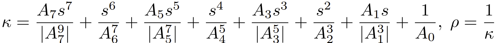
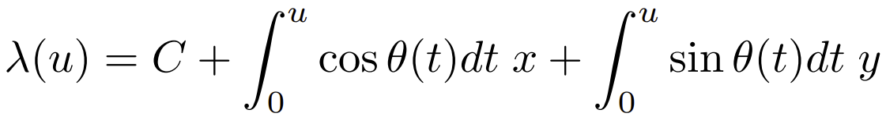
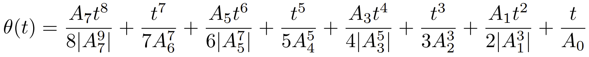

The _IfcSeventhOrderPolynomialSpiral_ is a specialization of _IfcSpiral_. The curvature _κ_ and radius of the curvature _ρ_, at any point of the curve, are related to the arc length _s_ by the seventh order formulae:

<!-- end of short definition -->

>>
>> 
>>
> Interpretation of the parameters:
>>
>>
>> C = SELF\IfcSpiral.Position.Location
>> x = SELF\IfcSpiral.Position.P[1]
>> y = SELF\IfcSpiral.Position.P[2]
>> A7 = SepticTerm
>> A6 = SexticTerm
>> A5 = QuinticTerm
>> A4 = QuarticTerm
>> A3 = CubicTerm
>> A2 = QuadraticTerm
>> A1 = LinearTerm
>> A0 = ContantTerm
>>
> and the seventh order polynomial spiral is parameterized as:
>>
>> 
>>
> where:
>>
>> 
>>
> and the parametric range is: -∞ < _u_ < ∞.

## Attributes

### SepticTerm
The constant that defines the septic term in the equation which defines the relation between curvature and arc length for the curve.

### SexticTerm
The constant that defines the sextic term in the equation which defines the relation between curvature and arc length for the curve.

### QuinticTerm
The constant that defines the quintic term in the equation which defines the relation between curvature and arc length for the curve.

### QuarticTerm
The constant that defines the quartic term in the equation which defines the relation between curvature and arc length for the curve.

### CubicTerm
The constant that defines the cubic term in the equation which defines the relation between curvature and arc length for the curve.

### QuadraticTerm
The constant that defines the quadratic term in the equation which defines the relation between curvature and arc length for the curve.

### LinearTerm
The constant that defines the linear term in the equation which defines the relation between curvature and arc length for the curve.

### ConstantTerm
The constant that defines the constant term in the equation which defines the relation between curvature and arc length for the curve.
