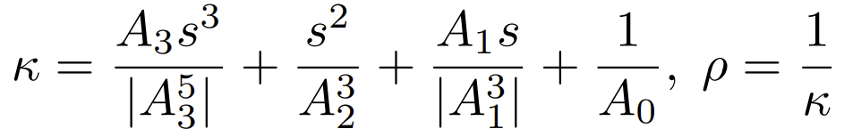
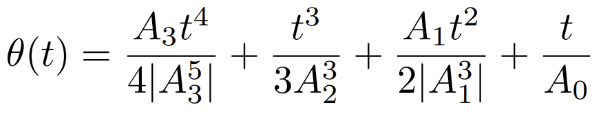

The _IfcThirdOrderPolynomialSpiral_ is a specialization of _IfcSpiral_. The curvature _κ_ and radius of the curvature _ρ_, at any point of the curve, are related to the arc length _s_ by the third order formulae:

<!-- end of short definition -->

>>
>> 
>>
> Interpretation of the parameters:
>>
>>
>> C = SELF\IfcSpiral.Position.Location
>> x = SELF\IfcSpiral.Position.P[1]
>> y = SELF\IfcSpiral.Position.P[2]
>> A3 = CubicTerm
>> A2 = QuadraticTerm
>> A1 = LinearTerm
>> A0 = ContantTerm
>>
> and the third order polynomial spiral is parameterized as:
>>
>> 
>>
> where:
>>
>> 
>>
> and the parametric range is: -∞ < _u_ < ∞.

## Attributes

### CubicTerm
The constant that defines the cubic term in the equation which defines the relation between curvature and arc length for the curve.

### QuadraticTerm
The constant that defines the quadratic term in the equation which defines the relation between curvature and arc length for the curve.

### LinearTerm
The constant that defines the linear term in the equation which defines the relation between curvature and arc length for the curve.

### ConstantTerm
The constant that defines the constant term in the equation which defines the relation between curvature and arc length for the curve.
