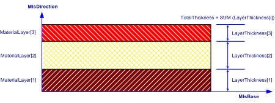

# IfcMaterialLayerSet

The _IfcMaterialLayerSet_ is a designation by which materials of an element constructed of a number of material layers is known and through which the relative positioning of individual layers can be expressed.<!-- end of definition -->

The Material Layer Set Base (MlsBase) describes the imaginary axis along which the material layers are positioned.

* In case of assigning the _IfcMaterialLayerSet_ directly to an element or element type, the individual layers are stacked according to their position within the list of _MaterialLayers_ without providing information on how to spatially relate the material layer information to the shape representation of the element or element type.
* In case of assigning the _IfcMaterialLayerSet_ through an _IfcMaterialLayerSetUsage_ to an element, the MlsBase is positioned along the reference axis or reference plane of the element. An offset from the reference axis or plane to MlsBase is supported by _IfcMaterialLayerSetUsage_ which combines layers and an offset. Offsets from element edges are supported by the subtype _IfcMaterialLayerWithOffsets_. The positive _LayerSetDirection_ (MlsDirection) describes the direction by which the individual material layers are stacked. The _IfcMaterialLayer_'s are stacked with no gap. Gaps within a material layer set are expressed as layers by themselves.

> EXAMPLE A cavity brick wall would be modeled as _IfcMaterialLayerSet_ consisting of three _IfcMaterialLayer_'s: brick, air cavity and brick. The air gap is identified by the _IsVentilated_ flag at _IfcMaterialLayer_.

> HISTORY  New entity in IFC1.0

{ .change-ifc2x4}
> IFC4 CHANGE  Subtyped from _IfcMaterialDefinition_, the attribute _Description_ has been added at the end of attribute list.

{ .use-head}
Attribute use definition

As shown in Figure 1, each _IfcMaterialLayerSet_ implicitly defines a material layer set base line (MlsBase), to which the start of the first _IfcMaterialLayer_ is aligned. The total thickness of a layer set is calculated from the individual layer thicknesses, the first layer starting from the MlsBase and following layers being placed on top of the previous (no gaps or overlaps).

## Attributes

### MaterialLayers
Identification of the _IfcMaterialLayer_’s from which the _IfcMaterialLayerSet_ is composed.

### LayerSetName
The name by which the _IfcMaterialLayerSet_ is known.

### Description
Definition of the _IfcMaterialLayerSet_ in descriptive terms.
{ .change-ifc2x4}
> IFC4 CHANGE  The attribute has been added at the end of attribute list.

### TotalThickness
Total thickness of the material layer set is derived from the function _IfcMlsTotalThickness._
