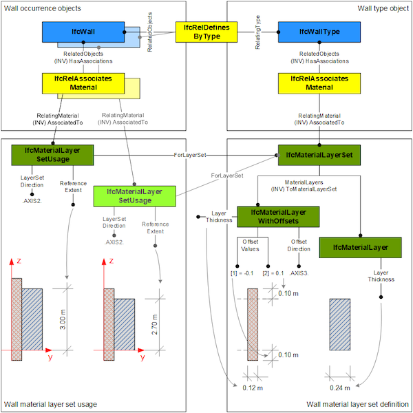

# IfcMaterialLayerWithOffsets

_IfcMaterialLayerWithOffsets_ is a specialization of _IfcMaterialLayer_ enabling definition of offset values along edges (within the material layer set usage in parent layer set).

It defines the assignment of two offset values for a material layer in its intended use within a material layer set. Offsets are applied to the edges of layered elements (that is, in directions perpendicular to the layer set direction). Offsets shall not be used in layer set direction, that is, for modelling gaps (or overlaps) between layers; gaps shall be modeled as layers with appropriate material assignment for the void.

> EXAMPLE  At the top of a standard wall, with shape representation 'SweptSolid', offset of a given layer can be specified in the direction of the extrusion (positive Z axis), applied at the start or end (extruded from bottom to top), and with a positive (extending above extrusion) or negative (ending below extrusion).
>
> Take a standard wall with the outer material layer for the external isolation extending above extrusion by 100mm, but starting at the same base height. In this case the following values are set: > * _OffsetDirection_ = .AXIS3.
> * _OffsetValues[1]_ = 0.0
> * _OffsetValues[2]_ = 100.0 (default unit assumed to be mm)

> NOTE  The 'Body' shape representation of an _IfcWall_ or an _IfcWallStandardCase_ may have multiple _Items_ each being an _IfcExtrudedAreaSolid_ corresponding to the _IfcMaterialLayer_ and _IfcMaterialLayerWithOffsets_.
>> HISTORY  New entity in IFC4.
> { .spec-head}
Informal Propositions:
>
> 1. The _OffsetDirection_ shall not be identical to the _LayerSetDirection_ of the corresponding _IfcMaterialLayerSetUsage_.
> 2. The attribute ReferenceExtent shall be asserted at the corresponding _IfcMaterialLayerSetUsage_.

{ .use-head}
Attribute use definition
>
> The _OffsetValues_ and _OffsetDirection_ correspond to the definitions _ReferenceExtent_ and _LayerSetDirection_ at the _IfcMaterialLayerSetUsage_. Figure 1 shows an example of applying the _OffsetValues_ to the material layers of a standard wall.
>
> 

## Attributes

### OffsetDirection
Orientation of the offset; shall be perpendicular to the parent layer set direction.

### OffsetValues
The numerical value of layer offset, in the direction of the axis assigned by the attribute _OffsetDirection_. The _OffsetValues[1]_ identifies the offset from the lower position along the axis direction (normally the start of the standard extrusion), the _OffsetValues[2]_ identifies the offset from the upper position along the axis direction (normally the end of the standard extrusion).
