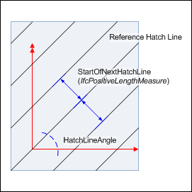
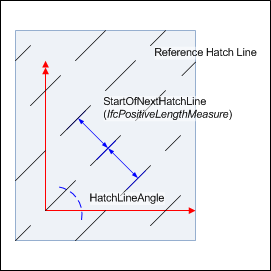
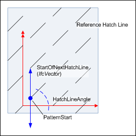
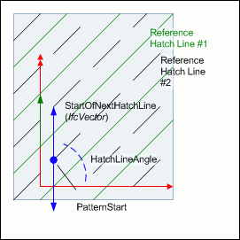

# IfcFillAreaStyleHatching

The _IfcFillAreaStyleHatching_ is used to define simple, vector-based hatching patterns, based on styled straight lines. The curve font, color and thickness is given by the _HatchLineAppearance_, the angle by the _HatchLineAngle_ and the distance to the next hatch line by _StartOfNextHatchLine_, being either an offset distance or a vector.<!-- end of definition -->

{ .extDef}
> NOTE  Definition according to ISO 10303-46:
> The fill area style hatching defines a styled pattern of curves for hatching an annotation fill area or a surface.

> NOTE  If the hatch pattern involves two (potentially crossing) rows of hatch lines, then two instances of _IfcFillAreaStyleHatching_ should be assigned to the _IfcFillAreaStyle_. Both share the same (virtual) point of origin of the hatching that is used by the reference hatch line (or the _PointOfReferenceHatchLine_ if there is an offset).

For better control of the hatching appearance, when using hatch lines with other fonts then continuous, the _PatternStart_ allows to offset the start of the curve font pattern along the reference hatch line (if not given, the _PatternStart_ is at zero distance from the virtual point of origin). If the reference hatch line does not go through the origin (of the virtual hatching coordinate system), it can be offset by using the _PatternStart_ .

> NOTE  The coordinates of the _PatternStart_ are given relative to the origin of the object coordinate of _IfcAnnotationFillArea_, or if present, the _FillAreaTarget_ attribute of _IfcAnnotationFillArea_. The measure values are given in global drawing length units, representing a model hatching, and can be translated into drawing units by the _TargetScale_ for a scale depended _IfcGeometricRepresentationSubContext_, if provided.

{ .deprecated}
> DEPRECATION  The use of _PointOfReferenceHatchLine_ is deprecated.

Figure 1 — Example 1

Figure 1 shows simple hatching given by using a curve font "continuous" at <em>HatchLineAppearance</em>.

The distance of hatch lines is given by a positive length measure. The angle (here 45' if measures in degree) is provided by <em>HatchLineAngle</em>.

The <em>PatternStart</em> is set to NIL ($) in this example.

Figure 2 — Example 2

Figure 2 shows hatching from example 1 with using a different curve font at <em>HatchLineAppearance</em>.

The distance of hatch lines is given by a positive length measure, therefore the font pattern start is at a point at the next hatch line given by a vector being perpendicular to the point of origin at the reference hatch line.

The <em>PatternStart</em> is set to NIL ($) in this example.

Figure 3 — Example 3

Figure 3 uses hatching from example 2 with a vector to determine the pattern start of the next hatch lines.

The pattern start is the beginning of the first visual curve font pattern segment at <em>IfcCurveStyleFont.PatternList</em>.

The <em>PatternStart</em> is set to NIL ($) in this example.

Figure 4 — Example 4

Figure 4 uses hatching from example 3 where the pattern start is offset from the point of origin at the reference hatch line. That is, the first visible curve font pattern segment now does not start at the point of origin at the reference hatch line.

Figure 6 — Example 5

This example shows use of <em>IfcFillAreaStyleHatching</em> attributes for two <em>IfcFillAreaStyleHatching</em>'s within one <em>IfcFillAreaStyle</em>.

Note that the <em>PatternStart</em> now displaces both the reference hatch line from the point of origin and the start of the curve pattern. This can be used in cases when more than one <em>IfcFillAreaStyleHatching</em> is used in an <em>IfcFillAreaStyle</em> in order to place rows of hatch lines with an offset from each other.

> NOTE  Entity adapted from **fill_area_style_hatching** defined in ISO10303-46

> HISTORY  New entity in IFC2x2.

{ .change-ifc2x3}
> IFC2x3 CHANGE  The _IfcFillAreaStyleHatching_ has been changed by making the attributes _PatternStart_ and _PointOfReferenceHatchLine_ OPTIONAL. The attribute _StartOfNextHatchLine_ has changed to a SELECT with the additional choice of _IfcPositiveLengthMeasure_. Upward compatibility for file based exchange is guaranteed.

{ .change-ifc2x4}
> IFC4 CHANGE  The attribute data type for _StartOfNextHatchLine_ has been changed to be a select of _IfcPositiveLengthMeasure_ and _IfcVector_.

## Attributes

### HatchLineAppearance
The curve style of the hatching lines. Any curve style pattern shall start at the origin of each hatch line.

### StartOfNextHatchLine
A repetition factor that determines the distance between adjacent hatch lines. The factor can either be defined by a parallel offset, or by a repeat factor provided by _IfcVector_.

{ .change-ifc2x3}
> IFC2x3 CHANGE  The attribute type of _StartOfNextHatchLine_ has changed to a SELECT of _IfcPositiveLengthMeasure_ (new) and _IfcOneDirectionRepeatFactor_.

{ .change-ifc2x4}
> IFC4 CHANGE  The attribute type of _StartOfNextHatchLine_ has changed to a SELECT of _IfcPositiveLengthMeasure_ (new) and _IfcVector_.

### PointOfReferenceHatchLine
A Cartesian point which defines the offset of the reference hatch line from the origin of the (virtual) hatching coordinate system. The origin is used for mapping the fill area style hatching onto an annotation fill area or surface. The reference hatch line would then appear with this offset from the fill style target point.
If not given the reference hatch lines goes through the origin of the (virtual) hatching coordinate system.

{ .change-ifc2x3}
> IFC2x3 CHANGE  The usage of the attribute _PointOfReferenceHatchLine_ has changed to not provide the Cartesian point which is the origin for mapping, but to provide an offset to the origin for the mapping. The attribute has been made OPTIONAL.

### PatternStart
A distance along the reference hatch line which is the start point for the curve style font pattern of the reference hatch line.
If not given, the start point of the curve style font pattern is at the (virtual) hatching coordinate system.

{ .change-ifc2x2}
> IFC2x2 Add2 CHANGE The attribute _PatternStart_ has been made OPTIONAL.

### HatchLineAngle
A plane angle measure determining the direction of the parallel hatching lines.

## Formal Propositions

### PatternStart2D
The _IfcCartesianPoint_, if given as value to _PatternStart_ shall have the dimensionality of 2.

### RefHatchLine2D
The _IfcCartesianPoint_, if given as value to _PointOfReferenceHatchLine_ shall have the dimensionality of 2.
