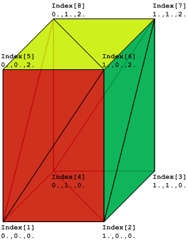

The _IfcIndexedColourMap_ provides the assignment of colour information to individual faces. It is used for colouring faces of tessellated face sets. The _IfcIndexedColourMap_ defines an index into an indexed list of colour information. The _Colours_ are a two-dimensional list of colours provided by three RGB values. The _ColourIndex_ attribute corresponds to the _CoordIndex_ of the _IfcTessellatedFaceSet_ defining the corresponding index list of faces. The Opacity attribute provides the alpha channel for all faces of the tessellated face set.

<!-- end of short definition -->

Figure 1 shows a diagram of _IfcTriangulatedFaceSet_ with a colour per face. Figure 2 shows a diagram of _IfcPolygonalFaceSet_ with a colour per face. 

Figure 1 — Indexed colour map for triangulated face sets

Figure 2 — Indexed colour map for polygonal face sets

Figure 3 — Indexed colour map for triangulated face set

Figure 3 illustrates an instance of _IfcTriangulatedFaceSet_ based on the following data:

<ul><li><em>IfcTriangulatedFaceSet.CoordIndex</em>: ((1,6,5),(1,2,6), (6,2,7), (7,2,3), (7,8,6), (6,8,5), (5,8,1), (1,8,4), (4,2,1), (2,4,3), (4,8,7), (7,3,4))</li> <li><em>IfcCartesianPointList.CoordList</em>: ((0.,0.,0.), (1.,0.,0.), (1.,1.,0.), (0.,1.,0.), (0.,0.,2.), (1.,0.,2.), (1.,1.,2.), (0.,1.,2.))</li> <li><em>IfcIndexedColourMap.ColourIndex</em>: (1, 1, 2, 2, 3, 3, 1, 1, 1, 1, 1, 1, )</li> <li><em>IfcColourRgbList.ColourList</em>: ((1.,0.,0.), (0.,1.,0.), (1.,1.,0.))</li></ul>

> HISTORY New entity in IFC4.

## Attributes

### MappedTo
Reference to the _IfcTessellatedFaceSet_ to which it applies the colours and alpha channel.

### Opacity
The opacity value that applies equally to all faces of the tessellated face set. 1.0 means opaque, and 0.0 completely transparent. If not provided, 1.0 is assumed (all colours are opaque).

> NOTE The definition of the alpha channel component for opacity follows the new definitions in image processing, where 0.0 means full transparency and 1.0 (or 2^bit depths^ -1) means fully opaque. This is contrary to the definition of transparency in _IfcSurfaceStyleShading_.

### Colours
Indexable list of lists of triples, representing RGB colours.

### ColourIndex
Indices into the _IfcColourRgbList_ for each face of the _IfcTriangulatedFaceSet_. The colour is applied uniformly to the indexed face.
