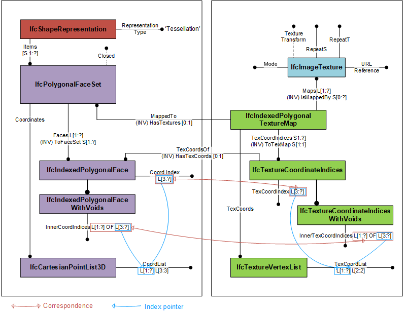

# IfcIndexedPolygonalTextureMap

The _IfcIndexedPolygonalTextureMap_ provides the mapping of the 2-dimensional texture coordinates to a set of polygonal bounded faces onto which it is mapped. It is used for mapping the texture to faces of an _IfcPolygonalFaceSet_. Such faces may have inner loops.<!-- end of definition -->

The _TexCoords_ defined at supertype _IfcIndexedTextureMap_ are a two-dimensional list of texture coordinates providing two parameter values for each indexed texture vertex. The set of _TexCoordIndices_ provides the texture coordinates for the list of _IfcIndexedPolygonalFace_ referred to via _MappedTo.Faces_. The texture coordinates at each _IfcTextureCoordinateIndices_ correspond to the vertex points at the referenced _IfcIndexedPolygonalFace_. See also Figure 1 for further explanation.

Figure 1 shows how to use _IfcIndexedPolygonalTextureMap_ to provide the texture and texture coordinates for _IfcPolygonalFaceSet_.

> HISTORY  New entity in IFC4.3.0.0

## Attributes

### TexCoordIndices
Set of texture coordinate indices for polygonal faces with and without inner loops.