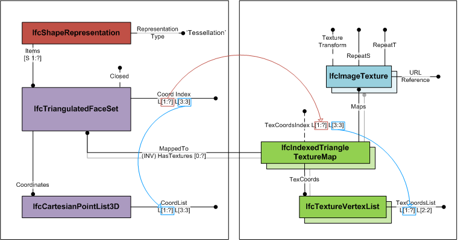
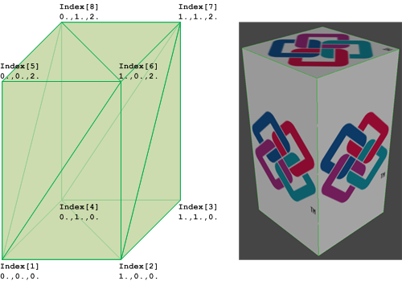

# IfcIndexedTriangleTextureMap

The _IfcIndexedTriangleTextureMap_ provides the mapping of the 2-dimensional texture coordinates to the surface onto which it is mapped. It is used for mapping the texture to triangles of the _IfcTriangulatedFaceSet_.

The _IfcIndexedTriangleTextureMap_ defines an index into an indexed list of texture coordinates. The _TexCoordIndex_ is a two-dimensional list, where

* first dimension is the unbounded list of faces corresponding to the list of triangles defined by _CoordIndex_ at _IfcTriangulatedFaceSet_; 
* second dimension is the fixed list of three indices to texture vertices cooresponding to the fixed list of indices to vertices at _IfcTriangulatedFaceSet_ 

The _TexCoords_ defined at supertype _IfcIndexedTextureMap_ are a two-dimensional list of texture coordinates provided by two parameter values. Each index of the second dimension list of _TexCoordIndex_ points to a texture vertex in _TexCoords_.

Figure 1 shows the use of _IfcTriangulatedFaceSet_ with textures.

<table summary="">
      <tr>
        <td>
          
        </td>
        <td>
          &nbsp;
        </td>
      </tr>
      <tr>
        <td>
          
Figure 1 &mdash; Indexed triangle texture map
          

        </td>
        <td>
          &nbsp;
        </td>
      </tr>
    </table>

Figure 2 illustrates an _IfcTriangulatedFaceSet_ represented by   
_IfcTriangulatedFaceSet.CoordIndex_: ((1,6,5), (1,2,6), (6,2,7), (7,2,3), (7,8,6), (6,8,5), (5,8,1), (1,8,4), (4,2,1), (2,4,3), (4,8,7), (7,3,4))  
_IfcCartesianPointList.CoordList_: ((0.,0.,0.), (1.,0.,0.), (1.,1.,0.), (0.,1.,0.), (0.,0.,2.), (1.,0.,2.), (1.,1.,2.), (0.,1.,2.))  
_IfcIndexedTriangleTextureMap.TexCoordsIndex_: ((1 4 3), (1 2 4), (3 1 4), (4 1 2), (8 7 6), (6 7 5), (4 3 2), (2 3 1), (5 8 7), (8 5 6), (2 4 3), (3 1 2))  
_IfcTextureVertexList.TexCoordsList_: ((0. -0.5), (1. -0.5), (0. 1.5), (1. 1.5), (0. 0.), (0. 1.), (1. 0.), (1. 1.))

<table summary="">
      <tr>
        <td>
          
        </td>
        <td>
          &nbsp;
        </td>
      </tr>
      <tr>
        <td>
          
Figure 2 &mdash; Indexed triangle texture map geometry 
          

        </td>
        <td>
          &nbsp;
        </td>
      </tr>
    </table>

> HISTORY&nbsp; New entity in IFC4.

## Attributes

### TexCoordIndex
Index into the _IfcTextureVertexList_ for each vertex of the triangles representing the _IfcTriangulatedFaceSet_.
