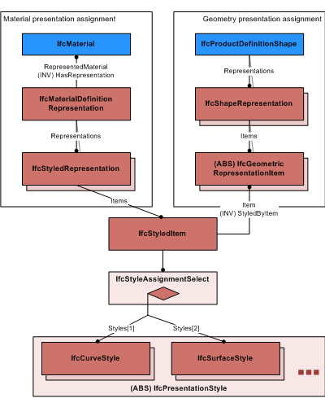

# IfcStyledItem

The _IfcStyledItem_ holds presentation style information for products, either explicitly for an _IfcGeometricRepresentationItem_ being part of an _IfcShapeRepresentation_ assigned to a product, or by assigning presentation information to _IfcMaterial_ being assigned as other representation for a product.

* If the _IfcStyledItem_ is used within a reference from an _IfcProductDefinitionShape_ then one _Item_ shall be provided.
* If the _IfcStyledItem_ is used within a reference from an _IfcMaterialDefinitionRepresentation_ then no _Item_ shall be provided.

{ .extDef}
> NOTE  Definition according to ISO/CD 10303-46:1992
> The styled item is an assignment of style for presentation to a geometric representation item as it is used in a representation.

> NOTE  Entity adapted from **styled_item** defined in ISO10303-46.

> HISTORY  New entity in IFC2x2.

{ .change-ifc2x2}
> IFC2x2 Addendum 1 CHANGE  The entity _IfcStyledItem_ has been made non abstract and the attribute _Name_ added.

{ .change-ifc2x3}
> IFC2x3 CHANGE The attribute _Item_ has been made optional, upward compatibility for file based exchange is guaranteed.

{ .change-ifc2x4}
> IFC4 CHANGE The subtype _IfcAnnotationOccurrence_ and its subtypes are deleted. Use _IfcStyledItem_ for all instantiations. The data type of _Styles_ has been changed to _IfcStyleAssignmentSelect_

{ .use-head}
Use Definition

Figure 1 illustrates use of _IfcStyledItem_ for the two usage examples:

* <small>As a presentation for a geometric representation item</small>
* <small>As a presentation for a material definition</small>

## Attributes

### Item
A geometric representation item to which the style is assigned.

{ .change-ifc2x2}
> IFC2x2 Add2 CHANGE The attribute _Item_ has been made optional. Upward compatibility for file based exchange is guaranteed.

### Styles
Representation styles which are assigned, either to an geometric representation item, or to a material definition.
{ .change-ifc2x4}
> IFC4 CHANGE The data type has been changed to _IfcStyleAssignmentSelect_ with upward compatibility for file based exchange.

> NOTE  Only the select item _IfcPresentationStyle_ shall be used from IFC4 onwards, the _IfcPresentationStyleAssignment_ has been deprecated.

### Name
The word, or group of words, by which the styled item is referred to.

## Formal Propositions

### ApplicableItem
A styled item cannot be styled by another styled item.
