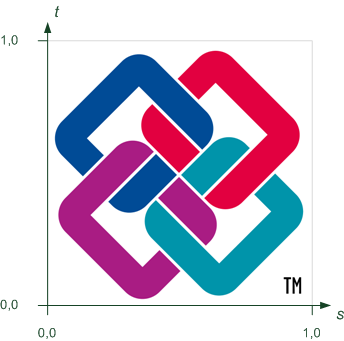

# IfcSurfaceTexture

An _IfcSurfaceTexture_ provides a 2-dimensional image-based texture map. It can either be given by referencing an external image file through an URL reference (_IfcImageTexture_), including the image file as a blob (long binary) into the data set (_IfcBlobTexture_), or by explicitly including an array of pixels (_IfcPixelTexture_).
<!-- end of short definition -->

The following definitions from ISO/IEC 19775-1 X3D Architecture and base components ([X3D Specification](http://www.web3d.org/x3d/specifications/)) apply:

 * Texture: An image used in a texture map to create visual appearance effects when applied to geometry.
 * Texture map: A texture plus the general parameters necessary for mapping the texture to geometry.
 * Textures are defined by 2D images that contain an array of colour values describing the texture. The texture values are interpreted differently depending on the number of components in the texture and the specifics of the image format. In general, texture may be described using one of the following forms:
  1. Intensity textures (one-component)
  2. Intensity plus alpha opacity textures (two-component)
  3. Full RGB textures (three-component)
  4. Full RGB plus alpha opacity textures (four-component)

> NOTE Image formats specify an alpha opacity, not transparency (where alpha = 1 - transparency).

### Texture coordinate systems

Figure 1 illustrates the texture coordinate system.

The following definitions from ISO/IEC 19775-1 X3D Architecture and base components ([X3D Specification](http://www.web3d.org/x3d/specifications/)) on texture coordinates apply:

 * Texture maps are defined in a 2D coordinate system (s, t) that ranges from [0.0, 1.0] in both directions. The bottom edge of the image corresponds to the S-axis of the texture map, and left edge of the image corresponds to the T-axis of the texture map. The lower-left pixel of the image corresponds to s=0, t=0, and the top-right pixel of the image corresponds to s=1, t=1. Texture maps may be viewed as two dimensional colour functions that, given an <em>(s, t)</em> coordinate, return a colour value <em>colour(s, t)</em>.
 * The _RepeatS_ and _RepeatT_ Boolean flags control whether the texture map is repeated outside the [0.0, 1.0] texture coordinate range, when applied to a geometric surface, or clamped to lie within the [0.0, 1.0] range. The _TextureTransform_ applies a 2D non-uniform transformation to the texture before it is applied to a geometric surface.
 * These parameters support changes to the size, orientation, and position of textures on shapes. Note that these operations appear reversed when viewed on the surface of geometry. For example, a <em>scale</em> value of (2 2) will scale the texture coordinates and have the net effect of shrinking the texture size by a factor of 2 (texture coordinates are twice as large and thus cause the texture to repeat). A translation of (0.5 0.0) translates the texture coordinates +.5 units along the S-axis and has the net effect of translating the texture −0.5 along the S-axis on the geometry's surface. A rotation of π/2 of the texture coordinates results in a −π/2 rotation of the texture on the geometry.
 * The <em>center</em> field specifies a translation offset in texture coordinate space about which the <em>rotation</em> and <em>scale</em> fields are applied. The <em>scale</em> field specifies a scaling factor in S and T of the texture coordinates about the <em>center</em> point. <em>scale</em> values shall be in the range (−∞,∞). The <em>rotation</em> field specifies a rotation in radians of the texture coordinates about the <em>center</em> point after the scale has been applied. A positive rotation value makes the texture coordinates rotate counterclockwise about the centre, thereby rotating the appearance of the texture itself clockwise. The <em>translation</em> field specifies a translation of the texture coordinates.

The following conventions apply:

 * center = <em>TextureTransform.LocalOrigin</em>;
 * rotation = <em>TextureTransform.Axis1</em>
 * scale S = <em>TextureTransform.Scale</em>
 * scale T = <em>TextureTransform.Scale2</em>

The mapping of the texture onto the surface or the solid is determined with the following priority:

 1. If the geometry is of a special IFC type which defines a texture mapping, such as an IfcSphere, IfcBlock, or IfcExtrudedAreaSolid, then that definition is the default texture mapping.
 2. If IfcTextureCoordinate texture coordinates are assigned to a surface texture, these texture coordinates are used.
 3. If the geometry has no texture mapping definition and no texture coordinates, the texture s coordinate comes from local vertex X coordinate, and t coordinate comes from local vertex Y coordinate. Along each axis, the s and t texture coordinate goes from 0 to 1, as the geometry goes from bounding box minimum to maximum.

### Texture modes

A texture may belong to a mode, which determines how the texture affects the reflectance method in IfcSurfaceStyleRendering as described in Table 1. Only a single texture may be supplied per texture Mode type (DIFFUSE, SPECULAR, etc).

Mode | PHONG | PHYSICAL | FLAT
--- | --- | --- | ---
AMBIENT | Yes | No | No
NORMAL | Yes | Yes | No
EMISSIVE | Yes | Yes | Yes
METALLICROUGHNESS | No | Yes | No
OCCLUSION | Yes | Yes | No
SHININESS | Yes | No | No
SPECULAR | Yes | No | No
DIFFUSE | Yes | Yes | No

Table 1 — Which texture nodes are applicable in different reflectance methods.

> NOTE The definitions of texturing within this standard have been developed in dependence on the texture component of X3D. See ISO/IEC 19775-1.2:2008 X3D Architecture and base components Edition 2, Part 1, 18 Texturing component for the definitions in the international standard.

> HISTORY New entity in IFC2x2.

{ .change-ifc2x4}
> IFC4.3.0.0 CHANGE Definition and attributes have been updated in line with texture usage in X3D.

> IFC4 CHANGE Attribute TextureType replaces by _Mode_, attributes _Parameter_ and _MapsTo_ added, new inverse attribute _UsedInStyle_.

## Attributes

### RepeatS
The _RepeatS_ field specifies how the texture wraps in the S direction. If _RepeatS_ is TRUE (the default), the texture map is repeated outside the [0.0, 1.0] texture coordinate range in the S direction so that it fills the shape. If _RepeatS_ is FALSE, the texture coordinates are clamped in the S direction to lie within the [0.0, 1.0] range.

### RepeatT
The _RepeatT_ field specifies how the texture wraps in the T direction. If _RepeatT_ is TRUE (the default), the texture map is repeated outside the [0.0, 1.0] texture coordinate range in the T direction so that it fills the shape. If _RepeatT_ is FALSE, the texture coordinates are clamped in the T direction to lie within the [0.0, 1.0] range.

### Mode
Mode shall hold the type of map this corresponds to, chosen from the following list: AMBIENT, NORMAL, EMISSIVE, METALLICROUGHNESS, OCCLUSION, SHININESS, SPECULAR, DIFFUSE.

If Mode is omitted, DIFFUSE is assumed.

{ .change-ifc2x4}
> IFC4 CHANGE New attribute replacing previous TextureType.

> IFC4.3.0.0 CHANGE Attribute has been repurposed to store the type of texture.

### TextureTransform
The _TextureTransform_ defines a 2D transformation that is applied to the texture coordinates. It affects the way texture coordinates are applied to the surfaces of geometric representation items. The 2D transformation supports changes to the size, orientation, and position of textures on shapes. Mirroring is not allowed to be used in the _IfcCartesianTransformationOperator_

### Parameter
> IFC4.3.0.0 DEPRECATION This attribute is deprecated and shall no longer be used.

### IsMappedBy
Texture coordinates, either provided by a corresponding list of texture vertices to vertex-based geometric items or by a texture coordinate generator, that applies the surface texture to the surfaces of the geometric items.
{ .change-ifc2x4}
> IFC4 CHANGE New attribute added at the end of the attribute list.

### UsedInStyles

