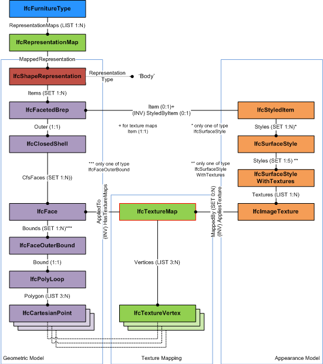

# IfcTextureMap

An _IfcTextureMap_ provides the mapping of the 2-dimensional texture coordinates to the surface onto which it is mapped. It is used for mapping the texture to surfaces of vertex based geometry models, such as

*  _IfcFacetedBrep_ 
*  _IfcFacetedBrepWithVoids_ 
*  _IfcFaceBasedSurfaceModel_ 
*  _IfcShellBasedSurfaceModel_ 

The _IfcTextureMap_ has a list of _TextureVertex_, that corresponds to the points of the outer face bound of the vertex based geometry item. The corresponding pair of lists is:

1. the list of _Polygon_ of the _IfcFaceOuterBound_ of type _IfcCartesianPoint_, and 
2. the list of _Vertices_ of type _IfcTextureVertex_. 

Each _IfcTextureVertex_ (given as S, T coordinates of the 2-dimension texture coordinate system) corresponds to the geometric coordinates of the _IfcCartesianPoint_ (given as 3-dimension X, Y, and Z coordinates within the object coordinate system of the geometric item).

{ .extDef}
> NOTE&nbsp; Definition according to ISO/IEC 19775-1:  
> The TextureCoordinate node is a geometry property node that specifies a set of 2D texture coordinates used by vertex-based geometry nodes to map textures to vertices.

> NOTE&nbsp; In contrary to the X3D vertext based geometry, for example IndexedFaceSet and ElevationGrid, the vertext based geometry in IFC may include inner loops. The areas of inner loops have to be cut-out from the texture applied to the outer loop.

Figure 1 &mdash; Texture map

Figure 1 illustrates applying a texture map to a vertex based geometry.

> HISTORY&nbsp; New entity in IFC2x2.

{ .change-ifc2x3}
> IFC2x3 CHANGE&nbsp; The attribute Texture is deleted, and the attribute TextureMaps is added.

{ .change-ifc2x4}
> IFC4 CHANGE&nbsp; The attribute TextureMap is replaced by _Vertices_, and the attribute _AppliedTo_ is added.

{ .spec-head}
Informal Propositions:

1. The _IfcFace_ referenced in _AppliedTo_ shall be used by the vertex based geometry, to which this texture map is assigned to by through the _IfcStyledItem_.

## Attributes

### Vertices
List of texture coordinate vertices that are applied to the corresponding points of the polyloop defining a face bound.

### MappedTo
The face that defines the corresponding list of points along the bounding poly loop of the face outer bound.
> NOTE&nbsp; The face may have additional inner loops. The _IfcTextureMap_ and its _Vertices_ only correspond with the coordinates of the _IfcPolyloop_ representing the outer bound.
