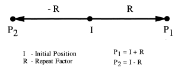

# IfcHatchLineDistanceSelect

The _IfcHatchLineDistanceSelect_ is a selection between different ways to determine the distance and optionally the start point of hatch lines, either by an offset distance measure or by a vector.

The vector, if selected, acts as a one time repeat factor in the fill area style hatching for determining the origin of the repeated hatch line relative to the origin of the previous hatch line, Given the initial position of any hatch line, the one direction repeat factor determines two new positions according to the equation:

{ .extDef}
> NOTE  Definition according to ISO 10303-46:
>
> I + k \* R    k &isin;{-1,1}
>
> Figure 1 shows the use of a vector for hatch line distances
>
> 

> NOTE  Use of _IfcVector_ as one time repeat factor is adapted from **one_direction_repeat_factor** defined in ISO10303-46

> HISTORY  New select type in IFC2x3
