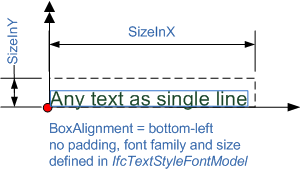

# IfcTextLiteralWithExtent

The text literal with extent is a text literal with the additional explicit information of the planar extent. An alignment attribute defines how the text box is aligned to the placement and how it may expand if additional lines of text need to be added.

Figure 1 shows the use of planar extent and box alignment to position the text string

The planar extent defines the box model within which the text is placed. Padding maybe defined in the text style that offsets the text from the box to its inside.

> NOTE&nbsp; Entity adapted from **text_literal_with_extent** defined in ISO10303-46

> HISTORY&nbsp; New entity in IFC2x2.

{ .change-ifc2x3}
> IFC2x3 CHANGE &nbsp;The _IfcTextLiteralWithExtent_ has been changed by adding _BoxAlignment_.

## Attributes

### Extent
The extent in the x and y direction of the text literal.

### BoxAlignment
The alignment of the text literal relative to its position.

## Formal Propositions

### WR31
The subtype of _IfcPlanarExtent_, _IfcPlanarBox_, should not be used to represent an _Extent_ for the text literal.
