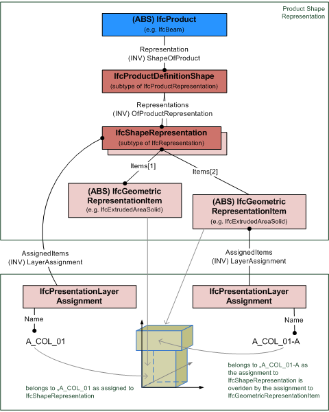

# IfcPresentationLayerAssignment

The presentation layer assignment provides the layer name (and optionally a description and an identifier) for a collection of geometric representation items. The _IfcPresentationLayerAssignment_ corresponds to the term "CAD Layer" and is used mainly for grouping and visibility control.

> NOTE&nbsp; The use of presentation layer shall be restricted to simple grouping and displaying purposes.

Visibility and access control and layer style assignment (colour, line style, line width) is handled by the subtype _IfcPresentationLayerAssignmentWithStyle_.

> NOTE&nbsp; Corresponding ISO 10303 name: presentation layer assignment. Please refer to ISO/IS 10303-46:1994, p. 36 for the final definition of the formal standard.

> HISTORY&nbsp; New entity in IFC2x2.

{ .use-head}
Attribute use definition

Figure 1 illustrates assignment of items by shape representation or representation item. The set of _AssignedItems_ can either include a whole shape representation, or individual geometric representation items. If both, the _IfcShapeRepresentation_ has a layer assignment, and an individual geometric representation item in the set of _IfcShapeRepresentation_.Items, then the layer assignment of the _IfcGeometricRepresentationItem_ overides the layer assignment of the _IfcShapeRepresentation_.

## Attributes

### Name
Name of the layer.

### Description
Additional description of the layer.

### AssignedItems
The set of layered items, which are assigned to this layer.

### Identifier
An (internal) identifier assigned to the layer.

## Formal Propositions

### ApplicableItems
The items within the set of _AssignedItems_ that can be assigned to a presentation layer shall be geometric shape representation or representation items.
{ .change-ifc2x4}
> IFC4 CHANGE&nbsp; The where rule has been added.
