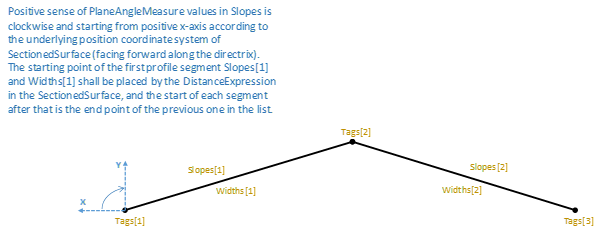

# IfcOpenCrossProfileDef

A two-dimensional open profile defined by widths and slopes for the use within the swept surface geometry, in SectionedSurface in particular. The underlying coordinate system is defined by the swept surface that uses the profile definition; when used in SectionedSurface it is the XY plane of each list member of SectionedSurface.CrossSectionPositions where the profile X axis is oriented perpendicularly to the left of the Directrix (same direction as positive LateralOffset at _IfcPointByDistanceExpression_) as facing forward along the directrix, and the profile Y axis is oriented upwards or vertically perpendicular to the Directrix depending on the usage in the SectionedSurface.
The behaviour of OpenCrossProfileDef in sweeping operation can be controlled by attribute Tags. Tags allow two consecutive cross sections to have different number of break points: points with the same tag value are connected either by assuming linear longitudinal breakline between them, or by a guide curve identified by the same Tag value as the cross section points.

## Attributes

### HorizontalWidths
Indicates if the widths shall be measured horizontally or along the slopes.

### Widths
The horizontal widths (when HorizontalWidths=.T.) or distances along the Slope (when HorizontalWidths=.F.)  for the segments in the profile. And if Horizontal=.T. the Slopes shall not be = +/- 90 deg.

### Slopes
The slope measure.

### Tags

## Formal Propositions

### CorrectProfileType

The profile type shall be CURVE.

### CorrespondingSlopeWidths

The list of slopes and the list of widths shall be of the same size.

### CorrespondingTags

The list of tags shall have one more member.
