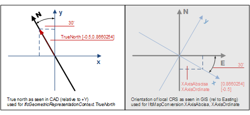

# IfcGeometricRepresentationContext

The _IfcGeometricRepresentationContext_ defines the context that applies to several shape representations of products within a project. It defines the type of the context in which the shape representation is defined, and the numeric precision applicable to the geometric representation items defined in this context. In addition it can be used to offset the project coordinate system from a global point of origin, using the _WorldCoordinateSystem_ attribute. The main representation context may also provide the true north direction, see Figure 1.<!-- end of definition -->

Figure 1 — Definition of the true north direction

The <em>TrueNorth</em> attribute should be provided, if the y axis of the <em>WorldCoordinateSystem</em> does not point to the global northing. Direction of the true north, or geographic northing direction, relative to the underlying project coordinate system as established by the attribute <em>WorldCoordinateSystem</em>. It is given by a 2 dimensional direction within the xy-plane of the project coordinate system. If not resent, it defaults to [0.,1.] - i.e. the positive Y axis of the project coordinate system equals the geographic northing direction. The direction is provided within project coordinate system and identifies the true north direction.

The "true North as seen in CAD" within Figure 1 shows the correct interpretation of the <em>TrueNorth</em> direction.

If a conversion to a geographic coordinate system is included by virtue of the <em>HasCoordinateOperation</em> attribute, then the <em>TrueNorth</em> attribute shall be omitted or included only for informational purposes. It shall not be added to any transformation already applied by an <em>IfcCoordinateOperation</em>.

The use of one instance of _IfcGeometricRepresentationContext_ to represent the model (3D) view is mandatory, the use of a second instance of _IfcGeometricRepresentationContext_ to represent the plan (2D) view is optional (but needs to be given, if there are scale dependent plan views), the additional scale or view dependent contexts need to be handled by using the subtype _IfcGeometricRepresentationSubContext_ pointing to the model view (or the plan view) as the _ParentContext_. See Figure 2 for an example using geometric representation contexts for 3D and 2D with assigned sub contexts.

> NOTE  The inherited attribute _ContextType_ shall have one of the following recognized values: 'Model', 'Plan', 'NotDefined'.

Figure 2 — Example of using geometric representation contexts

Use of representation contexts defined at <em>IfcProject</em> for 3D model and 2D plan context, including sub context definitions for different target scales. There shall always be a maximum of one geometric representation context for 2D and for 3D coordinate space.

{ .extDef}
> NOTE  Definition according to ISO/CD 10303-42:1992
> A geometric representation context is a representation context in which the geometric representation items are geometrically founded.

> NOTE  Entity adapted from **geometric_representation_context** defined in ISO 10303-42.

> HISTORY  New entity in IFC2.0.

{ .change-ifc2x3}
> IFC2x3 CHANGE  Applicable values for _ContextType_ are only 'Model', 'Plan', and 'NotDefined'. All other contexts are now handled by _IfcGeometricRepresentationSubContext_.

{ .change-ifc2x4}
> IFC4 CHANGE  Mapping to Geographic coordinate system added by inverse attribute _HasCoordinateOperation_.

## Attributes

### CoordinateSpaceDimension
The integer dimension count of the coordinate space modeled in a geometric representation context.

### Precision
Value of the model precision for geometric models. It is a double value (REAL), typically in 1E-5 to 1E-8 range, that indicates the tolerance under which two given points are still assumed to be identical. The value can be used e.g. to sets the maximum distance from an edge curve to the underlying face surface in brep models.

### WorldCoordinateSystem
Establishment of the engineering coordinate system (often referred to as the world coordinate system in CAD) for all representation contexts used by the project.

> NOTE  It can be used to provide better numeric stability if the placement of the building(s) is far away from the origin. In most cases however it would be set to origin: (0.,0.,0.) and directions x(1.,0.,0.), y(0.,1.,0.), z(0.,0.,1.).

If an geographic placement is provided using _IfcMapConversion_ then the _WorldCoordinateSystem_ atttibute is used to define the offset between the zero point of the local engineering coordinate system and the geographic reference point to which the _IfcMapConversion_ offset relates. In preferred practise both points (also called "project base point" and "survey point") should be coincidental. However it is possible to offset the geographic reference point from the local zero point.

### TrueNorth
Direction of the true north, or geographic northing direction, relative to the underlying project coordinate system. It is given by a 2 dimensional direction within the xy-plane of the project coordinate system. If not present, it defaults to 0. 1., meaning that the positive Y axis of the project coordinate system equals the geographic northing direction.

> NOTE  If a geographic placement is provided using _IfcMapConversion_ then the true north is for information only. In case of inconsistency, the value provided with _IfcMapConversion_ shall take precedence.

### HasSubContexts
The set of _IfcGeometricRepresentationSubContexts_ that refer to this _IfcGeometricRepresentationContext_.

### HasCoordinateOperation
Indicates conversion between coordinate systems. In particular it refers to an _IfcCoordinateOperation_ between a Geographic map coordinate reference system, and the engineering coordinate system of this construction project. If there is more then one _IfcGeometricRepresentationContext_ provided to the _IfcProject_ then all contexts shall have an identical instance of _IfcCoordinateOperation_ as _HasCoordinateOperation_ referring to the same instance of _IfcCoordinateReferenceSystem_.

## Formal Propositions

### North2D
The _TrueNorth_ direction, if provided, shall be a two-dimensional direction.
