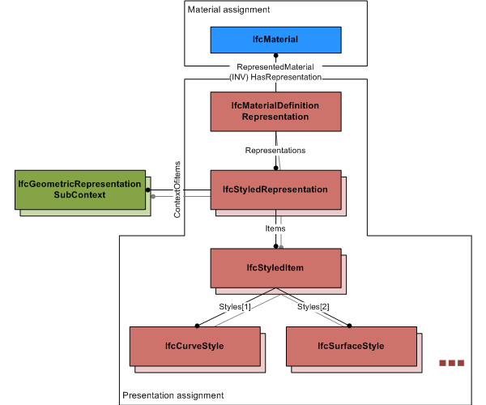

# IfcMaterialDefinitionRepresentation

_IfcMaterialDefinitionRepresentation_ defines presentation information relating to _IfcMaterial_. It allows for multiple presentations of the same material for different geometric representation contexts.

> NOTE&nbsp; The _IfcMaterialDefinitionRepresentation_ is currently only used to define presentation information to material used at element occurrences, defined as subtypes of _IfcElement_, or at element types, defined as subtypes of _IfcElementType_. The _IfcMaterial_ is assigned to the subtype of _IfcElement_, or _IfcElementType_ using the _IfcRelAssociatesMaterial_ relationship (eventually via other material related entities _IfcMaterialLayerSetUsage_, _IfcMaterialLayerSet_, _IfcMaterialLayer_, or _IfcMaterialProfileSetUsage_, _IfcMaterialProfileSet_, _IfcMaterialProfile_).

The _IfcMaterialDefinitionRepresentation_ can apply

* different presentation styles for different representation contexts, for example, a different style for sketch view, model view or plan view, or for different target scales, 
* for each representation context is can apply curve style, fill area style (hatching), symbol, text and surface style. 

> HISTORY&nbsp; New entity in IFC2x3.

{ .change-ifc2x3}
> IFC2x3 CHANGE&nbsp; The entity _IfcMaterialDefinitionRepresentation_ has been added. Upward compatibility for file based exchange is guaranteed.

{ .change-ifc2x4}
> IFC4 CHANGE&nbsp; The assignment of curve, surface and other styles to an _IfcStyledItem_ has been simplified by _IfcStyleAssignmentSelect_. The use of intermediate _IfcPresentationStyleAssignment_ is deprecated.

&nbsp;

{ .use-head}
Use definition

<table border="0" cellpadding="0" cellspacing="0" summary="use diagram">
      <tr>
        <td valign="top">
          
        </td>
	<td>As shown in Figure 1, the presentation assignment can be
      specific to a representation context by adding one and more
      <em>IfcStyledRepresentation</em>'s. Each of them includes a
      single <em>IfcStyledItem</em> with exactly zero or one style
      for either curve, fill area, surface, text or symbol style
      that is applicable.</td>
      </tr>
      <tr>
        <td>
          
Figure 1 &mdash; Material definition representation

        </td>
	<td>&nbsp;</td>
      </tr>
    </table>

## Attributes

### RepresentedMaterial
Reference to the material to which the representation applies.

## WhereRules

### OnlyStyledRepresentations
Only representations of type _IfcStyledRepresentation_ should be used to represent material through the _IfcMaterialRepresentation_.
