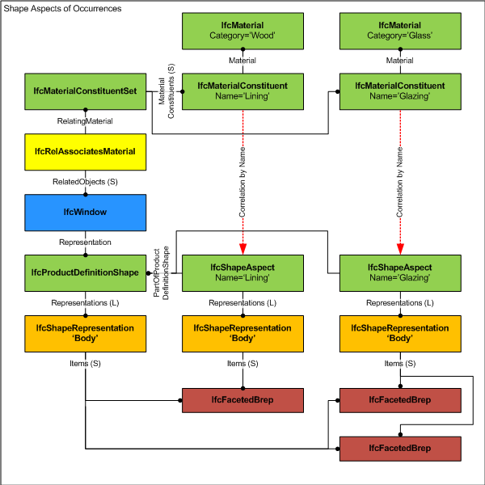

# IfcShapeAspect

_IfcShapeAspect_ allows for grouping of shape representation items that represent aspects (or components) of the shape of a product. Thereby shape representations of components of the product shape represent a distinctive part to a product that can be explicitly addressed.

The _IfcShapeAspect_'s may have distinct material information or other distict characteristics that differs from other parts of the product shape representation.

> NOTE  The _IfcShapeAspect_ together with the _IfcMaterialConstituent_ can be used to associate distict material information to parts of the product shape representation.

Figure 1 indicates the association of material characteristics to shape aspects.

{ .extDef}
> NOTE  Definition from ISO 10303-41:
> A shape aspect is an identifiable element of the shape of an object.

> NOTE  Entity adapted from **shape_aspect** defined in ISO 10303-42.

> HISTORY  New entity in IFC2.0

{ .change-ifc2x4}
> IFC4 CHANGE  Attribute _PartOfProductDefinitionShape_ declared OPTIONAL and extended to type _IfcProductRepresentationSelect_ with upward compatibility for file based exchange.

{ .spec-head}
Informal Propositions:

1. If _ShapeRepresentations_ points to shape representations that are part of an _IfcProductDefinitionShape_, _PartOfProductDefinitionShape_ must refer to this instance of _IfcProductDefinitionShape_.
2. If _ShapeRepresentations_ points to shape representations that are part of an _IfcRepresentationMap_, _PartOfProductDefinitionShape_ must refer to this instance of _IfcRepresentationMap_.

## Attributes

### ShapeRepresentations
List of ~~shape~~ representations. Each member defines a valid representation of a particular type within a particular representation context as being an aspect (or part) of a product definition.
{ .change-ifc2x3}
> IFC2x3 CHANGE  The data type has been changed from _IfcShapeRepresentation_ to _IfcShapeModel_ with upward compatibility

### Name
The word or group of words by which the shape aspect is known. It is a tag to indicate the particular semantic of a component within the product definition shape, used to provide meaning. Example: use the tag "Glazing" to define which component of a window shape defines the glazing area.

### Description
The word or group of words that characterize the shape aspect. It can be used to add additional meaning to the name of the aspect.

### ProductDefinitional
An indication that the shape aspect is on the physical boundary of the product definition shape. If the value of this attribute is TRUE, it shall be asserted that the shape aspect being identified is on such a boundary. If the value is FALSE, it shall be asserted that the shape aspect being identified is not on such a boundary. If the value is UNKNOWN, it shall be asserted that it is not known whether or not the shape aspect being identified is on such a boundary.
---
EXAMPLE: Would be FALSE for a center line, identified as shape aspect; would be TRUE for a cantilever.
---

### PartOfProductDefinitionShape
Reference to the _IfcProductDefinitionShape_ or the _IfcRepresentationMap_ of which this shape is an aspect.
{ .change-ifc2x4}
> IFC4 CHANGE  Data type modified to be _IfcProductRepresentationSelect_ allowing the assignment also to _IfcRepresentationMap_.

### HasExternalReferences
External references (e.g. classification) associated with the shape aspect.
