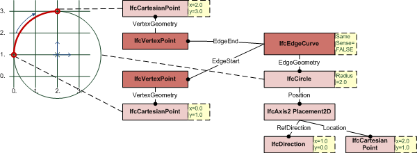

# IfcEdgeCurve

An _IfcEdgeCurve_ defines two vertices being connected topologically including the geometric representation of the connection.<!-- end of definition -->

> NOTE  The topology is used to trim the geometry of the edge. There is no need to geometrically trim the edge to match the topology.

Figure 1 — Edge curve

> EXAMPLE Figure 1 illustrates an example where the edge geometry is given by an unbounded curve, here <em>IfcCircle</em>. The bounds are provided by the <em>EdgeStart</em> and <em>EdgeEnd</em>, the topological direction of the <em>IfcEdgeCurve</em> opposes the direction of the <em>IfcCircle</em> by <em>SameSense</em> = FALSE.

{ .extDef}
> NOTE  Definition according to ISO/CD 10303-42:1992
> An edge curve is a special subtype of edge which has its geometry fully defined. The geometry is defined by associating the edge with a curve which may be unbounded. As the topological and geometric directions may be opposed, an indicator (same sense) is used to identify whether the edge and curve directions agree or are opposed. The Boolean value indicates whether the curve direction agrees with (TRUE) or is in the opposite direction (FALSE) to the edge direction. Any geometry associated with the vertices of the edge shall be consistent with the edge geometry. Multiple edges can reference the same curve.

> NOTE  Entity adapted from **edge_curve** defined in ISO 10303-42.

> HISTORY  New entity in IFC2x.

**Informal Propositions**

1. The domain of the edge curve is formally defined to be the domain of its edge geometry as trimmed by the vertices. This domain does not include the vertices.
2. An edge curve has non-zero finite extent.
3. An edge curve is a manifold.
4. An edge curve is arcwise connected.
5. The edge start is not a part of the edge domain.
6. The edge end is not a part of the edge domain.
7. Vertex geometry shall be consistent with edge geometry.

## Attributes

### EdgeGeometry
The curve which defines the shape and spatial location of the edge. This curve may be unbounded and is implicitly trimmed by the vertices of the edge; this defines the edge domain. Multiple edges can reference the same curve.

### SameSense
This logical flag indicates whether (TRUE), or not (FALSE) the senses of the edge and the curve defining the edge geometry are the same. The sense of an edge is from the edge start vertex to the edge end vertex; the sense of a curve is in the direction of increasing parameter.
