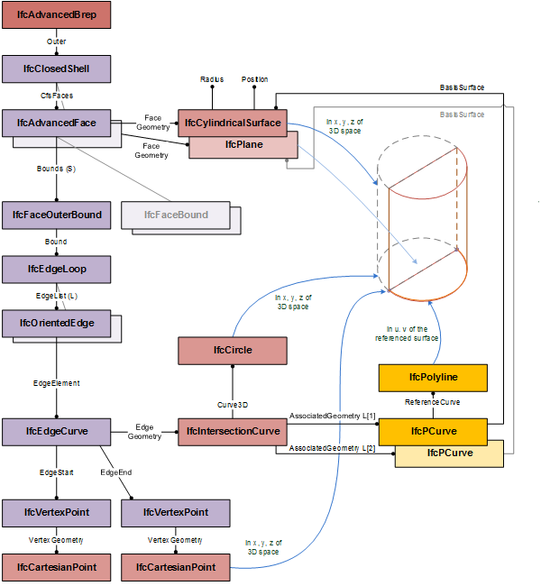

# IfcOrientedEdge

The _IfcOrientedEdge_ represents an _IfcEdge_ with an _Orientation_ flag applied. It allows to reuse the same _IfcEdge_ when traversed exactly twice, once forwards and once backwards.<!-- end of definition -->

> NOTE The sense of the normal to the _IfcFace_ is solely determined from the edges. If all the edges of the face are connected in a counter clockwise manner following the edge orientations the face normal will point outward. The normal to the underlying _IfcFaceSurface_ representing the geometry of that face has no relevance to this. The purpose of the _IfcFaceSurface.SameSense_ attribute is to give additional information for verification purposes. _SameSense_ TRUE means surface normal and face normal are the same, _SameSense_ FALSE means they are in opposite directions.

The reused edge with a geometric representation as _IfcEdgeCurve_ defines the edge in 3D coordinate space. In some cases, particularly when using elementary or swept surfaces, there is the risk of imprecise mapping of the 3D (x, y, z) _IfcEdgeCurve_ onto the adjacent surfaces to determine the boundaries of these surfaces. The optional _CurveOnSurface_ defines the 2D (u, v) edge within the parametric space of the surface. It could be used to determine the correctness of the mapping of the 3D _IfcEdgeCurve_ onto this surface.

Figure 1 — Curve on surface representation of an

> EXAMPLE Figure 1 illustrates an example where the <em>CurveOnSurface</em> is provided in addition to the curve geometry of the <em>IfcEdgeCurve</em>.

{ .extDef}
> NOTE Definition according to ISO/CD 10303-42:1992
> An oriented edge is an edge constructed from another edge and contains a BOOLEAN direction flag to indicate whether or not the orientation of the constructed edge agrees with the orientation of the original edge. Except for perhaps orientation, the oriented edge is equivalent to the original edge.
>
> A common practice is solid modelling systems is to have an entity that represents the "use" or "traversal" of an edge. This "use" entity explicitly represents the requirement in a manifold solid that each edge must be traversed exactly twice, once in each direction. The "use" functionality is provided by the edge subtype oriented edge.

> NOTE Entity adapted from **oriented_edge** defined in ISO 10303-42.

> HISTORY New entity in IFC2.0.

{ .change-ifc2x4}
> IFC4 Add2 CHANGE The attribute _CurveOnSurface_ has been added.

## Attributes

### EdgeElement
Edge entity used to construct this oriented edge.

### Orientation
BOOLEAN, If TRUE the topological orientation as used coincides with the orientation from start vertex to end vertex of the edge element. If FALSE otherwise.

### EdgeStart
The start vertex of the oriented edge. It derives from the vertices of the edge element after taking account of the orientation.

### EdgeEnd
The end vertex of the oriented edge. It derives from the vertices of the edge element after taking account of the orientation.

## Formal Propositions

### EdgeElementNotOriented
The edge element shall not be an oriented edge.
