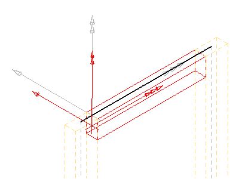
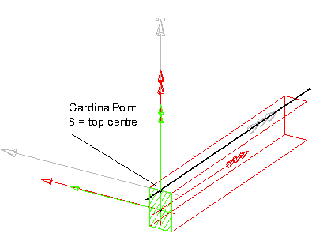
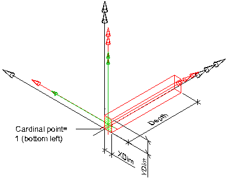
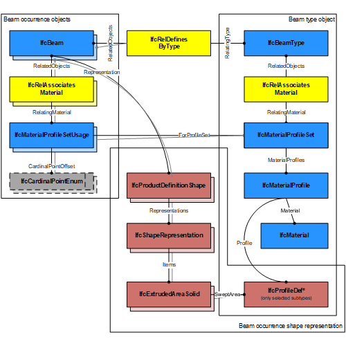
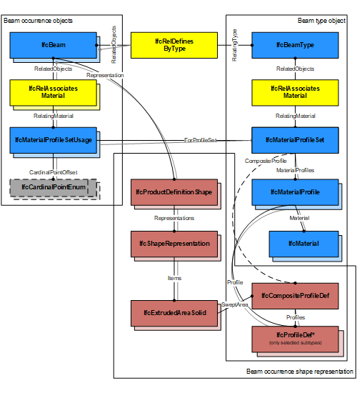

An _IfcBeam_ is typically a horizontal, or nearly horizontal, structural member that is capable of withstanding load primarily by resisting bending. It may also represent such a member from an architectural point of view. It is not required to be load bearing.

<!-- end of short definition -->

There are two main representations for beam occurrences:

 * _IfcBeam_ with _IfcMaterialProfileSetUsage_ is used for all occurrences of beams, that have a profile defined that is swept along a directrix. The profile might change uniformly by a taper definition along the directrix. The profile parameter and its cardinal point of insertion can be fully described by the _IfcMaterialProfileSetUsage_. These beams are always represented geometricly by an 'Axis' and a 'SweptSolid' or 'AdvancedSweptSolid' shape representation (or by a 'Clipping' geometry based on the swept solid), if a 3D geometric representation is assigned.
 * _IfcBeam_ without _IfcMaterialProfileSetUsage_ is used for all other occurrences of beams, particularly for beams with non-uniformly changing profile sizes along the sweep, or beams having only 'AdvancedBrep', 'Brep', or 'SurfaceModel' geometry, if a more parametric representation is not intended.

For any other longitudinal structural member, not constrained to be predominately horizontal nor vertical, or where this semantic information is irrelevant, the entity _IfcMember_ should be used.

> REFERENCE Definition according to ISO 6707-1: structural member for carrying load(s) between or beyond points of support, usually narrow in relation to its length and horizontal or nearly so.

> NOTE The entity _IfcBeamStandardCase_ has been deleted, _IfcBeam_ with _IfcMaterialProfileSetUsage_ is used instead.

> NOTE The representation of load-bearing beams in a structural analysis model is provided by subtypes of _IfcStructuralMember_ (with _IfcStructuralCurveMember_ being mostly applicable) as part of an _IfcStructuralAnalysisModel_. The camber of a beam may be defined by assigning an _IfcStructuralCurveMember_ with displacement coordinates. Multiple sets of camber ordinates may be provided that are qualified by the particular load case, where full dead load would typically be used for fabrication, and other scenarios used for other loading conditions such as during construction.

> HISTORY New entity in IFC1.0

## Attributes

### PredefinedType
Predefined generic type for a beam that is specified in an enumeration. There may be a property set given specifically for the predefined types.
> NOTE The _PredefinedType_ shall only be used, if no _IfcBeamType_ is assigned, providing its own _IfcBeamType.PredefinedType_.

{ .change-ifc2x4}
> IFC4 CHANGE The attribute has been added at the end of the entity definition.

## Formal Propositions

### CorrectPredefinedType
Either the _PredefinedType_ attribute is unset (e.g. because an _IfcBeamType_ is associated), or the inherited attribute _ObjectType_ shall be provided, if the _PredefinedType_ is set to USERDEFINED.

### CorrectTypeAssigned
Either there is no beam type object associated, i.e. the _IsTypedBy_ inverse relationship is not provided, or the associated type object has to be of type _IfcBeamType_.

## Concepts

### Axis 3D Geometry

The axis representation can be used to represent the fundamental orientation and extents of a beams's body.

If an _IfcMaterialProfileSetUsage_ is used, the axis representation is used to locate the profile. In addition:

 * For a body representation using an _IfcExtrudedAreaSolid_, the axis may be an _IfcPolyline_ having two Points, or _IfcTrimmedCurve_ with BasisCurve of type _IfcLine_. The axis curve lies on the z axis of the object coordinate system.
 * For a body representation using an _IfcRevolvedAreaSolid_, the axis may be an _IfcTrimmedCurve_ with BasisCurve of type _IfcCircle_. The axis curve lies on the x/z plane of the object coordinate system, the tangent at the start is along the positive z-axis.

As shown in Figure 76, the axis shall be defined along the z axis of the object coordinate system.

Figure 76 — Beam axis representation

As shown in Figure 77, the axis representation must be positioned at the _IfcMaterialProfileSetUsage_._CardinalPoint_, and parallel to the _IfcExtrudedAreaSolid_._ExtrudedDirection_. This offset between the axis line and the _IfcExtrudedAreaSolid_._Position_ must correlate with the chosen _IfcMaterialProfileSetUsage_._CardinalPoint_.

Figure 77 — Beam axis cardinal point

#### Axis_IfcBoundedCurve_Curve3D

Three-dimensional reference curve for the beam.

### Body AdvancedSweptSolid Geometry

* _IfcSurfaceCurveSweptAreaSolid_, _IfcFixedReferenceSweptAreaSolid_, _IfcExtrudedAreaSolidTapered_, _IfcRevolvedAreaSolidTapered_ shall be supported.
* All subtypes of _IfcProfileDef_ (with exception of _IfcArbitraryOpenProfileDef_)

### Body Clipping Geometry

* _IfcExtrudedAreaSolid_, _IfcRevolvedAreaSolid_ shall be supported
* All subtypes of _IfcProfileDef_ (with exception of _IfcArbitraryOpenProfileDef_)
* All extrusion directions shall be supported.
* The _IfcBooleanClippingResult_ shall be supported, allowing for Boolean differences between the swept solid (here _IfcExtrudedAreaSolid_) and one or several _IfcHalfSpaceSolid_ (or its subtypes).

Figure 201 illustrates use of _IfcBooleanClippingResult_ between an _IfcExtrudedAreaSolid_ and an _IfcHalfSpaceSolid_ to create a clipped body.

Figure 201 — Beam clipping

### Body SweptSolid Geometry

 * _IfcExtrudedAreaSolid_, _IfcRevolvedAreaSolid_ shall be supported
 * All subtypes of _IfcProfileDef_
 * All extrusion directions shall be supported.

When an _IfcMaterialProfileSetUsage_ is assigned to the _IfcBeam_:

 * For all single profiles, the _IfcParameterizedProfileDef_._Position_ shall be NIL, or having _Location_ = 0.,0. and _RefDirection_ = 1.,0.
 * The extrusion shall be perpendicular to the profile direction.
 * Orientation: The y-axis of the profile, as determined by _IfcSweptAreaSolid_._Position_._P[2]_ shall point upwards. It indicates the "role" of the beam, a role=0° means y-axis of profile pointing upwards.

Figure 200 illustrates the 'SweptSolid' geometric representation. There are no restrictions or conventions on how to use the local placement (black), solid of extrusion placement (red) and profile placement (green).

Figure 200 — Beam swept solid

Figure 201 illustrates the use of non-perpendicular extrusion to create the _IfcExtrudedAreaSolid_.

Figure 201 — Beam non-perpendicular extrusion

If parametric profiles are used, the parameters may be interpreted to be the dimensions of the beam:

* _IfcRectangleProfileDef_._YDim_ interpreted as beam height
* _IfcRectangleProfileDef_._XDim_ interpreted as beam width
* _IfcCircleProfileDef_._Radius_ interpreted as beam radius.

Figure 207 — Beam body extrusion using an _IfcRectangleProfileDef_

### Element Composition

#### IfcElementAssembly

Special purpose composite entity

#### IfcBuiltElement

Any built element can be a composite

### Material Profile Set Usage

Figure 196 illustrates assignment of _IfcMaterialProfileSetUsage_ and _IfcMaterialProfileSet_ to the _IfcBeamType_ and the _IfcBeam_ occurrence. Both the _IfcMaterialProfileSet_ and _IfcProfileDef_ is shared between all occurrences.

Figure 196 — Beam profile usage

Figure 197 illustrates cardinal point alignment. The use of _IfcCardinalPointReference_ must be consistent with the placement of the extrusion body provided by _IfcExtrudedAreaSolid_._Position_.

Figure 197 — Beam cardinal points

Figure 198 illustrates assignment of a composite profile by using _IfcCompositeProfileDef_ for geometric representation and several _IfcMaterialProfile_ entities within the _IfcMaterialProfileSet_.

Figure 198 — Beam composite profiles

### Object Typing

### Product Assignment

#### IfcStructuralCurveMember

An idealized structural member corresponding to the beam.

### Property Sets for Objects

### Quantity Sets

### Spatial Containment

The _IfcBeam_, as any subtype of _IfcBuiltElement_, may participate alternatively in one of the two different containment relationships:

* the _Spatial Containment_ (defined here), or
* the _Element Composition_.

#### IfcBuildingStorey

Default spatial container

#### IfcBuilding

Spatial container for the element if it cannot be assigned to a building storey

#### IfcSite

Spatial container for the element in case that it is placed on site (outside of building)
