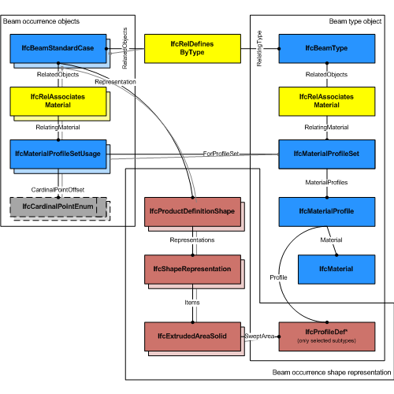
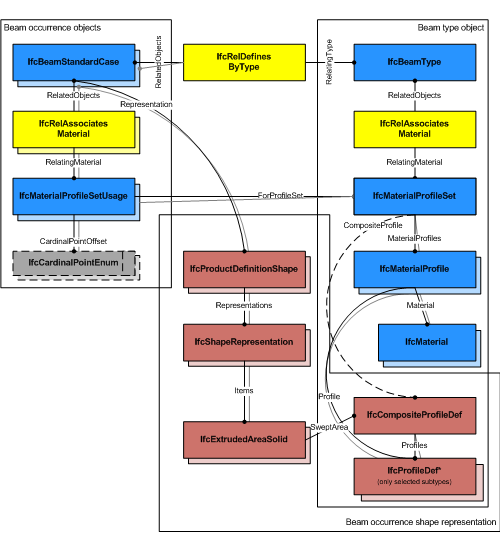

# IfcBeamStandardCase

The standard beam, _IfcBeamStandardCase_, defines a beam with certain constraints for the provision of material usage, parameters and with certain constraints for the geometric representation. The _IfcBeamStandardCase_ handles all cases of beams, that:

* have a reference to the _IfcMaterialProfileSetUsage_ defining the material profile association of the beam with the cardinal point of its insertion relative to the local placement.
* are consistent in using the correct cardinal point offset of the profile as compared to the 'Axis' and 'Body' shape representation
* are based on a sweep of a planar profile, or set of profiles, as defined by the _IfcMaterialProfileSet_
* have an 'Axis' shape representation with constraints provided below in the geometry use definition
* have a 'Body' shape representation with constraints provided below in the geometry use definition 
    * are extruded perpendicular to the profile definition plane
    * have a start profile, or set of profiles, that is swept
    * the sweeping operation can be linear extrusion, circular rotation, or a sweep along a directrix
    * the start profile, or set of profiles can be swept unchanged, or might be changed uniformly by a taper definition 
*  
>> NOTE  View definitions and implementer agreements may further constrain the applicable geometry types, e.g. by excluding tapering from an _IfcBeamStandardCase_ implementation. 

> HISTORY  New entity in IFC4.

**_Geometric Representations_**

The geometric representation of _IfcBeamStandardCase_ is defined using the following multiple shape representations for its definition:

* **Axis**: A three dimensional open curve (subtype of _IfcBoundedCurve_) defining the axis for the standard beam. The cardinal point is determined by the beam axis.
* **Body**: A Swept Solid Representation or a CSG clipping representation defining the 3D shape of the standard beam.

> NOTE  It is invalid to exchange a 'SurfaceModel', 'Brep', or 'MappedRepresentation' representation for the 'Body' shape representation of an _IfcBeamStandardCase_.

## Formal Propositions

### HasMaterialProfileSetUsage
A valid instance of _IfcBeamStandardCase_ relies on the provision of an _IfcMaterialProfileSetUsage_.

## Concepts

### Axis 3D Geometry

The following additional constraints apply to the 'Axis'
representation, if the 'Body' shape representation has the
RepresentationType : 'SweptSolid':

* Axis
	+ IfcPolyline having two Points, or
	IfcTrimmedCurve with BasisCurve of Type
	IfcLine for 'SweptSolid' provided as
	IfcExtrudedAreaSolid. The axis curve lies on the z axis of
	the object coordinate system.
	+ IfcTrimmedCurve with BasisCurve of Type
	IfcCircle for 'SweptSolid' provided as
	IfcRevolvedAreaSolid. The axis curve lies on the x/z plane
	of the object coordinate system, the tangent at the start is along
	the positive z-axis.

 

> EXAMPLE  As shown in Figure 76, the axis shall be defined along the z axis of the object coordinate system. The axis representation can be used to represent the system length of a beam that may extent the body length of the beam.

Figure 206 — Beam axis representation

 

> EXAMPLE  As shown in Figure 77, the axis representation shall be used to represent the cardinal point as the offset between the 'Axis' and the extrusion path of the beam. The extrusion path is provided as IfcExtrudedAreaSolid.ExtrudedDirection and should be parallel to the 'Axis' and the z axis. It has to be guaranteed that the value provided by
> IfcMaterialProfileSetUsage.CardinalPoint is consistent to the IfcExtrudedAreaSolid.Position.

Figure 207 — Beam axis cardinal point

 

### Body AdvancedSweptSolid Geometry

The following additional constraints apply to the
'AdvancedSweptSolid' representation type:

* Solid: IfcSurfaceCurveSweptAreaSolid,
IfcFixedReferenceSweptAreaSolid,
IfcExtrudedAreaSolidTapered,
IfcRevolvedAreaSolidTapered shall be supported.

> NOTE  View definitions and implementer agreement
> can further constrain the allowed swept solid
> types.
* Solid Position : see 'SweptSolid' geometric
representation
* Profile: see 'SweptSolid' geometric representation
* Profile Position : see 'SweptSolid' geometric
representation
* Extrusion: not applicable

### Body Clipping Geometry

The following constraints apply to the 'Clipping'
representation:

* Solid : see 'SweptSolid' geometric representation
* Solid Position : see 'SweptSolid' geometric
representation
* Profile : see 'SweptSolid' geometric representation
* Profile Position : see 'SweptSolid' geometric
representation
* Extrusion : see 'SweptSolid' geometric
representation
* Orientation : see 'SweptSolid' geometric
representation
* Boolean result: The IfcBooleanClippingResult
shall be supported, allowing for Boolean differences between the
swept solid (here IfcExtrudedAreaSolid) and one or several
IfcHalfSpaceSolid (or its subtypes).

Figure 208 illustrates a 'Clipping' geometric representation with use of IfcBooleanClippingResult between an IfcExtrudedAreaSolid and an IfcHalfSpaceSolid to create a clipped body, with cardinal point applied as 4 (mid-depth left)

Figure 208 — Beam body clipping

### Body SweptSolid Geometry

The following additional constraints apply to the 'SweptSolid'
representation:

* Solid: IfcExtrudedAreaSolid,
IfcRevolvedAreaSolid shall be supported
* Solid Position : The IfcSweptAreaSolid.Position
shall exclusively been used to correspond to the cardinal point.
The x/y offset of the Position represents the cardinal
point offset of the profile against the axis. No rotation shall be
allowed.
* Profile: All subtypes of
IfcParameterizedProfileDef
* Profile Position : For all single profiles, the
IfcParameterizedProfileDef.Position shall be NIL, or having
Location = 0.,0. and RefDirection = 1.,0.
* Extrusion: Perpendicular to the profile direction.
The IfcExtrudedAreaSolid.ExtrudedDirection shall be
[0.,0.,1.].
* Orientation: The y-axis of the profile, as determined by
IfcSweptAreaSolid.Position.P[2] shall point upwards. It
indicates the "role" of the beam, a role=0° means y-axis of
profile pointing upwards.

Figure 207 illustrates a standard geometric representation with cardinal point applied as 1 (bottom left).

The following interpretation of dimension parameter applies for rectangular beams with linear extrusions:

* IfcRectangleProfileDef.YDim interpreted as beam height
* IfcRectangleProfileDef.XDim interpreted as beam width

The following interpretation of dimension parameter applies for circular beams:

* IfcCircleProfileDef.Radius interpreted as beam radius.

Figure 207 — Beam body extrusion

### Material Profile Set Usage

The IfcBeamStandardCase defines in addition that the
 IfcBeamType should have a unique
 IfcMaterialProfileSet, that is referenced by the 
IfcMaterialProfileSetUsage that is assigned to all
occurrences of this IfcBeamType.

> EXAMPLE  Figure 204 illustrates assignment of IfcMaterialProfileSetUsage and IfcMaterialProfileSet to the IfcBeamStandardCase as the beam occurrence and to the IfcBeamType. The same IfcMaterialProfileSet shall be shared by many occurrences of IfcMaterialProfileSetUsage. This relationship shall be consistent to the relationship between the IfcBeamType and the IfcBeamStandardCase.

Figure 204 — Beam profile usage

 

> EXAMPLE  Figure 205 illustrates alignment of cardinal points.

> NOTE  It has to be guaranteed that the use of IfcCardinalPointEnum is consistent to the placement of the extrusion body provided by IfcExtrudedAreaSolid.Position

> NOTE  The cardinal points 8 (top centre) and 6 (mid-depth right) are assigned according to the definition at IfcCardinalPointReference

Figure 205 — Beam cardinal points

 

> EXAMPLE  Figure 206 illustrates assignment of a composite profile by using IfcCompositeProfile for geometric representation and several IfcMaterialProfile's within the IfcMaterialProfileSet.

Figure 206 — Beam composite profiles

### Placement

The following restriction is imposed:

* The local placement shall provide the location and directions 
for the standard beam, the x/y plane is the plane for the start 
profile, and the z-axis is the extrusion axis for the beam body (in
case of rotation, the tangent direction).

