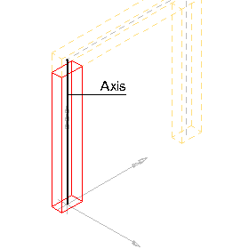
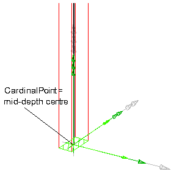
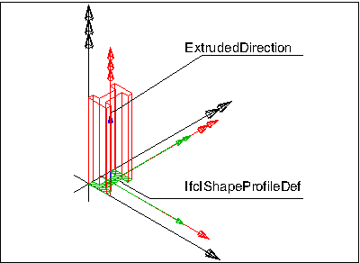
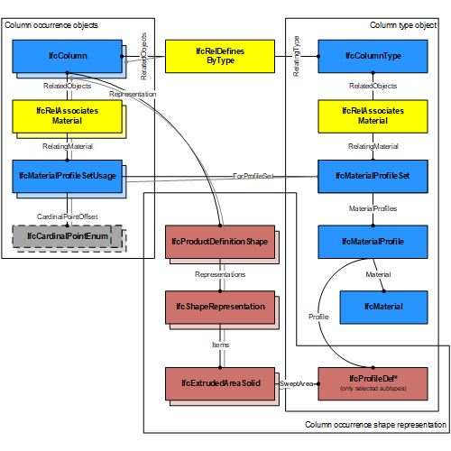
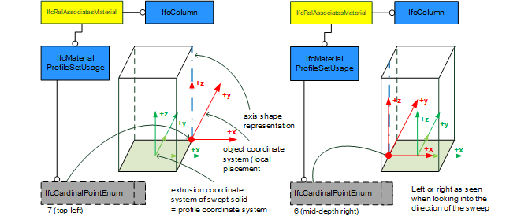
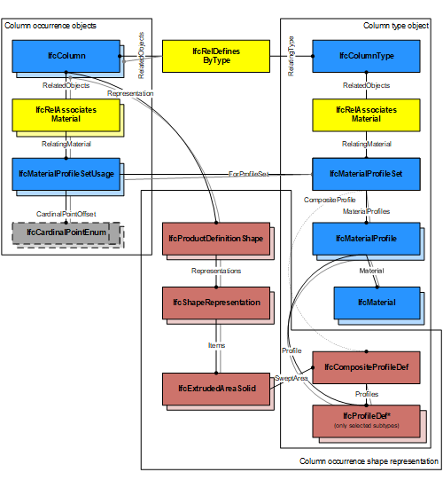

# IfcColumn

An _IfcColumn_ is a vertical structural member which often is aligned with a structural grid intersection. It represents a vertical, or nearly vertical, structural member that transmits, through compression, the weight of the structure above to other structural elements below. It represents such a member from an architectural point of view. It is not required to be load bearing.

> NOTE  Definition according to ISO 6707-1
> structural member of slender form, usually vertical, that transmits to its base the forces, primarily in compression, that are applied to it.

There are two main representations for column occurrences:

- _IfcColumn_ with _IfcMaterialProfileSetUsage_ is used for all occurrences of columns, that have a profile defined that is swept along a directrix. The profile might be changed uniformly by a taper definition along the directrix. The profile parameter and its cardinal point of insertion can be fully described by the _IfcMaterialProfileSetUsag_e. These columns are always represented geometricly by an 'Axis' and a 'SweptSolid' or 'AdvancedSweptSolid' shape representation (or by a 'Clipping' geometry based on the swept solid), if a 3D geometric representation is assigned.

- _IfcColumn_ is used for all other occurrences of columns, particularly for columns with changing profile sizes along the extrusion, or columns defined by non-linear extrusion, or columns having only 'Brep', or 'SurfaceModel' geometry, or if a more parametric representation is not intended.

> NOTE  The entity IfcColumnStandardCase has been deprecated, IfcColumn with IfcMaterialProfileSetUsage is used instead.

For any longitudial structural member, not constrained to be predominately horizontal nor vertical, or where this semantic information is irrelevant, the entity _IfcMember_ exists.

> NOTE  The representation of a column in a structural analysis model is provided by _IfcStructuralCurveMember_ being part of an _IfcStructuralAnalysisModel_.

> HISTORY  New entity in IFC1.0

## Attributes

### PredefinedType
Predefined generic type for a column that is specified in an enumeration. There may be a property set given specifically for the predefined types.
> NOTE  The _PredefinedType_ shall only be used, if no _IfcColumnType_ is assigned, providing its own _IfcColumnType.PredefinedType_.

{ .change-ifc2x4}
> IFC4 CHANGE The attribute has been added at the end of the entity definition.

## Formal Propositions

### CorrectPredefinedType
Either the _PredefinedType_ attribute is unset (e.g. because an _IfcColumnType_ is associated), or the inherited attribute _ObjectType_ shall be provided, if the _PredefinedType_ is set to USERDEFINED.

### CorrectTypeAssigned
Either there is no column type object associated, i.e. the _IsTypedBy_ inverse relationship is not provided, or the associated type object has to be of type _IfcColumnType_.

## Concepts

### Axis 3D Geometry

The axis representation can be used to represent the system
 length of a column that may extent the body length of the
 column.

> NOTE  The 'Axis' is used to locate the
> material profile set, if the material association is of type IfcMaterialProfileSetUsage.

The following additional constraints apply to the 'Axis'
representation, if an IfcMaterialProfileSetUsage is provided and the 'Body' shape representation has the
RepresentationType: 'SweptSolid':

* Axis
	+ IfcPolyline having two Points, or
	IfcTrimmedCurve with BasisCurve of Type
	IfcLine for 'SweptSolid' provided as
	IfcExtrudedAreaSolid. The axis curve lies on the z axis of
	the object coordinate system.
	+ IfcTrimmedCurve with BasisCurve of Type
	IfcCircle for 'SweptSolid' provided as
	IfcRevolvedAreaSolid. The axis curve lies on the x/z plane
	of the object coordinate system, the tangent at the start is along
	the positive z-axis.

 

> EXAMPLE  As shown in Figure 213, the axis shall be defined along the z axis of
> the object coordinate system. The axis representation can be used to
> represent the system length of a column that may extent the body
> length of the column.

Figure 213 — Column axis representation

 

> EXAMPLE  As shown in Figure 214, the axis representation shall be used to represent the cardinal point as the offset between the 'Axis' and the extrusion path of the column. The extrusion path is provided as IfcExtrudedAreaSolid.ExtrudedDirection and should be parallel to the 'Axis'. It has to be guaranteed that the value provided by IfcMaterialProfileSetUsage.CardinalPoint is consistent to the IfcExtrudedAreaSolid.Position.

Figure 214 — Column axis cardinal point

 

### Body AdvancedSweptSolid Geometry

The following additional constraints apply to the
'AdvancedSweptSolid' representation type:

* Solid: IfcSurfaceCurveSweptAreaSolid,
IfcFixedReferenceSweptAreaSolid,
IfcExtrudedAreaSolidTapered,
IfcRevolvedAreaSolidTapered shall be supported.

> NOTE  View definitions and implementer
> agreements can further constrain the allowed swept solid
> types.
* Profile: see 'SweptSolid' geometric
representation
* Extrusion: not applicable

### Body Clipping Geometry

The following constraints apply to the 'Clipping' representation:

* Solid: see 'SweptSolid' geometric representation
* Profile: see 'SweptSolid' geometric
representation
* Extrusion: see 'SweptSolid' geometric
representation
* Boolean result: The IfcBooleanClippingResult
shall be supported, allowing for Boolean differences between the
swept solid (here IfcExtrudedAreaSolid) and one or several
IfcHalfSpaceSolid.

Figure 216 illustrates a 'Clipping' geometric representation with use of IfcBooleanClippingResult between
an IfcExtrudedAreaSolid and an IfcHalfSpaceSolid to create a clipped body.

Figure 216 — Column clipping

### Body SweptSolid Geometry

The following additional constraints apply to the 'SweptSolid'
representation:

* Solid: IfcExtrudedAreaSolid,
IfcRevolvedAreaSolid shall be supported
* Profile: all subtypes of IfcProfileDef (with
exception of IfcArbitraryOpenProfileDef)
* Extrusion: All extrusion directions shall be
supported

Figure 215 illustrates a 'SweptSolid' geometric representation. There are no restrictions or conventions on
how to use the local placement (black), solid of extrusion placement (red) and profile placement (green).

Figure 215 — Column swept solid

Figure 216 illustrates use of a special profile type (here IfcIShapeProfileDef) for the definition of the IfcExtrudedAreaSolid.

Figure 216 — Column extrusion of I-Shape

### Material Profile Set

The material information of the IfcColumn is defined by the
IfcMaterialProfileSet or as fallback by IfcMaterial, and it is attached either directly or at the IfcColumnType. In this case, the material information does not allow to construct a shape by applying the profile definition to the axis representation, to enable this parametric definition, the IfcMaterialProfileSetUsage has to be used instead.

### Material Profile Set Usage

The Material Profile Set Usage defines the assignment of an IfcMaterialProfileSetUsage to the
IfcColumnType providing a common profile definition to all
 occurrences of this IfcColumnType. Columns with
composite profile can be represented by refering to
 several IfcMaterialProfile's within the
IfcMaterialProfileSet that is referenced from the
IfcMaterialProfileSetUsage.

Figure 211 illustrates assignment of IfcMaterialProfileSetUsage and IfcMaterialProfileSet to the IfcColumn as the column occurrence and to the IfcColumnType. The same IfcMaterialProfileSet shall be shared by many occurrences of IfcMaterialProfileSetUsage. This relationship shall be consistent to the relationship between the IfcColumnType and the IfcColumnStandardCase.

Figure 211 — Column profile usage

Figure 212 illustrates cardinal point alignment.

> NOTE  It has to be guaranteed that the use of IfcCardinalPointEnum is consistent to the placement of the
> extrusion body provided by IfcExtrudedAreaSolid.Position

> NOTE  The cardinal points 7 (top left), and 6 (mid-depth right) are assigned according to the
> definition at IfcCardinalPointReference

Figure 212 — Column cardinal points

Figure 213 illustrates assignment of a composite profile by using IfcCompositeProfile for geometric representation and several IfcMaterialProfile's within the IfcMaterialProfileSet. The number of IfcMaterialProfile's within the IfcMaterialProfileSet is restricted to maximal 2 and requires the use of IfcExtrudedAreaSolidTapered, or IfcRevolvedAreaSolidTapered for the correct 'Body' shape representation.

Figure 213 — Column composite profiles

### Object Typing

### Property Sets for Objects

### Quantity Sets

### Spatial Containment

The IfcColumn, as any subtype of IfcBuildingElement,
may participate alternatively in one of the two different containment relationships:

* the Spatial Containment (defined here), or
* the Element Composition.
