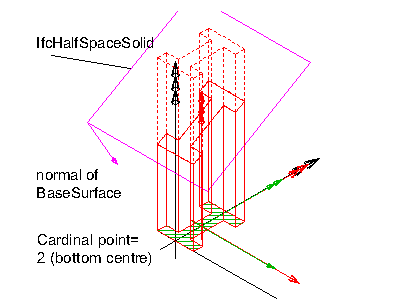
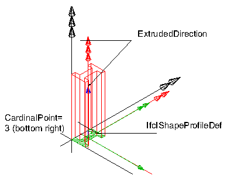
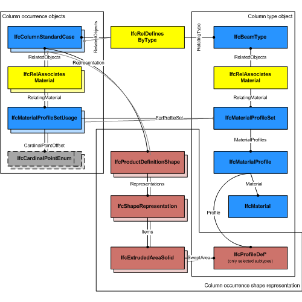
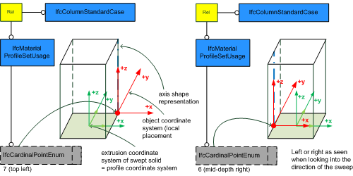
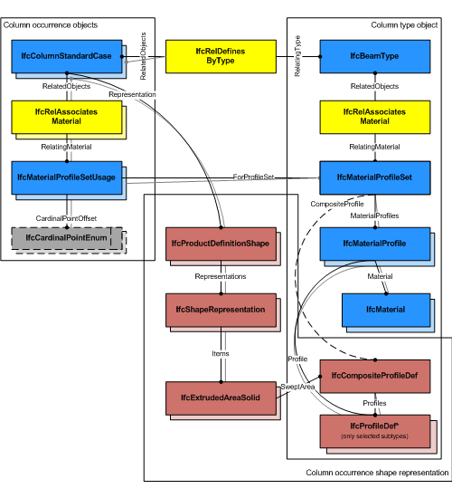

# IfcColumnStandardCase

The standard column, _IfcColumnStandardCase_, defines a column with certain constraints for the provision of material usage, parameters and with certain constraints for the geometric representation. The _IfcColumnStandardCase_ handles all cases of columns, that:

<ul>
<li>have a reference to the <em>IfcMaterialProfileSetUsage</em>
defining the material profile association of the column with the
cardinal point of its insertion relative to the local
placement.</li>
<li>are based on a sweep of a planar profile, or set of profiles,
as defined by the <em>IfcMaterialProfileSet</em></li>
<li>have an 'Axis' shape representation with constraints provided
below in the geometry use definition</li>
<li>have a 'Body' shape representation with constraints provided
below in the geometry use definition</li>
<li>have a start profile, or set of profiles, that is swept along
the directrix and might be changed uniformly by a taper
definition</li>
<li>are consistent in using the correct cardinal point offset of
the profile as compared to the 'Axis' and 'Body' shape
representation</li>
<li>are extruded perpendicular to the profile definition
plane</li>
<li style="list-style-type:none">
<blockquote class="note"><small>NOTE  View definitions and implementer
agreements may further constrain the applicable geometry types,
e.g. by excluding tapering from an <em>IfcBeamStandardCase</em>
implementation.</small></blockquote>
</li>
</ul>
> HISTORY  New entity in IFC4.

**_Geometric Representations_**

The geometric representation of _IfcColumnStandardCase_ is defined using the following multiple shape representations for its definition:

* **Axis**: A three-dimensional open curve (subtype of _IfcBoundedCurve_) defining the axis for the standard column. The cardinal point is determined by the column axis.
* **Body**: A Swept Solid Representation or a CSG representation defining the 3D shape of the standard column.

> NOTE  It is invalid to exchange a 'SurfaceModel', 'Brep', or 'MappedRepresentation' representation for the 'Body' shape representation of an _IfcColumnStandardCase_.

## Formal Propositions

### HasMaterialProfileSetUsage
A valid instance of _IfcColumnStandardCase_ relies on the provision of an _IfcMaterialProfileSetUsage_.

## Concepts

### Axis 3D Geometry

The following additional constraints apply to the 'Axis'
representation, if the 'Body' shape representation has the
RepresentationType : 'SweptSolid':

* Axis
	+ IfcPolyline having two Points, or
	IfcTrimmedCurve with BasisCurve of Type
	IfcLine for 'SweptSolid' provided as
	IfcExtrudedAreaSolid. The axis curve lies on the z axis of
	the object coordinate system.
	+ IfcTrimmedCurve with BasisCurve of Type
	IfcCircle for 'SweptSolid' provided as
	IfcRevolvedAreaSolid. The axis curve lies on the x/z plane
	of the object coordinate system, the tangent at the start is along
	the positive z-axis.

 

> EXAMPLE  As shown in Figure 221, the axis shall be defined along the z axis of
> the object coordinate system. The axis representation can be used to
> represent the system length of a column that may extent the body
> length of the column.

Figure 221 — Column axis representation

 

> EXAMPLE  As shown in Figure 222, the axis representation shall be used to represent the cardinal point as the offset between the 'Axis' and the extrusion path of the column. The extrusion path is provided as IfcExtrudedAreaSolid.ExtrudedDirection and should be parallel to the 'Axis'. It has to be guaranteed that the value provided by IfcMaterialProfileSetUsage.CardinalPoint is consistent to the IfcExtrudedAreaSolid.Position.

Figure 222 — Column axis cardinal point

 

### Body AdvancedSweptSolid Geometry

The following additional constraints apply to the
'AdvancedSweptSolid' representation type:

* Solid: IfcSurfaceCurveSweptAreaSolid,
IfcFixedReferenceSweptAreaSolid,
IfcExtrudedAreaSolidTapered,
IfcRevolvedAreaSolidTapered shall be supported.

> NOTE  View definitions and implementer
> agreement can further constrain the allowed swept solid
> types.
* Profile: see 'SweptSolid' geometric
representation
* Profile Position : see 'SweptSolid' geometric
representation
* Extrusion: not applicable

### Body Clipping Geometry

The following constraints apply to the 'Clipping'
representation:

* Solid: see 'SweptSolid' geometric representation
* Profile: see 'SweptSolid' geometric
representation
* Profile Position : see 'SweptSolid' geometric
representation
* Extrusion: see 'SweptSolid' geometric
representation
* Orientation: see 'SweptSolid' geometric
representation
* Boolean result: The IfcBooleanClippingResult
shall be supported, allowing for Boolean differences between the
swept solid (here IfcExtrudedAreaSolid) and one or several
IfcHalfSpaceSolid (or its subtypes).

Figure 223 illustrates a 'Clipping' geometric representation with use of IfcBooleanClippingResult between
an IfcExtrudedAreaSolid and an IfcHalfSpaceSolid to create a clipped body, with cardinal point applied as 2 (bottom centre).

Figure 223 — Column body clipping

### Body SweptSolid Geometry

The following additional constraints apply to the 'SweptSolid'
representation:

* Solid: IfcExtrudedAreaSolid,
IfcRevolvedAreaSolid shall be supported
* Profile: all subtypes of IfcProfileDef (with
exception of IfcArbitraryOpenProfileDef)
* Profile Position : For all single profiles, the
IfcParameterizedProfileDef.Position shall be NIL, or
having Location = 0.,0. and RefDirection =
1.,0.
* Extrusion: perpendicular to the profile direction. The
IfcExtrudedAreaSolid.ExtrudedDirection shall be
[0.,0.,1.].
* Orientation: The y-axis of the profile, as determined
by IfcSweptAreaSolid.Position.P[2] shall point to the
Y-Axis. It indicates the "role" of the column, a role=0°
means y-axis of profile = Y-axis of reference coordinate
system.

Figure 222 illustrates a standard geometric representation with cardinal point applied as 5 (mid-depth centre).

The following interpretation of dimension parameter applies for rectangular columns:

* IfcRectangleProfileDef.YDim interpreted as column width
* IfcRectangleProfileDef.XDim interpreted as column depth

The following interpretation of dimension parameter applies for circular columns:

* IfcCircleProfileDef.Radius interpreted as column radius.

Figure 222 — Column body extrusion

### Material Profile Set Usage

The IfcColumnStandardCase defines in addition that the
IfcColumnType should have a unique
 IfcMaterialProfileSet, that is referenced by the
IfcMaterialProfileSetUsage assigned to all occurrences of
this IfcColumnType.
Composite profile columns can be represented by referring to
several IfcMaterialProfile's within the
IfcMaterialProfileSet that is referenced from the
IfcMaterialProfileSetUsage.

Figure 219 illustrates assignment of IfcMaterialProfileSetUsage and IfcMaterialProfileSet to the IfcColumnStandardCase as the column occurrence and to the IfcColumnType. The same IfcMaterialProfileSet shall be shared by many occurrences of IfcMaterialProfileSetUsage. This relationship shall be consistent to the relationship between the IfcColumnType and the IfcColumnStandardCase.

Figure 219 — Column profile usage

Figure 220 illustrates cardinal point alignment.

> NOTE  It has to be guaranteed that the use of IfcCardinalPointEnum is consistent to the placement of the
> extrusion body provided by IfcExtrudedAreaSolid.Position

> NOTE  The cardinal points 7 (top left), and 6 (mid-depth right) are assigned according to the
> definition at IfcCardinalPointReference

Figure 220 — Column cardinal points

Figure 221 illustrates assignment of a composite profile by using IfcCompositeProfile for geometric representation and several IfcMaterialProfile's within the IfcMaterialProfileSet. The number of IfcMaterialProfile's within the IfcMaterialProfileSet is restricted to maximal 2 and requires the use of IfcExtrudedAreaSolidTapered, or IfcRevolvedAreaSolidTapered for the correct 'Body' shape representation.

Figure 221 — Column composite profiles

### Product Placement

The following restriction is imposed:

* The local placement shall provide the location and directions
for the standard column, the x/y plane is the plane for the start
profile, and the z-axis is the extrusion axis for the column body (in
case of rotation, the tangent direction).

