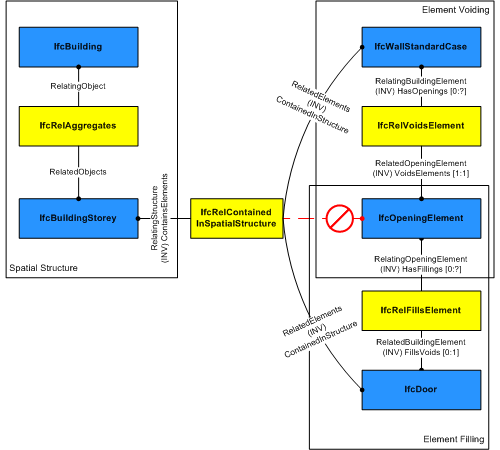

# IfcDoor

The door is a built element that is predominately used to provide controlled access for people, goods, animals and vehicles. It includes constructions with hinged, pivoted, sliding, and additionally revolving and folding operations.

> NOTE  Definition according to ISO 6707-1: construction for closing an opening, intended primarily for access with hinged, pivoted or sliding operation.

The _IfcDoor_ defines a particular occurrence of a door inserted in the spatial context of a project. A door can:
* be inserted as a filler in an opening using the _IfcRelFillsElement_ relationship, then the _IfcDoor_ has an inverse attribute _FillsVoids_ provided;
>NOTE  View definitions or implementer agreements may restrict the relationship to only include one door into one opening.

* be part of an element assembly, in general an _IfcCurtainWall_, using the _IfcRelAggregates_ relationship, then the _IfcDoor_ has an inverse attribute _Decomposes_ is provided;
* be a "free standing" door, then the _IfcDoor_ has no inverse attributes _FillsVoids_ or _Decomposes_ provided.

This specification provides two main representations for door occurrences:

* _IfcDoor_ used for all occurrences of doors, that have a 'Profile' shape representation defined to which a set of shape parameters for lining and framing properties apply. Additionally it requires the provision of an _IfcDoorType_ that references one _IfcDoorLiningProperties_ and one to many _IfcDoorPanelProperties_;

> NOTE  The entity _IfcDoorStandardCase_ has been deprecated.

* _IfcDoor_ used for all other occurrences of doors, particularly for doors having only 'Brep', or 'SurfaceModel' geometry without applying shape parameters.

The actual parameters of the door and/or its shape are defined by the _IfcDoor_ as the occurrence definition or by the _IfcDoorType_ as the object type definition. The following parameters are provided:

* at the _IfcDoor_ for occurrence specific parameters. The _IfcDoor_ specifies:
    * the door width and height
    * the door opening direction (by the y-axis of the _ObjectPlacement_)
* at the _IfcDoorType_, to which the _IfcDoor_ is related by the inverse relationship _IsTypedBy_ pointing to _IfcRelDefinesByType_, for type parameters common to all occurrences of the same type.
    * the operation type (single swing, double swing, revolving, etc.)
    * the door hinge side (by using two different styles for right and left opening doors)
    * the construction material type
    * the particular attributes for the lining by the _IfcDoorLiningProperties_
    * the particular attributes for the panels by the _IfcDoorPanelProperties_

> HISTORY  New entity in IFC1.0.

{ .change-ifc2x4}
> IFC4 CHANGE  The attributes _PredefinedType_ and _OperationType_ are added, the applicable type object has been changed to _IfcDoorType_.

The geometric representation of _IfcDoor_ is given by the _IfcProductDefinitionShape_, allowing multiple geometric representations. The _IfcDoor_ may get its parameter and shape from the _IfcDoorType_. If an _IfcRepresentationMap_ (a block definition) is defined for the _IfcDoorType_, then the _IfcDoor_ inserts it through the _IfcMappedItem_.

The geometric representation of _IfcDoor_ is defined using the following (potentially multiple) _IfcShapeRepresentation_'s for its _IfcProductDefinitionShape_:

* **Profile**: A 'Curve3D' consisting of a single losed curve defining the outer boundary of the door (lining). The door parametric representation uses this profile in order to apply the door lining and panel parameter. If not provided, the profile of the _IfcOpeningElement_ is taken.
* **FootPrint**: A 'GeometricCurveSet', or 'Annotation2D' representation defining the 2D shape of the door
* **Body**: A 'SweptSolid', 'SurfaceModel', or 'Brep' representation defining the 3D shape of the door.

In addition the parametric representation of a (limited) door shape is available by applying the parameters from _IfcDoorType_ referencing _IfcDoorLiningProperties_ and _IfcDoorPanelProperties_. The purpose of the parameter is described at those entities and below (door opening operation by door type).
The overall size of the _IfcDoor_ to be used to apply the lining or panel parameter provided by the _IfcDoorType_ is determined by the IfcShapeRepresentation with the RepresentationIdentifier = 'Profile'.

## Attributes

### OverallHeight
Overall measure of the height, it reflects the Z Dimension of a bounding box, enclosing the body of the door opening. If omitted, the _OverallHeight_ should be taken from the geometric representation of the _IfcOpening_ in which the door is inserted.
 NOTE The body of the door might be taller then the door opening (e.g. in cases where the door lining includes a casing). In these cases the _OverallHeight_ shall still be given as the door opening height, and not as the total height of the door lining.

### OverallWidth
Overall measure of the width, it reflects the X Dimension of a bounding box, enclosing the body of theE door opening. If omitted, the _OverallWidth_ should be taken from the geometric representation of the _IfcOpening_ in which the door is inserted.
 NOTE The body of the door might be wider then the door opening (e.g. in cases where the door lining includes a casing). In these cases the _OverallWidth_ shall still be given as the door opening width, and not as the total width of the door lining.

### PredefinedType

### OperationType
Type defining the general layout and operation of the door type in terms of the partitioning of panels and panel operations.
 NOTE The _OperationType_ shall only be used, if no type object _IfcDoorType_ is assigned, providing its own _IfcDoorType.OperationType_.

### UserDefinedOperationType
Designator for the user defined operation type, shall only be provided, if the value of _OperationType_ is set to USERDEFINED.

## Formal Propositions

### CorrectStyleAssigned
Either there is no door type object associated, i.e. the _IsTypedBy_ inverse relationship is not provided, or the associated type object has to be of type _IfcDoorType_.
> NOTEnbsp; The deprecated type _IfcDoorStyle_ is still included for backward compatibility reasons.

### CorrectPredefinedType
Either the _PredefinedType_ attribute is unset (e.g. because an _IfcDoorType_ is associated), or the inherited attribute _ObjectType_ shall be provided, if the _PredefinedType_ is set to USERDEFINED.

### CorrectTypeAssigned
Either there is no door type object associated, i.e. the _IsTypedBy_ inverse relationship is not provided, or the associated type object has to be of type _IfcDoorType_.

## Concepts

### Door Attributes

The opening direction is determined by the local placement of
IfcDoor and the OperationType of the IfcDoorType as
shown in Figure 228.

The IfcDoorTypeOperationEnum defines the general layout of the door type and its symbolic presentation. Depending on the enumerator, the appropriate instances of IfcDoorLiningProperties and IfcDoorPanelProperties are attached in the list of HasPropertySets. The IfcDoorTypeOperationEnum mainly determines the hinge side (left hung, or right hung), the operation (swinging, sliding, folding, etc.) and the number of panels.

> NOTE  There are different definitions
> in various countries on what a left opening or left hung or left
> swing door is (same for right). Therefore the IFC definition may
> derivate from the local standard and need to be mapped
> appropriately.

Opening
directions
Definitions
Reference to other
standards

The door panel (for swinging doors) opens
always into the direction of the positive Y axis of the local
placement. The determination of whether the door opens to the left
or to the right is done at the level of the IfcDoorType.
Here it is a left side opening door given
by IfcDoorType.OperationType =
SingleSwingLeft
referred to as LEFT HAND (LH) in US *

referred to as DIN-R (right hung) in Germany

If the door should open to the other side,
then the local placement has to be changed. It is still a left side
opening door, given by IfcDoorType.OperationType =
 SingleSwingLeft
referred to as RIGHT HAND REVERSE (RHR) in
US *

referred to as DIN-R (right hung) in Germany

If the door panel (for swinging doors)
opens to the right, a separate door style needs to be used (here
IfcDoorTypee.OperationType = SingleSwingRight) and it always
opens into the direction of the positive Y axis of the local
placement.
referred to as RIGHT HAND (RH) in US *

referred to as DIN-L (left hung) in Germany

If the door panel (for swinging doors)
opens to the right, and into the opposite directions, the local
placement of the door need to change. The door style is given by
IfcDoorType.OperationType = SingleSwingRight.
referred to as LEFT HAND REVERSE (LHR) in US
*

referred to as DIN-L (left hung) in Germany
* it assumes that the
'inside/private/primary' space is above (top in the pictures) and
 the 'outside/public/secondary' space is below (bottom in the
pictures).
Figure 228 — Door swing

> NOTE  The OverallWidth and
> OverallHeight parameters are for informational purpose
> only.

### Material Constituent Set

The material of the IfcDoor is defined by the
IfcMaterialConstituentSet or as fall back by
IfcMaterial and attached by the
IfcRelAssociatesMaterial relationship. It is accessible by the inverse HasAssociations relationship.

The following keywords for IfcMaterialConstituentSet.MaterialConstituents[n].Name shall be used:

* 'Lining' - to indicate that the material constituent applies to to the door lining
* 'Framing' - to indicate that the material constituent applies to to the door framing, if not provided, the 'Lining' material information applied to frams as well
* 'Glazing' - to indicate that the material constituent applies to to the glazing as well

If the fall back single IfcMaterial is referenced, it applies to the lining and framing of the door.

### Object Typing

### Product Local Placement

The following restriction is imposed:

1. The PlacementRelTo relationship of
IfcLocalPlacement shall point to the local placement of the
same element (if given), in which the IfcDoor is used as a
filling (normally an IfcOpeningElement), as provided by the
IfcRelFillsElement relationship;
2. If the IfcDoor is part of an assembly, e.g. an
IfcCurtainWall, then the PlacementRelTo
relationship of IfcLocalPlacement shall point (if given) to
the local placement of that assembly;
3. If the IfcDoor is not inserted into an
IfcOpeningElement, then the PlacementRelTo
relationship of IfcLocalPlacement shall point (if given) to
the local placement of the same IfcSpatialStructureElement
that is used in the ContainedInStructure inverse attribute
or to a referenced spatial structure element at a higher
level.

> NOTE  The product placement is used to determine the opening direction of the door.

### Profile 3D Geometry

The door profile is represented by a three-dimensional closed
curve within a particular shape representation. The profile is used
to apply the parameter of the parametric door representation. The
 following attribute values for the IfcShapeRepresentation
holding this geometric representation shall be used:

* RepresentationIdentifier : 'Profile'
* RepresentationType : 'Curve3D' or 'GeometricCurveSet',
in case of 'GeometricCurveSet' only a single closed curve shall be
contained in the set of IfcShapeRepresentation.Items.

The following additional constraints apply to the 'Profile'
representation type:

* Curve: being an IfcPolyline defining a
rectangle.
* Position: The curve shall lie in the xz plane of the
 object placement coordinate (the y coordinate values of the
IfcCartesianPoint's shall be 0.).

 

> EXAMPLE  Figure 229 illustrates applying the door lining parameters to the
> door profile shape representation. The profile defines the outer
> boundary to which the door lining parameters relate as:

>
> * IfcDoorLiningProperties.LiningDepth starting at distance
> defined by LiningOffset going into the positive y
> direction.
> * IfcDoorLiningProperties.LiningThickness offset into the
> inner side of the rectangle.
> * IfcDoorLiningProperties.LiningOffset distance along the
> positive y direction to where the LiningDepth applies.
> * IfcDoorLiningProperties.ThresholdThickness starting at
> the bottom edge of the rectangle into the inner side of the
> rectangle
> * IfcDoorLiningProperties.ThresholdDepth starting at
> distance defined by LiningOffset going into the positive y
> direction.
> * IfcDoorLiningProperties.TransomOffset starting at the
> bottom edge of the rectangle (along local x axis) into the inner
> side of the rectangle, distance provided as percentage of overall
> height. Distance to the centre line of the transom.
>

Figure 229 — Door profile

 

### Property Sets for Objects

### Quantity Sets

### Spatial Containment

The IfcDoor, as any subtype of IfcBuildingElement,
may participate alternatively in one of the two different containment relationships:

* the Spatial Containment (defined here), or
* the Element Composition.

The IfcDoor may also be connected to the IfcOpeningElement in which it is placed as a filler. In this case, the spatial containment relationship shall be provided, see Figure 230.

> NOTE  The containment shall be
> defined independently of the filling relationship, that is, even if
>
>  the IfcDoor is a filling of an opening established by
> IfcRelFillsElement, it is also contained in the spatial
> structure by
>  IfcRelContainedInSpatialStructure.

Figure 230 — Door spatial containment

 
