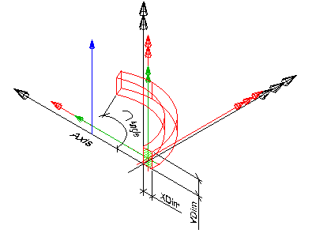

# IfcMember

An _IfcMember_ is a structural member designed to carry loads between or beyond points of support. It is not required to be load bearing. The orientation of the member (being horizontal, vertical or sloped) is not relevant to its definition (in contrary to _IfcBeam_ and _IfcColumn_). An _IfcMember_ represents a linear structural element from an architectural or structural modeling point of view and shall be used if it cannot be expressed more specifically as either an _IfcBeam_ or an _IfcColumn_.

There are two main representations for member occurrences:

- _IfcMember_ with _IfcMaterialProfileSetUsage_ is used for all occurrences of members, that have a profile defined that is swept along a directrix. The profile might be changed uniformly by a taper definition along the directrix. The profile parameter and its cardinal point of insertion can be fully described by the _IfcMaterialProfileSetUsage_. These members are always represented geometricly by an 'Axis' and a 'SweptSolid' or 'AdvancedSweptSolid' shape representation (or by a 'Clipping' geometry based on the swept solid), if a 3D geometric representation is assigned.

- _IfcMember_ without _IfcMaterialProfileSetUsage_ is used for all other occurrences of members, particularly for members with changing profile sizes along the extrusion, or members defined by non-linear extrusion, or members having only 'Brep', or 'SurfaceModel' geometry, or if a more parametric representation is not intended.

> NOTE  The representation of a member in a structural analysis model is provided by _IfcStructuralCurveMember_ being part of an _IfcStructuralAnalysisModel_.

> HISTORY  New entity in IFC2x2 Addendum 1.

## Attributes

### PredefinedType
Predefined generic type for a member that is specified in an enumeration. There may be a property set given for the predefined types.
> NOTE  The _PredefinedType_ shall only be used, if no _IfcMemberType_ is assigned, providing its own _IfcMemberType.PredefinedType_.

{ .change-ifc2x4}
> IFC4 CHANGE The attribute has been added at the end of the entity definition.

## Formal Propositions

### CorrectPredefinedType
Either the _PredefinedType_ attribute is unset (e.g. because an _IfcMemberType_ is associated), or the inherited attribute _ObjectType_ shall be provided, if the _PredefinedType_ is set to USERDEFINED.

### CorrectTypeAssigned
Either there is no member type object associated, i.e. the _IsTypedBy_ inverse relationship is not provided, or the associated type object has to be of type _IfcMemberType_.

## Concepts

### Axis 3D Geometry

The axis representation can be used to represent the system length of a member that may extent the body length of the member.

> NOTE&nbsp; The 'Axis' is not used to locate the material profile set, only the subtype IfcMemberStandardCase provides this capability.

#### Axis_IfcBoundedCurve_Curve3D

Three-dimensional reference curve for the member.

### Body AdvancedSweptSolid Geometry

The following additional constraints apply to the 'AdvancedSweptSolid' representation type:

* **Solid**: IfcSurfaceCurveSweptAreaSolid, IfcFixedReferenceSweptAreaSolid, IfcExtrudedAreaSolidTapered, IfcRevolvedAreaSolidTapered shall be supported. 
>> NOTE&nbsp; View definitions and implementer agreements can further constrain the allowed swept solid types. 
* **Profile**: see 'SweptSolid' geometric representation
* **Extrusion**: not applicable

_MappedRepresentation Representation Type_

### Body Clipping Geometry

The following constraints apply to the 'Clipping' representation:

* **Solid**: see 'SweptSolid' geometric representation
* **Profile**: see 'SweptSolid' geometric representation
* **Extrusion**: see 'SweptSolid' geometric representation
* **Boolean result**: The IfcBooleanClippingResult shall be supported, allowing for Boolean differences between the swept solid (here IfcExtrudedAreaSolid) and one or several IfcHalfSpaceSolid (or its subtypes).

Figure 1 illustrates a 'Clipping' geometric representation with use of IfcBooleanClippingResult between an IfcExtrudedAreaSolid and an IfcHalfSpaceSolid to create a clipped body.

### Body SweptSolid Geometry

The following additional constraints apply to the 'SweptSolid' representation:

* **Solid**: IfcExtrudedAreaSolid, IfcRevolvedAreaSolid shall be supported
* **Profile**: all subtypes of IfcProfileDef (with exception of IfcArbitraryOpenProfileDef) 
* **Extrusion**: All extrusion directions shall be supported.

Figure 1 illustrates a 'SweptSolid' geometric representation. There are no restrictions or conventions on how to use the local placement (black), solid of extrusion placement (red) and profile placement (green).

### Material Profile Set

The material of the IfcMember is defined by the IfcMaterialProfileSet or as fallback by IfcMaterial, and it is attached either directly or at the IfcMemberType.

> NOTE&nbsp; It is illegal to assign an IfcMaterialProfileSetUsage to an IfcMember. Only the subtype IfcMemberStandardCase supports this concept.

### Object Typing

### Product Assignment

#### IfcStructuralCurveMember

An idealized structural member corresponding to the member.

#### IfcTask

A task for operating on the member.

### Property Sets for Objects

### Quantity Sets

### Spatial Containment

The IfcMember, as any subtype of IfcBuildingElement, may participate alternatively in one of the two different containment relationships:

* the _Spatial Containment_ (defined here), or
* the _Element Composition_.

#### IfcBuildingStorey

Default spatial container

#### IfcBuilding

Spatial container for the element if it cannot be assigned to a building storey

#### IfcSite

Spatial container for the element in case that it is placed on site (outside of building)

