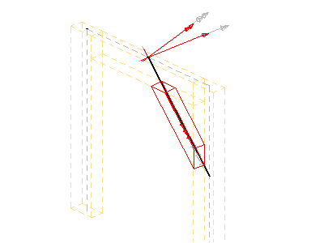
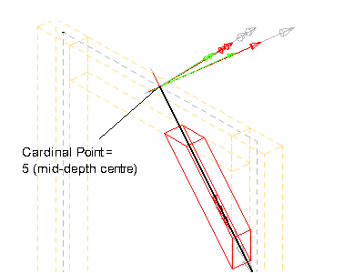
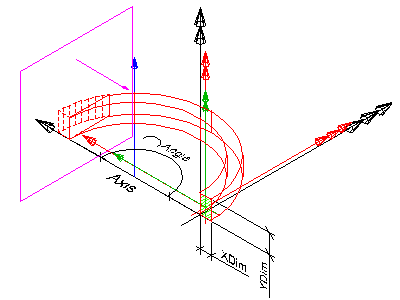
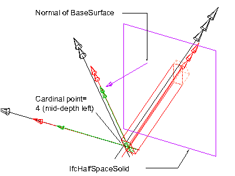
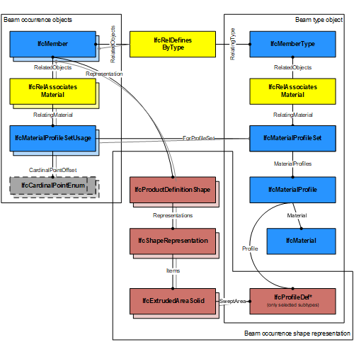
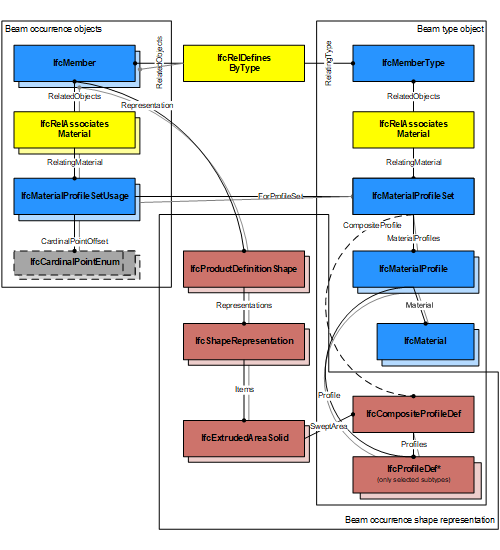

# IfcMember

An _IfcMember_ is a structural member designed to carry loads between or beyond points of support. It is not required to be load bearing. The orientation of the member (being horizontal, vertical or sloped) is not relevant to its definition (in contrary to _IfcBeam_ and _IfcColumn_). An _IfcMember_ represents a linear structural element from an architectural or structural modeling point of view and shall be used if it cannot be expressed more specifically as either an _IfcBeam_ or an _IfcColumn_.

There are two main representations for member occurrences:

- _IfcMember_ with _IfcMaterialProfileSetUsage_ is used for all occurrences of members, that have a profile defined that is swept along a directrix. The profile might be changed uniformly by a taper definition along the directrix. The profile parameter and its cardinal point of insertion can be fully described by the _IfcMaterialProfileSetUsage_. These members are always represented geometricly by an 'Axis' and a 'SweptSolid' or 'AdvancedSweptSolid' shape representation (or by a 'Clipping' geometry based on the swept solid), if a 3D geometric representation is assigned.

- _IfcMember_ without _IfcMaterialProfileSetUsage_ is used for all other occurrences of members, particularly for members with changing profile sizes along the extrusion, or members defined by non-linear extrusion, or members having only 'Brep', or 'SurfaceModel' geometry, or if a more parametric representation is not intended.

> NOTE  The representation of a member in a structural analysis model is provided by _IfcStructuralCurveMember_ being part of an _IfcStructuralAnalysisModel_.

> HISTORY  New entity in IFC2x2 Addendum 1.

## Attributes

### PredefinedType
Predefined generic type for a member that is specified in an enumeration. There may be a property set given for the predefined types.
> NOTE  The _PredefinedType_ shall only be used, if no _IfcMemberType_ is assigned, providing its own _IfcMemberType.PredefinedType_.

{ .change-ifc2x4}
> IFC4 CHANGE The attribute has been added at the end of the entity definition.

## Formal Propositions

### CorrectPredefinedType
Either the _PredefinedType_ attribute is unset (e.g. because an _IfcMemberType_ is associated), or the inherited attribute _ObjectType_ shall be provided, if the _PredefinedType_ is set to USERDEFINED.

### CorrectTypeAssigned
Either there is no member type object associated, i.e. the _IsTypedBy_ inverse relationship is not provided, or the associated type object has to be of type _IfcMemberType_.

## Concepts

### Axis 3D Geometry

The axis representation can be used to represent the system
 length of a member that may extent the body length of the
 member.

> NOTE  The 'Axis' is used to locate the
> material profile set, if the material association is of type IfcMaterialProfileSetUsage.

The following additional constraints apply to the 'Axis'
representation, if an IfcMaterialProfileSetUsage is provided and the 'Body' shape representation has the
RepresentationType: 'SweptSolid':

* Axis
	+ IfcPolyline having two Points, or
	IfcTrimmedCurve with BasisCurve of Type
	IfcLine for 'SweptSolid' provided as
	IfcExtrudedAreaSolid. The axis curve lies on the z axis of
	the object coordinate system.
	+ IfcTrimmedCurve with BasisCurve of Type
	IfcCircle for 'SweptSolid' provided as
	IfcRevolvedAreaSolid. The axis curve lies on the x/z plane
	of the object coordinate system, the tangent at the start is along
	the positive z-axis.

 

> EXAMPLE  As shown in Figure 101, the axis representation can be used to represent the system length of a member that may extent the body length of the member.

Figure 235 — Member axis representation

 

> EXAMPLE  As shown in Figure 102, the axis representation shall be used to represent the cardinal point as the offset between the 'Axis' and the extrusion path of the member. The extrusion path is provided as IfcExtrudedAreaSolid.ExtrudedDirection and should be parallel to the 'Axis'. It has to be guaranteed that the value provided by IfcMaterialProfileSetUsage.CardinalPoint is consistent to the IfcExtrudedAreaSolid.Position.

Figure 236 — Member axis cardinal point

 

### Body AdvancedSweptSolid Geometry

The following constraints apply to the
'AdvancedSweptSolid' representation type:

* Solid: IfcSurfaceCurveSweptAreaSolid,
IfcFixedReferenceSweptAreaSolid,
IfcExtrudedAreaSolidTapered,
IfcRevolvedAreaSolidTapered shall be supported.

> NOTE  View definitions and implementer
> agreements can further constrain the allowed swept solid
> types.
* Profile: see 'SweptSolid' geometric
representation
* Extrusion: not applicable

The following additional constraints apply to the
'AdvancedSweptSolid' representation type, when an IfcMaterialProfileSetUsage is assigned to the IfcMember:

* Solid: IfcSurfaceCurveSweptAreaSolid,
IfcFixedReferenceSweptAreaSolid,
IfcExtrudedAreaSolidTapered,
IfcRevolvedAreaSolidTapered shall be supported.

> NOTE  View definitions and implementer
> agreement can further constrain the allowed swept solid
> types.

> NOTE  Using IfcExtrudedAreaSolidTapered,
> or IfcRevolvedAreaSolidTapered requires the use of two
> IfcMaterialProfile's within the
> IfcMaterialProfileSet assinged to the
> IfcMember
* Profile: see 'SweptSolid' geometric
representation
* Profile Position : see 'SweptSolid' geometric
representation
* Extrusion: not applicable

### Body Clipping Geometry

The following constraints apply to the 'Clipping'
representation:

* Solid: see 'SweptSolid' geometric representation
* Profile: see 'SweptSolid' geometric
representation
* Extrusion: see 'SweptSolid' geometric
representation
* Boolean result: The IfcBooleanClippingResult
shall be supported, allowing for Boolean differences between the
swept solid (here IfcExtrudedAreaSolid) and one or several
IfcHalfSpaceSolid (or its subtypes).

Figure 238 illustrates a 'Clipping' geometric representation with use of IfcBooleanClippingResult between an IfcExtrudedAreaSolid and an IfcHalfSpaceSolid to create a clipped body.

Figure 238 — Member clipping

The following constraints apply to the 'Clipping'
representation, when an IfcMaterialProfileSetUsage is assigned to the IfcMember:

* Solid: see 'SweptSolid' geometric representation
* Profile: see 'SweptSolid' geometric
representation
* Profile Position : see 'SweptSolid' geometric
representation
* Extrusion: see 'SweptSolid' geometric
representation
* Boolean result: The IfcBooleanClippingResult
shall be supported, allowing for Boolean differences between the
swept solid (here IfcExtrudedAreaSolid) and one or several
IfcHalfSpaceSolid (or its subtypes).

Figure 239 illustrates an advanced geometric representation with use of IfcBooleanClippingResult between
an IfcExtrudedAreaSolid and an IfcHalfSpaceSolid to create a clipped body, with cardinal point applied as 4 (mid-depth left).

Figure 239 — Member body clipping

### Body SweptSolid Geometry

The following constraints apply to the 'SweptSolid' representation:

* Solid: IfcExtrudedAreaSolid, IfcRevolvedAreaSolid shall be supported
* Profile: all subtypes of IfcProfileDef (with exception of IfcArbitraryOpenProfileDef)
* Extrusion: All extrusion directions shall be supported.

<>The following additional constraints apply to the 'SweptSolid'
representation, when an IfcMaterialProfileSetUsage is assigned to the IfcMember:

* Solid: IfcExtrudedAreaSolid,
IfcRevolvedAreaSolid shall be supported
* Profile: all subtypes of IfcProfileDef (with
exception of IfcArbitraryOpenProfileDef)
* Profile Position : For all single profiles, the
 IfcParameterizedProfileDef.Position shall be NIL, or
having Location = 0.,0. and RefDirection =
1.,0.
* Extrusion: perpendicular to the profile
direction.
* Orientation: The y-axis of the profile, as determined
by IfcSweptAreaSolid.Position.P[2] shall point to the
Z-Axis. It indicates the "role" of the column, a role=0°
means y-axis of profile = Z-axis of reference coordinate system.
In the exception of a vertical member, the y-axis shall point to
the Y-axis.

Figure 236 illustrates a 'SweptSolid' geometric representation with cardinal point applied as 1 (bottom left).

The following interpretation of dimension parameter applies for rectangular members:

* IfcRectangleProfileDef.YDim interpreted as member width
* IfcRectangleProfileDef.XDim interpreted as member depth

The following interpretation of dimension parameter applies for circular members:

* IfcCircleProfileDef.Radius interpreted as beam radius.

Figure 236 — Member body extrusion

### Material Profile Set

The material information of the IfcMember is defined by the
 IfcMaterialProfileSet or as fallback by IfcMaterial, and it is attached either directly or at the IfcMemberType. In this case, the material information does not allow to construct a shape by applying the profile definition to the axis representation, to enable this parametric definition, the IfcMaterialProfileSetUsage has to be used instead.

### Material Profile Set Usage

The material of the IfcMember is defined by
IfcMaterialProfileSetUsage and attached by the
IfcRelAssociatesMaterial.RelatingMaterial. It is
accessible by the inverse HasAssociations relationship.
 Composite profile members can be represented by refering to
several IfcMaterialProfile's within the
IfcMaterialProfileSet that is referenced from the
IfcMaterialProfileSetUsage.

Figure 233 illustrates assignment of IfcMaterialProfileSetUsage and IfcMaterialProfileSet to the IfcMember as the member occurrence and to the IfcMemberType. The same IfcMaterialProfileSet shall be shared by many occurrences of IfcMaterialProfileSetUsage. This relationship shall be consistent to the relationship between the IfcMemberType and the IfcMember.

Figure 233 — Member profile usage

Figure 234 illustrates assignment of a composite profile by using IfcCompositeProfile for geometric representation and several IfcMaterialProfile's within the IfcMaterialProfileSet. The number of IfcMaterialProfile's within the IfcMaterialProfileSet is restricted to maximal 2 and
requires the use of IfcExtrudedAreaSolidTapered, or IfcRevolvedAreaSolidTapered for the correct 'Body' shape representation.

Figure 234 — Member composite profiles

### Object Typing

### Property Sets for Objects

### Quantity Sets

### Spatial Containment

The IfcMember, as any subtype of IfcBuildingElement,
may participate alternatively in one of the two different containment relationships:

* the Spatial Containment (defined here), or
* the Element Composition.
