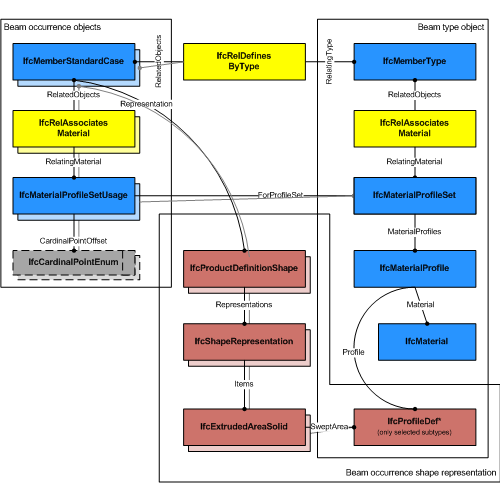
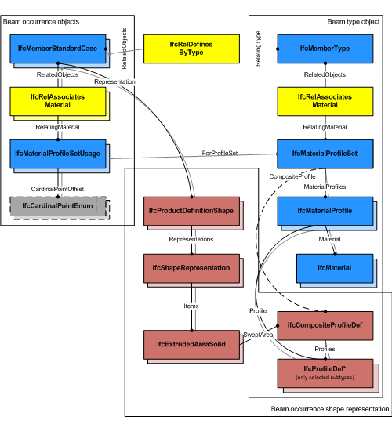

# IfcMemberStandardCase

The standard member, _IfcMemberStandardCase_, defines a member with certain constraints for the provision of material usage, parameters and with certain constraints for the geometric representation. The _IfcMemberStandardCase_ handles all cases of members, that:

* have a reference to the _IfcMaterialProfileSetUsage_ defining the material profile association of the member with the cardinal point of its insertion relative to the local placement.
* are based on a sweep of a planar profile, or set of profiles, as defined by the _IfcMaterialProfileSet_
* have an 'Axis' shape representation with constraints provided below in the geometry use definition
* have a 'Body' shape representation with constraints provided below in the geometry use definition
* have a start profile, or set of profiles, that is swept along the directrix and might be changed uniformly by a taper definition
* are consistent in using the correct cardinal point offset of the profile as compared to the 'Axis' and 'Body' shape representation
* are extruded perpendicular to the profile definition plane

> NOTE  View definitions and implementer agreements may further constrain the applicable geometry types, such as by excluding tapering from an _IfcMemberStandardCase_ implementation.

> HISTORY  New entity in IFC4.

## Formal Propositions

### HasMaterialProfileSetUsage
A valid instance of _IfcMemberStandardCase_ relies on the provision of an _IfcMaterialProfileSetUsage_.

## Concepts

### Axis 3D Geometry

The following additional constraints apply to the 'Axis'
representation, if the 'Body' shape representation has the
RepresentationType : 'SweptSolid':

* Axis
	+ IfcPolyline having two Points, or
	IfcTrimmedCurve with BasisCurve of Type
	IfcLine for 'SweptSolid' provided as
	IfcExtrudedAreaSolid. The axis curve lies on the z axis of
	the object coordinate system.
	+ IfcTrimmedCurve with BasisCurve of Type
	IfcCircle for 'SweptSolid' provided as
	IfcRevolvedAreaSolid. The axis curve lies on the x/z plane
	of the object coordinate system, the tangent at the start is along
	the positive z-axis.

 

> EXAMPLE  As shown in Figure 101, the axis representation can be used to represent the system length of a member that may extent the body length of the member.

Figure 242 — Member axis representation

 

> EXAMPLE  As shown in Figure 102, the axis representation shall be used to represent the cardinal point as the offset between the 'Axis' and the extrusion path of the member. The extrusion path is provided as IfcExtrudedAreaSolid.ExtrudedDirection and should be parallel to the 'Axis'. It has to be guaranteed that the value provided by IfcMaterialProfileSetUsage.CardinalPoint is consistent to the IfcExtrudedAreaSolid.Position.

Figure 243 — Member axis cardinal point

 

### Body AdvancedSweptSolid Geometry

The following additional constraints apply to the
'AdvancedSweptSolid' representation type:

* Solid: IfcSurfaceCurveSweptAreaSolid,
IfcFixedReferenceSweptAreaSolid,
IfcExtrudedAreaSolidTapered,
IfcRevolvedAreaSolidTapered shall be supported.

> NOTE  View definitions and implementer
> agreement can further constrain the allowed swept solid
> types.

> NOTE  Using IfcExtrudedAreaSolidTapered,
> or IfcRevolvedAreaSolidTapered requires the use of two
> IfcMaterialProfile's within the
> IfcMaterialProfileSet assinged to the
> IfcBeamStandardCase
* Profile: see 'SweptSolid' geometric
representation
* Profile Position : see 'SweptSolid' geometric
representation
* Extrusion: not applicable

### Body Clipping Geometry

The following constraints apply to the advanced
representation:

* Solid: see 'SweptSolid' geometric representation
* Profile: see 'SweptSolid' geometric
representation
* Profile Position : see 'SweptSolid' geometric
representation
* Extrusion: see 'SweptSolid' geometric
representation
* Boolean result: The IfcBooleanClippingResult
shall be supported, allowing for Boolean differences between the
swept solid (here IfcExtrudedAreaSolid) and one or several
IfcHalfSpaceSolid (or its subtypes).

Figure 244 illustrates an advanced geometric representation with use of IfcBooleanClippingResult between
an IfcExtrudedAreaSolid and an IfcHalfSpaceSolid to create a clipped body, with cardinal point applied as 4 (mid-depth left).

Figure 244 — Member body clipping

### Body SweptSolid Geometry

The following additional constraints apply to the 'SweptSolid'
representation:

* Solid: IfcExtrudedAreaSolid,
IfcRevolvedAreaSolid shall be supported
* Profile: all subtypes of IfcProfileDef (with
exception of IfcArbitraryOpenProfileDef)
* Profile Position : For all single profiles, the
IfcParameterizedProfileDef.Position shall be NIL, or
having Location = 0.,0. and RefDirection =
1.,0.
* Extrusion: perpendicular to the profile
direction.
* Orientation: The y-axis of the profile, as determined
by IfcSweptAreaSolid.Position.P[2] shall point to the
Z-Axis. It indicates the "role" of the column, a role=0°
means y-axis of profile = Z-axis of reference coordinate system.
In the exception of a vertical member, the y-axis shall point to
the Y-axis.

Figure 243 illustrates a 'SweptSolid' geometric representation with cardinal point applied as 1 (bottom left).

The following interpretation of dimension parameter applies for rectangular members:

* IfcRectangleProfileDef.YDim interpreted as member width
* IfcRectangleProfileDef.XDim interpreted as member depth

The following interpretation of dimension parameter applies for circular members:

* IfcCircleProfileDef.Radius interpreted as beam radius.

Figure 243 — Member body extrusion

### Material Profile Set Usage

Figure 240 illustrates assignment of IfcMaterialProfileSetUsage and IfcMaterialProfileSet to the IfcMemberStandardCase as the member occurrence and to the IfcMemberType. The same IfcMaterialProfileSet shall be shared by many occurrences of IfcMaterialProfileSetUsage. This relationship shall be consistent to the relationship between the IfcMemberType and the IfcMemberStandardCase.

Figure 240 — Member profile usage

Figure 241 illustrates assignment of a composite profile by using IfcCompositeProfile for geometric representation and several IfcMaterialProfile's within the IfcMaterialProfileSet. The number of IfcMaterialProfile's within the IfcMaterialProfileSet is restricted to maximal 2 and
requires the use of IfcExtrudedAreaSolidTapered, or IfcRevolvedAreaSolidTapered for the correct 'Body' shape representation.

Figure 241 — Member composite profiles

The material of the IfcMemberStandardCase is defined by
IfcMaterialProfileSetUsage and attached by the
IfcRelAssociatesMaterial.RelatingMaterial. It is
accessible by the inverse HasAssociations relationship.
Composite profile members can be represented by refering to
several IfcMaterialProfile's within the
IfcMaterialProfileSet that is referenced from the
IfcMaterialProfileSetUsage.

Material information can also be given at the
IfcMemberType, defining the common attribute data for all
occurrences of the same type. It is then accessible by the
inverse IsDefinedBy relationship pointing to
IfcMemberType.HasAssociations and via
IfcRelAssociatesMaterial.RelatingMaterial. See Type Use
Definition for additional agreements for standard
members.

### Object Typing

The IfcMemberStandardCase defines in addition that the
IfcMemberType should have a unique
IfcMaterialProfileSet, that is referenced by the
IfcMaterialProfileSetUsage assigned to all occurrences of 
this IfcMemberType.

### Product Placement

The following restriction is imposed:

* The local placement shall provide the location and directions 
for the standard member, the x/y plane is the plane for the start 
profile, and the z-axis is the extrusion axis for the member body (in
case of rotation, the tangent direction).

