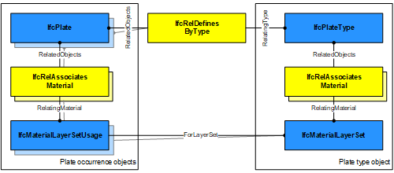

# IfcPlate

An _IfcPlate_ is a planar and often flat part with constant thickness. A plate may carry loads between or beyond points of support, or provide stiffening. The location of the plate (being horizontal, vertical or sloped) is not relevant to its definition (in contrary to _IfcWall_ and _IfcSlab_ (as floor slab)).

> NOTE  Definition according to ISO 6707-1: thin, rigid, flat, metal product, of a thickness greater than that of a sheet.

Plates are normally made of steel, other metallic material, or by glass panels. However the definition of _IfcPlate_ is material independent and specific material information shall be handled by using _IfcAssociatesMaterial_ to assign a material specification to the _IfcPlate_.

> NOTE  Although not necessarily, plates are often add-on parts. This is represented by the _IfcRelAggregates_ decomposition mechanism used to aggregate parts, such as _IfcPlate_, into a container element such as _IfcElementAssembly_ or _IfcCurtainWall_.

An instance of _IfcPlate_ should preferably get its geometric representation and material assignment through the type definition by _IfcPlateType_ assigned using the _IfcRelDefinesByType_ relationship. This allows identical plates in a construction to be represented by the same instance of _IfcPlateType_.

A plate may have openings, such as voids or recesses. They are defined by an _IfcOpeningElement_ attached to the plate using the inverse relationship _HasOpenings_ pointing to _IfcRelVoidsElement_. The position number of a plate as often used in steel construction is assigned through the attribute _IfcElement.Tag_

There are two main representations for plate occurrences:

- _IfcPlate_ with _IfcMaterialLayerSetUsage_ is used for all occurrences of plates, that are prismatic and where the thickness parameter can be fully described by the _IfcMaterialLayerSetUsage_. These plates are always represented geometrically by a 'SweptSolid' geometry (or by a 'Clipping' geometry based on 'SweptSolid'), if a 3D geometric representation is assigned.

- _IfcPlate_ without _IfcMaterialLayerSetUsage_ is used for all other occurrences of plates, particularly for plates with changing thickness, or plates with non planar surfaces, and plates having only 'SurfaceModel' or 'Brep' geometry or if a more parametric representation is not intended.

> NOTE  The representation of a plate in a structural analysis model is provided by _IfcStructuralSurfaceMember_ being part of an _IfcStructuralAnalysisModel_.

> HISTORY  New entity in IFC2x2

## Attributes

### PredefinedType
Predefined generic type for a plate that is specified in an enumeration. There may be a property set given specifically for the predefined types.
> NOTE  The _PredefinedType_ shall only be used, if no _IfcPlateType_ is assigned, providing its own _IfcPlateType.PredefinedType_.

{ .change-ifc2x4}
> IFC4 CHANGE The attribute has been added at the end of the entity definition.

## Formal Propositions

### CorrectPredefinedType
Either the _PredefinedType_ attribute is unset (e.g. because an _IfcPlateType_ is associated), or the inherited attribute _ObjectType_ shall be provided, if the _PredefinedType_ is set to USERDEFINED.

### CorrectTypeAssigned
Either there is no plate type object associated, i.e. the _IsTypedBy_ inverse relationship is not provided, or the associated type object has to be of type _IfcPlateType_.

## Concepts

### Body Clipping Geometry

The following constraints apply to the 'Clipping'
representation when an IfcMaterialLayerSetUsage is assigned to the IfcPlate:

* Solid: see 'SweptSolid' shape representation,
* Profile: see 'SweptSolid' shape
representation,
* Extrusion: see 'SweptSolid' shape
representation,
* Material: see 'SweptSolid' shape
representation,
* Boolean result: The IfcBooleanClippingResult
shall be supported, allowing for Boolean differences between the
swept solid (here IfcExtrudedAreaSolid) and one or several
IfcHalfSpaceSolid.

 

Figure 248 — Plate body clipping

> EXAMPLE  Figure 248 illustrates a 'Clipping' geometric representation with definition of a plate using advanced geometric representation. The profile is extruded non-perpendicular and the plate body is clipped at the eave.

### Body SweptSolid Geometry

The following additional constraints apply to the 'SweptSolid'
representation:

* Solid: IfcExtrudedAreaSolid is required,
* Profile: IfcArbitraryClosedProfileDef,
IfcArbitraryProfileDefWithVoids, IfcRectangleProfileDef,
IfcCircleProfileDef, IfcEllipseProfileDef shall be
supported.
* Extrusion: The profile can be extruded perpendicularly
or non-perpendicularly to the plane of the swept profile.

The following additional constraints apply to the 'SweptSolid'
representation, when an IfcMaterialLayerSetUsage is assigned to the IfcPlate:

* Solid: IfcExtrudedAreaSolid is required,
* Profile: IfcArbitraryClosedProfileDef,
IfcRectangleProfileDef, IfcRoundedRectangleProfileDef,
IfcCircleProfileDef, IfcEllipseProfileDef shall be
supported.
* Extrusion: The profile can be extruded perpendicularly
or non-perpendicularly to the plane of the swept profile.
* Material: The definition of the
IfcMaterialLayerSetUsage, particularly of the
OffsetFromReferenceLine and the
ForLayerSet.TotalThickness, has to be consistent to the
'SweptSolid' representation.

 

Figure 247 — Plate body extrusion

> EXAMPLE  Figure 247 illustrates a 'SweptSolid' geometric representation. The following interpretation of dimension parameter applies for polygonal plates (in ground floor view): IfcArbitraryClosedProfileDef.OuterCurve being a closed bounded curve is interpreted as area (or foot print) of the plate.

### Material Layer Set

The material information of the IfcPlate is defined by
 IfcMaterialLayerSet, or by IfcMaterial, and it is attached either directly or at the IfcPlateType. In this case, the material information does not allow to construct a shape by applying the layer definition to the plane of the shape representation, to enable this parametric definition, the IfcMaterialLayerSetUsage has to be used instead.
 
### Material Layer Set Usage

The material of IfcPlate can be defined by
IfcMaterialLayerSetUsage and attached by
IfcRelAssociatesMaterial.RelatingMaterial. It is
 accessible by the inverse HasAssociations relationship.
 Multi-layer plates can be represented by referring to several
IfcMaterialLayer's within the IfcMaterialLayerSet
that is referenced from the
IfcMaterialLayerSetUsage.

When assigning an
IfcMaterialLayerSetUsage to IfcPlate it shall imply that the
 IfcPlateType should have a unique
 IfcMaterialLayerSet, that is referenced by IfcMaterialLayerSetUsage assigned to all
occurrences of this IfcPlateType.

Figure 246 illustrates assignment of IfcMaterialLayerSetUsage and IfcMaterialLayerSet to the IfcPlate as the plate occurrence and to the IfcPlateType. The same IfcMaterialLayerSet shall be shared by many occurrences of IfcMaterialLayerSetUsage. This relationship shall be consistent to the relationship between the IfcPlateType and the IfcPlate.

 

Figure 246 — Plate type definition

As shown in Figure 106, the following conventions shall be met:

* The reference coordinate system is the coordinate system established by the IfcExtrudedAreaSolid.Position.
* The reference plane is the plane defined by the extruded profile of IfcExtrudedAreaSolid.SweptSolid. The IfcMaterialLayerSetUsage.OffsetFromReferenceLine is given as a distance from this plane.
* The IfcMaterialLayerSetUsage.DirectionSense defines how the IfcMaterialLayer's are assigned to the reference plane. POSITIVE means in direction to the positive z-axis of the reference coordinate system.
* The IfcMaterialLayerSetUsage.OffsetFromReferenceLine is the distance parallel to the reference plane and always perpendicular to the base (XY) plane of the reference coordinate system. This is independent of a potential non-perpendicular extrusion given by IfcExtrudedAreaSolid.ExtrudedDirection <> 0.,0.,1. A positive value of IfcMaterialLayerSetUsage.OffsetFromReferenceLine would then point into the positive z-axis of the reference coordinate system.
* The Thickness of each IfcMaterialLayer shall be the parallel distance (measured perpendicular to the base plane). The TotalThickness of the IfcMaterialLayerSet is the sum of all layer thicknesses and in case of a perpendicular extrusion identical with IfcExtrudedAreaSolid.Depth
* The IfcMaterialLayerSetUsage.LayerSetDirection i always AXIS3.

Figure 247 — Plate material layers

### Object Typing

### Product Assignment

#### IfcStructuralSurfaceMember

An idealized structural member corresponding to the plate.

#### IfcTask

A task for operating on the plate.

### Property Sets for Objects

### Quantity Sets

### Spatial Containment

The IfcPlate, as any subtype of IfcBuildingElement, may participate alternatively in one of the two different containment relationships:

* the _Spatial Containment_ (defined here), or
* the _Element Composition_.

#### IfcBuildingStorey

Default spatial container

#### IfcBuilding

Spatial container for the element if it cannot be assigned to a building storey

#### IfcSite

Spatial container for the element in case that it is placed on site (outside of building)

### Surface 3D Geometry

> NOTE&nbsp; The 'Surface' can be used to define a surfacic model of the building (e.g. for analytical purposes, or for reduced Level of Detail representation).

