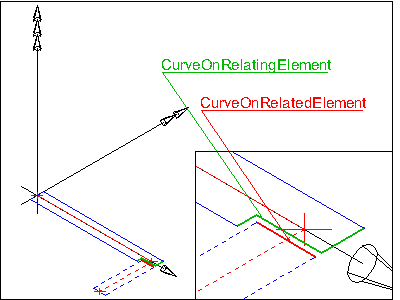
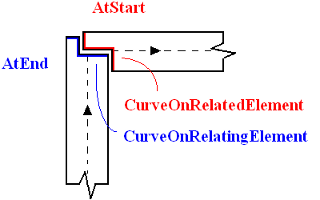
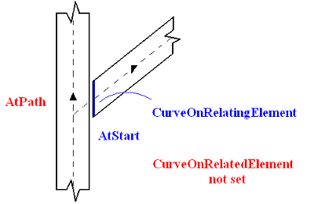

# IfcRelConnectsPathElements

The _IfcRelConnectsPathElements_ relationship provides the connectivity information between two elements, which have path information.

The objectified relationship provides the additional information required to describe the connection between two path based elements that might have single or multiple layers of material. The connection type specifies where at the path based element a connection is given (at the start, in the middle or at the end).

The connection is described by a connection geometry, given within the object coordinate systems of the _RelatingElement_ and of the _RelatedElement_. In case of layered IfcWall elements as the _RelatingElement_ and _RelatedElement_ the connection geometry is provided by the subtype _IfcConnectionCurveGeometry_. Both curves indicate the so called "end cap", i.e. the curve that trims the wall outer edges (being parallel along the wall axis) at the end.

Figure 1 &mdash; Path connection geometry

Figure 1 shows the application of _IfcRelConnectsPathElements_ with the _ConnectionGeometry_ of type  _IfcConnectionCurveGeometry_. The example shows the connection relationship between two instances of layered _IfcWall_ elements using the _IfcRelConnectsPathElements_ relationship. The _ConnectionCurveGeometry_ defines the _CurveOnRelatingElement_ and _CurveOnRelatedElement_, both are of type _IfcPolyline_.

Figure 2 &mdash; Path connection T-Type

Figure 2 illustrates using the _IfcRelConnectsPathElements_ for a "T" type connection between two instances of layered _IfcWall_ elements.

Figure 3 &mdash; Path connection L-Type

Figure 3 illustrates using the _IfcRelConnectsPathElements_ for a "L" type connection between two instances of layered _IfcWall_ elements.

> NOTE  The two wall axes connect in each case.

> HISTORY  New entity in IFC1.5.

{ .change-ifc2x4}
> IFC4 CHANGE  The data type of _RelatingPriorities_ and _RelatedPriorities_ are restricted to a range o [0..100] to be a normalized ratio measure.

## Attributes

### RelatingPriorities
Overriding priorities at this connection. It overrides the standard priority given at the wall layer provided by _IfcMaterialLayer_._Priority_. The list of _RelatingProperties_ corresponds to the list of _IfcMaterialLayerSet_._MaterialLayers_ of the element referenced by _RelatingObject_.
{ .change-ifc2x4}
> IFC4 CHANGE  Data type changed to NUMBER and usage to hold a normalized ratio measure [0..1].

### RelatedPriorities
Overriding priorities at this connection. It overrides the standard priority given at the wall layer provided by _IfcMaterialLayer_._Priority_. The list of _RelatedProperties_ corresponds to the list of _IfcMaterialLayerSet_._MaterialLayers_ of the element referenced by _RelatedObject_.
{ .change-ifc2x4}
> IFC4 CHANGE  Data type changed to NUMBER and usage to hold a normalized ratio measure [0..1].

### RelatedConnectionType
Indication of the connection type in relation to the path of the _RelatedObject_.

### RelatingConnectionType
Indication of the connection type in relation to the path of the _RelatingObject_.

## Formal Propositions

### NormalizedRelatingPriorities
The _RelatingProperties_ shall all be given as a normalized integer range [0..100], where 0 is the lowest and 100 the highest priority of the material layers.

### NormalizedRelatedPriorities
The _RelatedProperties_ shall all be given as a normalized integer range [0..100], where 0 is the lowest and 100 the highest priority of the material layers.
