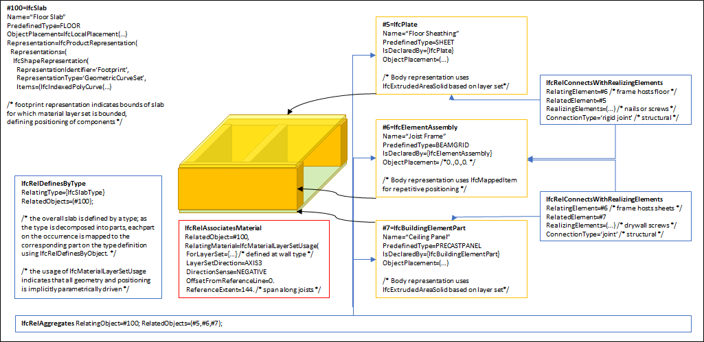
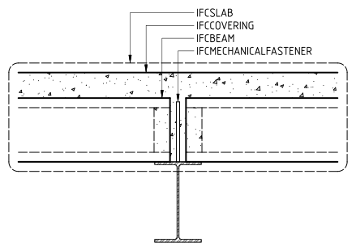
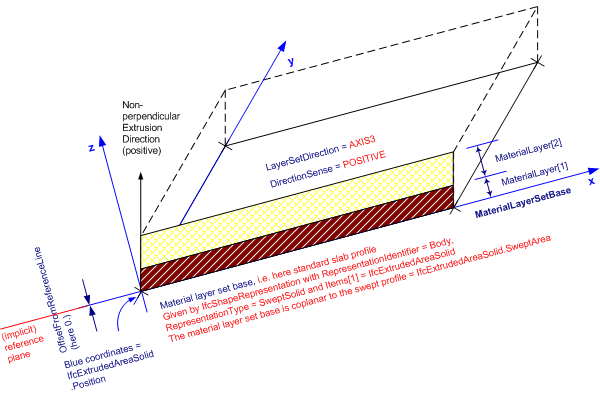

# IfcSlab

A slab is a component of the construction that may enclose a space vertically. The slab may provide the lower support (floor) or upper construction (roof slab) in any space in a building.<!-- end of definition -->

Only the core or constructional part of this construction is considered to be a slab. The upper finish (flooring, roofing) and the lower finish (ceiling, suspended ceiling) are considered to be coverings. A special type of slab is the landing, described as a floor section to which one or more stair flights or ramp flights connect.

A slab may have openings, such as floor openings, or recesses. They are defined by an _IfcOpeningElement_ attached to the slab using the inverse relationship _HasOpenings_ pointing to _IfcRelVoidsElement_. Slabs with openings that have already been modeled within the enclosing geometry may use the relationship _IfcRelConnectsElements_ to associate the _IfcSlab_ with embedded elements such as trap doors.

There are two main representations for slab occurrences:

- _IfcSlab_ with _IfcMaterialLayerSetUsage_ is used for all occurrences of slabs, that are prismatic and where the thickness parameter can be fully described by the _IfcMaterialLayerSetUsage_. These slabs are always represented geometrically by a 'SweptSolid' geometry (or by a 'Clipping' geometry based on 'SweptSolid'), if a 3D geometric representation is assigned.

- _IfcSlab_ without _IfcMaterialLayerSetUsage_ is used for all other occurrences of slabs, particularly for slabs with changing thickness, or slabs with non planar surfaces, and slabs having only 'SweptSolid' or 'Brep' geometry, or if a more parametric representation is not intended.

> REFERENCE  Definition according to ISO 6707-1: thick, flat or shaped component, usually larger than 300 mm square, used to form a covering or projecting from a building.

> NOTE  An arbitrary planar element to which this semantic information is not applicable or irrelevant shall be modeled as _IfcPlate_.

> NOTE The entity _IfcSlabStandardCase_ has been deleted, _IfcSlab_ with _IfcMaterialLayerSetUsage_ is used instead. The entity _IfcSlabElementedCase_ has been deleted, _IfcSlab_ with _IfcRelAggregates_ is used to describe occurrences of slabs which are aggregated from subordinate elements.

> NOTE There is a representation of slabs for structural analysis provided by a proper subtype of _IfcStructuralMember_ being part of the _IfcStructuralAnalysisModel_.

> HISTORY  New entity in IFC2.0; it is a merger of the two previous entities _IfcFloor_, _IfcRoofSlab_, introduced in IFC1.0

## Attributes

### PredefinedType
Predefined generic type for a slab that is specified in an enumeration. There may be a property set given specifically for the predefined types.
> NOTE  The _PredefinedType_ shall only be used, if no _IfcSlabType_ is assigned, providing its own _IfcSlabType.PredefinedType_.

{ .change-ifc2x}
> IFC2x CHANGE The attribute has been changed into an OPTIONAL attribute.

## Formal Propositions

### CorrectPredefinedType
Either the _PredefinedType_ attribute is unset (e.g. because an _IfcSlabType_ is associated), or the inherited attribute _ObjectType_ shall be provided, if the _PredefinedType_ is set to USERDEFINED.

### CorrectTypeAssigned
Either there is no slab type object associated, i.e. the _IsTypedBy_ inverse relationship is not provided, or the associated type object has to be of type _IfcSlabType_.

## Concepts

### Body Clipping Geometry

The following constraints apply to the 'Clipping' representation:

* Solid: _IfcExtrudedAreaSolid_ is required,
* Profile: _IfcArbitraryClosedProfileDef_, _IfcRectangleProfileDef_, _IfcCircleProfileDef_, _IfcEllipseProfileDef_ shall be supported.
* Extrusion: The profile can be extruded perpendicularly or non-perpendicularly to the plane of the swept profile.
* Boolean result: The _IfcBooleanClippingResult_ shall be supported, allowing for Boolean differences between the swept solid (here _IfcExtrudedAreaSolid_) and one or several _IfcHalfSpaceSolid_.

Additional constraints apply when an _IfcMaterialLayerSetUsage_ is used:

* Material: The definition of the _IfcMaterialLayerSetUsage_, particularly of the _OffsetFromReferenceLine_ and the _ForLayerSet.TotalThickness_, has to be consistent to the 'SweptSolid' representation.

Figure 266 illustrates a 'Clipping' geometric representation with definition of a roof slab using advanced
geometric representation. The profile is extruded non-perpendicular and the slab body is clipped at the eave.


Figure 266 — Slab body clipping

### Body SweptSolid Geometry

The following constraints apply to the 'SweptSolid'
representation:

* Solid: _IfcExtrudedAreaSolid_ is required,
* Profile: _IfcArbitraryClosedProfileDef_, _IfcRectangleProfileDef_, _IfcCircleProfileDef_, _IfcEllipseProfileDef_ shall be supported.
* Extrusion: The profile can be extruded perpendicularly or non-perpendicularly to the plane of the swept profile.

For polygonal slabs, the following interpretation of dimension parameter applies:

 * _IfcArbitraryClosedProfileDef.OuterCurve_: closed bounded curve interpreted as area (or foot print) of the slab.

Additional constraints apply when an _IfcMaterialLayerSetUsage_ is used:

* Material: The definition of the _IfcMaterialLayerSetUsage_, particularly of the _OffsetFromReferenceLine_ and the _ForLayerSet.TotalThickness_, has to be consistent to the 'SweptSolid' representation.


Figure 265 — Slab body extrusion

### Element Decomposition

A slab may be decomposed into parts such as for structural framing and covering panels or topping. For efficiency, each part may reuse geometry using the mapped geometry concept.



Figure ELEMENTEDCASE — A timber construction slab decomposed into parts.



Figure SLABAGG — A section showing a slab made from precast hollow core panels

#### IfcBeam

Precast hollow core planks or double tee beams in concrete construction, or joists and bearers in timber construction

#### IfcCovering

Concrete or topping screeds

#### IfcPlate

Used for metal decks at the base of slabs or sheathing

#### IfcBuildingElementPart

Parts for other elements

### Element Voiding

As shown in Figure ELEMENTVOID, openings within an aggregated slab are directly assigned to _IfcSlab_ using _IfcRelVoidsElement_ pointing to _IfcOpeningElement_ and apply to all aggregated parts. If individual parts have cutting and other voiding features, then the decomposed parts have a separate voiding relationship _IfcRelVoidsElement_ pointing to _IfcVoidingFeature_.

```
digraph dot_neato {
IfcSlab [pos="0,0!"];
IfcRelVoidsElement [pos="200,0!"];
IfcOpeningElement [pos="400,0!"];

IfcRelAggregates [pos="0,-70!"];

IfcBuildingElementPart [pos="0,-140!"];
IfcRelVoidsElement2 [label="IfcRelVoidsElement", pos="200,-140!"];
IfcVoidingFeature [pos="400,-140!"];

IfcRelVoidsElement -> IfcSlab [headlabel="RelatingBuildingElement", labelangle=90, labeldistance=3];
IfcRelVoidsElement -> IfcOpeningElement [headlabel="RelatedOpeningElement", labelangle=-90, labeldistance=3];
IfcRelAggregates -> IfcSlab [label="RelatingObject"];
IfcRelAggregates -> IfcBuildingElementPart [label="RelatedObjects[1]"];
IfcRelVoidsElement2 -> IfcBuildingElementPart [headlabel="RelatingBuildingElement", labelangle=90, labeldistance=3];
IfcRelVoidsElement2 -> IfcVoidingFeature [headlabel="RelatedOpeningElement", labelangle=-90, labeldistance=3];
}
```

Figure ELEMENTVOID — How individual parts being cut may be expressed.

### Material Layer Set Usage

Figure 262 illustrates assignment of _IfcMaterialLayerSetUsage_ and _IfcMaterialLayerSet_ to the _IfcSlabType_ and the _IfcSlab_ occurrence.


Figure 262 — Slab type definition


Figure 263 and Figure 264 illustrates material layer usage, where:

* The reference coordinate system is the coordinate system established by the _IfcExtrudedAreaSolid.Position_.
* The reference plane is the plane defined by the extruded profile of _IfcExtrudedAreaSolid.SweptSolid_. The _IfcMaterialLayerSetUsage.OffsetFromReferenceLine_ is given as a distance from this plane.
* The _IfcMaterialLayerSetUsage.DirectionSense_ defines how the _IfcMaterialLayer_'s are assigned to the reference plane. POSITIVE means in direction to the positive z-axis of the reference coordinate system.
* The _IfcMaterialLayerSetUsage.OffsetFromReferenceLine_ is the distance parallel to the reference plane and always perpendicular to the base (XY) plane of the reference coordinate system. This is independent of a potential non-perpendicular extrusion given by _IfcExtrudedAreaSolid.ExtrudedDirection_ <> 0.,0.,1. A positive value of _IfcMaterialLayerSetUsage.OffsetFromReferenceLine_ would then point into the positive z-axis of the reference coordinate system.
* The _Thickness_ of each _IfcMaterialLayer_ shall be the parallel distance (measured perpendicular to the base plane). The _TotalThickness_ of the _IfcMaterialLayerSet_ is the sum of all layer thicknesses and in case of a perpendicular extrusion identical with _IfcExtrudedAreaSolid.Depth_
* The _IfcMaterialLayerSetUsage.LayerSetDirection_ is always AXIS3.
* The local placement of the slab uses the the x/y plane for the profile, and the z-axis as the extrusion direction for the slab body.


Figure 264 — Standard usage of a material layer set



Figure 263 — Material layers used in a sloping roof slab

### Object Typing

### Product Assignment

#### IfcStructuralSurfaceMember

An idealized structural member corresponding to the slab.

#### IfcTask

A task for operating on the slab.

### Property Sets for Objects

### Quantity Sets

### Spatial Containment

The _IfcSlab_, as any subtype of _IfcBuiltElement_, may participate alternatively in one of the two different containment relationships:

* the _Spatial Containment_ (defined here), or
* the _Element Composition_.

#### IfcBuildingStorey

Default spatial container

#### IfcBuilding

Spatial container for the element if it cannot be assigned to a building storey

#### IfcSite

Spatial container for the element in case that it is placed on site (outside of building)

### Surface Geometry

The 'Surface' can be used to define a surfacic model of the building (e.g. for analytical purposes, or for reduced Level of Detail representation).
