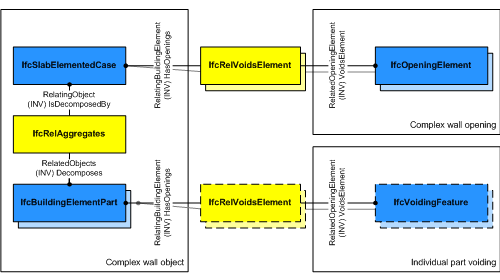

# IfcSlabElementedCase

The _IfcSlabElementedCase_ defines a slab with certain constraints for the provision of its components. The _IfcSlabElementedCase_ handles all cases of slabs, that are decomposed into parts:

* having components being assigned to the _IfcSlabElementedCase_ using the _IfcRelAggregates_ relationship accessible by the inverse relationship _IsDecomposedBy_.
* applying the constraint that the parts within the decomposition shall be of type _IfcElementAssembly_, _IfcBeam_, _IfcMember_, _IfcPlate_, _IfcBuildingElementPart_ or _IfcBuildingElementProxy_.

> HISTORY&nbsp; New entity in IFC4.

{ .use-head}
Voiding Use Definition:

As shown in Figure 1, openings within the composite slab are directly assigned to _IfcSlabElementedCase_ using _IfcRelVoidsElement_ pointing to _IfcOpeningElement_ and apply to all aggregated parts. If individual parts have cutting and other voiding features, then the decomposed parts have a separate voiding relationship _IfcRelVoidsElement_ pointing to _IfcVoidingFeature_.

## Formal Propositions

### HasDecomposition
A valid instance of _IfcSlabElementedCase_ has to have parts in a decomposition hierarchy.

## Concepts

### Aggregation

The following guidance is provided for the components of the
IfcSlabElementedCase. The following component entity types
should be used:

* Precast hollow core slabs
	+ double tee or plank components : IfcBeam
	+ topping : IfcBuildingElementPart
	+ others : IfcBuildingElementPart

### Placement

The use of local placement is defined at the supertype
IfcSlab. The local placement of the
IfcSlabElementedCase defines the parent coordinate systems
for the parts within the decomposition. All parts shall be
positioned relative to the IfcSlabElementedCase.

### Surface Geometry

A three-dimensional surface being a subtype
of IfcBoundedSurface defining the reference surface for
the elemented slab. It maybe used as a simplified representation
directly at the elemented slab.

> NOTE  It is invalid to exhange a 'Body' shape 
> representation of an IfcSlabElementedCase. The body
> geometry is defined by the parts within the 
> decomposition.

> NOTE  The 'Surface' can be used to define a
> surfacic model of the building (e.g. for analytical purposes, or
> for reduced Level of Detail representation). It should suppress
> the geometric details of the parts in the
> decomposition.

