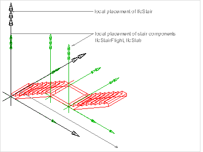

# IfcStair

A stair is a vertical passageway allowing occupants to walk (step) from one floor level to another floor level at a different elevation. It may include a landing as an intermediate floor slab.<!-- end of definition -->

{ .extDef}
> NOTE Definition according to ISO 6707-1: Construction comprising a succession of horizontal stages (steps or landings) that make it possible to pass on foot to other levels.

The _IfcStair_ shall either be represented:

* as a stair assembly entity that aggregates all parts (stair flight, landing, etc. with own representations), or
* as a single stair entity without decomposition including all representation directly at the stair entity.

> NOTE In case of an _IfcStair_ being the aggregate of all parts of the stair the aggregation is handled by the _IfcRelAggregates_ relationship, relating an _IfcStair_ with the related _IfcStairFlight_ and landings, _IfcSlab_ with _PredefinedType_=LANDING. _IfcRailing_'s belonging to the stair may also be included into the aggregation.

> NOTE Model View Definitions and implementer agreements may restrict the _IfcStair_ being an assembly to not have an independent shape representation, but to always require that the decomposed parts have a shape representation. In this case, at least the 'Body' geometric representations shall not be provided directly at _IfcStair_ if it is an assembly. The 'Body' geometric representation of the _IfcStair_ is then the sum of the 'Body' shape representation of the parts within the decomposition structure.

> HISTORY New entity in IFC2.0.

{ .change-ifc2x4}
> IFC4 CHANGE Attribute _ShapeType_ renamed to _PredefinedType_.

## Attributes

### PredefinedType
Predefined generic type for a stair that is specified in an enumeration. There may be a property set given specifically for the predefined types.
> NOTE The _PredefinedType_ shall only be used, if no _IfcStairType_ is assigned, providing its own _IfcStairType.PredefinedType_.

{ .change-ifc2x4}
> IFC4 CHANGE The attribute has been renamed from _ShapeType_ and changed to be OPTIONAL with upward compatibility for file based exchange.

## Formal Propositions

### CorrectPredefinedType
Either the _PredefinedType_ attribute is unset (e.g. because an _IfcStairType_ is associated), or the inherited attribute _ObjectType_ shall be provided, if the _PredefinedType_ is set to USERDEFINED.

### CorrectTypeAssigned
Either there is no stair type object associated, i.e. the _IsTypedBy_ inverse relationship is not provided, or the associated type object has to be of type _IfcStairType_.

## Concepts

### Axis 2D Geometry

The walking line is represented by a two-dimensional open curve as the axis. The curve is directed into the upward direction (direction has to be interpreted as specified at the subtypes of _IfcCurve_).

> NOTE The 'Axis' representation of _IfcStair_ may be provided even if the _IfcStair_ has components with own shape representations.

### Body SweptSolid Geometry

### Element Decomposition

_Geometric representation by aggregated elements_

If the _IfcStair_ has components (referenced by _SELF\IfcObject.IsDecomposedBy_) with own 'Body' representation, then no 'Body' representation shall be defined for the _IfcStair_. The _IfcStair_ shape is then represented by the geometric representation of its components. The components are accessed via _SELF\IfcObject.IsDecomposedBy[1].RelatedObjects_.

Figure 272 illustrates stair placement, where the _IfcStair_ defines the local placement for all components and the common 'Axis' representation, and each component has its own 'Body' representation.

Figure 272 — Stair placement

#### IfcStairFlight

Stairs may be decomposed into stair flights.

#### IfcSlab

Stairs may be decomposed into stair landing, represented by _IfcSlab.PredefinedType_=LANDING

#### IfcRailing

Stairs may be decomposed into railings for zero, one, or both sides.

### Material Single

The material of the _IfcStair_ is defined by the _IfcMaterial_ and attached by the _IfcRelAssociatesMaterial.RelatingMaterial_. It is accessible by the inverse _HasAssociations_ relationship.

Material information can also be given at the _IfcStairType_, defining the common attribute data for all occurrences of the same type. It is then accessible by the inverse IsDefinedBy relationship pointing to _IfcStair.HasAssociations_ and via _IfcRelAssociatesMaterial.RelatingMaterial_ to IfcMaterial. If both are given, then the material directly assigned to _IfcStair_ overrides the material assigned to _IfcStairType_.

### Object Typing

### Product Local Placement

The following restriction may be imposed by view definitions or implementer agreements:

* If the _IfcStair_ establishes an aggregate, then all contained elements shall be placed relative to the _IfcStair.ObjectPlacement_.

### Property Sets for Objects

### Spatial Containment

The _IfcStair_, as any subtype of _IfcBuiltElement_, may participate alternatively in one of the two different containment relationships:

* the _Spatial Containment_ (defined here), or
* the _Element Composition_.

#### IfcBuildingStorey

Default spatial container

#### IfcBuilding

Spatial container for the element if it cannot be assigned to a building storey

#### IfcSite

Spatial container for the element in case that it is placed on site (outside of building)

