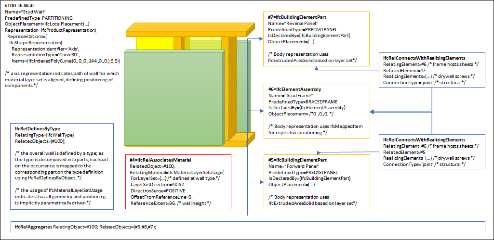

# IfcWall

The wall represents a vertical construction that may bound or subdivide spaces. Wall are usually vertical, or nearly vertical, planar elements, often designed to bear structural loads. A wall is however not required to be load bearing.

{ .extDef}

A wall may have openings, such as wall openings, openings used for windows or doors, or niches and recesses. They are defined by an _IfcOpeningElement_ attached to the wall using the inverse relationship _HasOpenings_ pointing to _IfcRelVoidsElement_. Walls with openings that have already been modeled within the enclosing geometry may use the relationship _IfcRelConnectsElements_ to associate the wall with embedded elements such as doors and windows.

There are two main representations for all occurrences:

 * _IfcWall_ with _IfcMaterialLayerSetUsage_ is used for all occurrences of walls, that have a non-changing thickness along the wall path and where the thickness parameter can be fully described by a material layer set. These walls are always represented geometrically by an 'Axis' and a 'SweptSolid' shape representation (or by a 'Clipping' geometry based on 'SweptSolid'), if a 3D geometric representation is assigned.

 * _IfcWall_ without _IfcMaterialLayerSetUsage_ is used for all other occurrences of wall, particularly for walls with changing thickness along the wall path (e.g. polygonal walls), or walls with a non-rectangular cross sections (e.g. L-shaped retaining walls), and walls having an extrusion axis that is unequal to the global Z axis of the project (i.e. non-vertical walls), or walls having only 'Brep', or 'SurfaceModel' geometry, or if a more parametric representation is not intended.

> REFERENCE  Definition according to ISO 6707-1: vertical construction usually in masonry or in concrete which bounds or subdivides a construction works and fulfils a load bearing or retaining function.

> NOTE  An arbitrary planar element to which this semantic information is not applicable (is not predominantly vertical), shall be modeled as _IfcPlate_.

> NOTE  The entity _IfcWallStandardCase_ has been deprecated, _IfcWall_ with _IfcMaterialLayerSetUsage_ is used instead. The entity _IfcWallElementedCase_ has been deleted, _IfcWall_ with _IfcRelAggregates_ is used to describe occurrences of wall which are aggregated from subordinate elements, such as wall panels.

> NOTE  There is a representation of walls for structural analysis provided by a proper subtype of _IfcStructuralMember_ being part of the _IfcStructuralAnalysisModel_.

> HISTORY  New entity in IFC1.0

## Attributes

### PredefinedType
Predefined generic type for a wall that is specified in an enumeration. There may be a property set given specifically for the predefined types.
> NOTE  The _PredefinedType_ shall only be used, if no _IfcWallType_ is assigned, providing its own _IfcWallType.PredefinedType_.

{ .change-ifc2x4}
> IFC4 CHANGE The attribute has been added at the end of the entity definition.

## Formal Propositions

### CorrectPredefinedType
Either the _PredefinedType_ attribute is unset (e.g. because an _IfcWallType_ is associated), or the inherited attribute _ObjectType_ shall be provided, if the _PredefinedType_ is set to USERDEFINED.

### CorrectTypeAssigned
Either there is no wall type object associated, i.e. the _IsTypedBy_ inverse relationship is not provided, or the associated type object has to be of type _IfcWallType_.

## Concepts

### Axis 2D Geometry

The wall axis is represented by a two-dimensional open curve within a particular shape representation. The 'Axis' shape representation is only used to locate the material layer set along the axis, if the _IfcMaterialLayerSetUsage_ is applied to the _IfcWall_. In this case, the wall axis is used to apply the material layer set usage parameter to the wall geometry.

* Axis
	* _IfcPolyline_ having two Points, or _IfcTrimmedCurve_ with _BasisCurve_ of Type _IfcLine_ for the 'SweptSolid' provided as _IfcExtrudedAreaSolid_. The axis curve lies on the x/y plane and is parallel to the x-axis of the object coordinate system.
	* _IfcTrimmedCurve_ with _BasisCurve_ of Type _IfcCircle_ for 'SweptSolid' provided as _IfcExtrudedAreaSolid_. The axis curve lies on the x/y plane of the object coordinate system, the tangent at the start is along the positive x-axis.


Figure 279 — Wall axis straight

Figure 279 illustrates an axis representation for a straight wall. In case of a straight wall, the set of items shall include a single geometric representation item of type _IfcPolyline_ or _IfcTrimmedCurve_ with the _BasisCurve_ being an _IfcLine_. The _IfcPolyline_ or _IfcTrimmedCurve_ shall be parallel (here in a special case co-linear) to the x-axis of the object coordinate system. The direction shall be identical to the direction of the x-axis.


Figure 280 — Wall axis curved

Figure 280 illustrates an axis representation for a curved wall. In case of a curved wall, the set of items shall include a single geometric representation item of type _IfcTrimmedCurve_. The curve shall have a _BasisCurve_ of type _IfcCircle_. The tangent of the _IfcTrimmedCurve_ shall be parallel at start to the x-axis of the object coordinate system. The direction shall be identical to the direction of the x-axis.

#### Axis_IfcBoundedCurve_Curve2D

The wall axis of the wall.

### Body Clipping Geometry

The following additional constraints apply to the 'SweptSolid'
representation, when an _IfcMaterialLayerSetUsage_ is assigned to the _IfcSlab_:

* Solid: _IfcExtrudedAreaSolid_ is required
* Profile: _IfcArbitraryClosedProfileDef_ and _IfcRectangleProfileDef_ shall be supported.
* Extrusion: All extrusion directions shall be supported.
* Boolean result: The _IfcBooleanClippingResult_ shall be supported, allowing for Boolean differences between the swept solid (here _IfcExtrudedAreaSolid_) and one or several _IfcHalfSpaceSolid_ (or subtypes).

Figure 283 illustrates a clipping for a straight wall using an _IfcPolygonalBoundedHalfSpace_ as _SecondOperand_ in
 the _IfcBooleanClippingResult_.


Figure 283 — Wall body clipping straight

Figure 284 illustrates a clipping for a curved wall using an _IfcHalfSpaceSolid_ as _SecondOperand_ in the
_IfcBooleanClippingResult_.


Figure 284 — Wall body clipping curved


### Body SweptSolid Geometry

The following additional constraints apply to the 'SweptSolid' representation:

* Solid: _IfcExtrudedAreaSolid_ is required
* Profile: _IfcArbitraryClosedProfileDef_ and _IfcRectangleProfileDef_ shall be supported.
* Extrusion: All extrusion directions shall be supported.

Additional constraints apply to the 'SweptSolid' representation, when an _IfcMaterialLayerSetUsage_ is used:

* Extrusion: The profile shall be extruded vertically, i.e., in the direction of the z-axis of the coordinate system of the referred spatial structure element. It might be further constraint to be in the direction of the global z-axis in implementers agreements. The extrusion axis shall be perpendicular to the swept profile, i.e. pointing into the direction of the z-axis of the _Position_ of the _IfcExtrudedAreaSolid_.

The profile of a wall is described in the ground view and extruded vertically. The profile (also identical with the foot print of the wall) is defined by the _IfcArbitraryClosedProfileDef_ (excluding its subtypes). The profile is given with all wall connections already resolved.

Figure 281 illustrates a body representation for a straight wall. In case of a straight wall, the two sides of the profile shall be parallel to the wall axis, that is, the wall has a single unchanged thickness.


Figure 281 — Wall body extrusion straight

Figure 282 illustrates a body representation for a curved wall. In case of a curved wall, the two sides of the profile shall be parallel (with defined offset) to the wall axis, that is, the wall has a single unchanged thickness.


Figure 282 — Wall body extrusion curved

### Element Decomposition

A wall may decomposed into parts such as framing and panels on each side. For efficiency, each part may reuse geometry using the mapped geometry concept.



Figure ELEMENTEDCASE &mdash; A wall decomposed into parts.

#### IfcElementAssembly

Frame containing studs, tracks, and possibly insulation

#### IfcBuildingElementPart

Panels on each side such as gypsum (drywall) or cement board (tile backing) with fasteners

#### IfcMember

Studs, posts and similar elements

#### IfcMechanicalFastener

Fasteners that may be used to connect elements together with _IfcRelConnectsWithRealizingElements_

### Element Voiding

As shown in Figure ELEMENTVOID, openings within the composite wall are directly assigned to _IfcWall_ using _IfcRelVoidsElement_ pointing to _IfcOpeningElement_ and apply to all aggregated parts. If individual parts have cutting and other voiding features, then the decomposed parts have a separate voiding relationship _IfcRelVoidsElement_ pointing to _IfcVoidingFeature_.

```
digraph dot_neato {
IfcWall [pos="0,0!"];
IfcRelVoidsElement [pos="200,0!"];
IfcOpeningElement [pos="400,0!"];

IfcRelAggregates [pos="0,-70!"];

IfcBuildingElementPart [pos="0,-140!"];
IfcRelVoidsElement2 [label="IfcRelVoidsElement", pos="200,-140!"];
IfcVoidingFeature [pos="400,-140!"];

IfcRelVoidsElement -> IfcWall [headlabel="RelatingBuildingElement", labelangle=90, labeldistance=3];
IfcRelVoidsElement -> IfcOpeningElement [headlabel="RelatedOpeningElement", labelangle=-90, labeldistance=3];
IfcRelAggregates -> IfcWall [label="RelatingObject"];
IfcRelAggregates -> IfcBuildingElementPart [label="RelatedObjects[1]"];
IfcRelVoidsElement2 -> IfcBuildingElementPart [headlabel="RelatingBuildingElement", labelangle=90, labeldistance=3];
IfcRelVoidsElement2 -> IfcVoidingFeature [headlabel="RelatedOpeningElement", labelangle=-90, labeldistance=3];
}
```

Figure ELEMENTVOID &mdash; How individual parts being cut may be expressed.

### Material Layer Set Usage

Figure 277 illustrates assignment of _IfcMaterialLayerSetUsage_ and _IfcMaterialLayerSet_ to the _IfcWallType_ and the _IfcWall_ occurrence.


Figure 277 — Wall Standard Object Typing

Figure 278 illustrates material layer usage, where:

* The reference coordinate system is the local coordinate system established by the _ObjectPlacement_ of the _IfcWall_.
* The reference axis is the axis defined by the _IfcShapeRepresentation_ with _RepresentationType_='Axis' as one of the wall's representations.
* The _IfcMaterialLayerSetUsage.OffsetFromReferenceLine_ is given as a distance from this axis.
* The _IfcMaterialLayerSetUsage.OffsetFromReferenceLine_ is the distance parallel to the reference axis and always within the base
(XY) plane of the reference coordinate system. A positive value of _IfcMaterialLayerSetUsage.OffsetFromReferenceLine_ would
then point into the positive y-axis of the reference coordinate system.
* The _IfcMaterialLayerSetUsage.DirectionSense_ defines how the _IfcMaterialLayer_'s are assigned to the reference axis. POSITIVE means in direction to the positive y-axis of the reference coordinate system.
* The _Thickness_ of each _IfcMaterialLayer_ is provided starting from the _OffsetFromReferenceLine_ and in the direction given by _DirectionSense_. It is applied without any gap or overlap between two consecutive layers. The _TotalThickness_ of the _IfcMaterialLayerSet_ is the sum of all layer thicknesses.
* The _IfcMaterialLayerSetUsage.LayerSetDirection_ is always AXIS2.
* The local placement of the wall uses the the x/y plane for the profile, and the z-axis as the extrusion direction for the wall body.


Figure 278 — Wall material layers


### Object Typing


### Path Connectivity


#### IfcWall

Walls with equal or lower priority are connected at _RelatedElement_.

### Product Assignment


#### IfcStructuralSurfaceMember

An idealized structural member corresponding to the wall.

#### IfcTask

A task for operating on the wall.

### Property Sets for Objects


### Quantity Sets


### Spatial Containment

The _IfcWall_, as any subtype of _IfcBuiltElement_, may participate alternatively in one of the two different containment relationships:

* the _Spatial Containment_ (defined here), or
* the _Element Composition_.

#### IfcBuildingStorey

Default spatial container

#### IfcBuilding

Spatial container for the element if it cannot be assigned to a building storey

#### IfcSite

Spatial container for the element in case that it is placed on site (outside of building)

### Surface Geometry

The 'Surface' can be used to define a surfacic model of the building (e.g. for analytical purposes, or for reduced Level of Detail representation).
