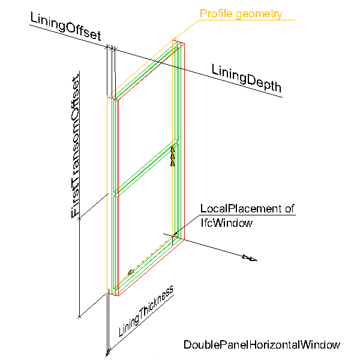
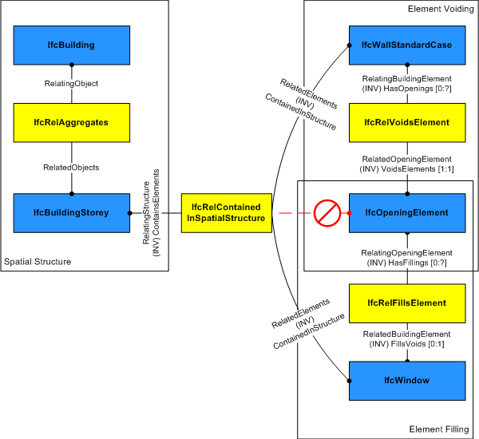

# IfcWindow

The window is a building element that is predominately used to provide natural light and fresh air. It includes vertical opening but also horizontal opening such as skylights or light domes. It includes constructions with swinging, pivoting, sliding, or revolving panels and fixed panels. A window consists of a lining and one or several panels. A window can:

* be a "free standing" window, contained in an _IfcSpatialElement_ such as an _IfcBuildingStorey_.
* fill an opening, typically in a wall. The window will then have a _FillsVoids_ attribute which uses the _IfcRelFillsElement_ relationship to relate the _IfcWindow_ with the _IfcOpeningElement_;
* be part of an element assembly, typically an _IfcCurtainWall_. The window will then have a _Decomposes_ attribute which uses the the _IfcRelAggregates_ relationship to relate the window with the assembly of elements;

<!-- end of short definition -->

There are two main representations for window occurrences:

 * _IfcWindow_ entities that have a 3D rectangle 'Profile' shape representation defined. This profile can then be used to parametrically generate the geometry of a window. If not provided, the profile of the _IfcOpeningElement_ can be used if the window fills an opening. The parameters are specified on the relating _IfcWindowType_ that references _IfcWindowLiningProperties_ and _IfcWindowPanelProperties_ for each panel in the window;
 * _IfcWindow_ entities that are not parametrically generated and have only 'Brep', or 'SurfaceModel' geometry.

In addition, an _IfcWindow_ may commonly include a 'FootPrint' representation defining the 2D shape of the window and its swing.

 * the window width and height
 * the window opening direction (by the positive y-axis of the _ObjectPlacement_)

The _IfcWindowType_ specifies parameters which are common to all of its occurrences of _IfcWindow_:

 * the partitioning type (single panel, double panel, tripel panel, more panels)
 * the operation type (swing, tilt and turn, pivot revolve, fixed casement, etc.)
 * the window panel hinge side (by using two different styles for right and left opening windows)
 * the particular attributes for the lining by the _IfcWindowLiningProperties_
 * the particular attributes for the panels by the _IfcWindowPanelProperties_

> REFERENCE Definition according to ISO 6707-1 Construction for closing a vertical or near vertical opening in a wall or pitched roof that will admit light and may admit fresh air.

> NOTE The entity _IfcWindowStandardCase_ has been deleted. Use an _IfcWindow_ with a 'Profile' representation instead. The _IfcWindow_ should also have an _IfcWindowType_ with _ParameterTakesPrecedence_ set to 'TRUE'.

> IFC4 CHANGE The attributes _PredefinedType_ and _OperationType_ are added, the applicable type object has been changed to _IfcWindowType_.

> HISTORY New entity in IFC1.0.

## Attributes

### OverallHeight
Overall measure of the height, it reflects the Z Dimension of a bounding box, enclosing the window opening. If omitted, the _OverallHeight_ should be taken from the geometric representation of the _IfcOpeningElement_ in which the window is inserted.

> NOTE The body of the window might be taller then the window opening (for example in cases where the window lining includes a casing). In these cases the _OverallHeight_ shall still be given as the window opening height, and not as the total height of the window lining.

### OverallWidth
Overall measure of the width, it reflects the X Dimension of a bounding box, enclosing the window opening. If omitted, the _OverallWidth_ should be taken from the geometric representation of the _IfcOpeningElement_ in which the window is inserted.

> NOTE The body of the window might be wider then the window opening (for example in cases where the window lining includes a casing). In these cases the _OverallWidth_ shall still be given as the window opening width, and not as the total width of the window lining.

### PredefinedType
Predefined generic type for a window that is specified in an enumeration. There may be a property set given specifically for the predefined types.
> NOTE The _PredefinedType_ shall only be used, if no _IfcWindowType_ is assigned, providing its own _IfcWindowType.PredefinedType_.

{ .change-ifc2x4}
> IFC4 CHANGE The attribute has been added at the end of the entity definition.

### PartitioningType
Type defining the general layout of the window in terms of the partitioning of panels.
> NOTE The _PartitioningType_ shall only be used, if no type object _IfcWindowType_ is assigned, providing its own _IfcWindowType.PartitioningType_.

{ .change-ifc2x4}
> IFC4 CHANGE The attribute has been added at the end of the entity definition.

### UserDefinedPartitioningType
Designator for the user defined partitioning type, shall only be provided, if the value of _PartitioningType_ is set to USERDEFINED.

## Formal Propositions

### CorrectStyleAssigned
Either there is no window type object associated, i.e. the _IsTypedBy_ inverse relationship is not provided, or the associated type object has to be of type _IfcWindowType_.

### CorrectPredefinedType
Either the _PredefinedType_ attribute is unset (e.g. because an _IfcWindowType_ is associated), or the inherited attribute _ObjectType_ shall be provided, if the _PredefinedType_ is set to USERDEFINED.

### CorrectTypeAssigned
Either there is no door type object associated, i.e. the _IsTypedBy_ inverse relationship is not provided, or the associated type object has to be of type _IfcWindowType_.

## Concepts

### Material Set

#### Lining

Indicates that the material constituent applies to the window lining.

#### Framing

Indicates that the material constituent applies to the windows panels(s); if not provided, the 'Lining' material information applies to panel(s) as well.

#### Glazing

Indicates that the material constituent applies to the glazing part.

### Material Single

If a single _IfcMaterial_ is referenced, it applies to the lining and framing of the window.

### Object Typing

### Product Local Placement

 * The _PlacementRelTo_ relationship of IfcLocalPlacement shall point to the local placement of the same element (if given), in which the _IfcWindow_ is used as a filling (normally an _IfcOpeningElement_), as provided by the _IfcRelFillsElement_ relationship.
 * If the _IfcWindow_ is not inserted into an _IfcOpeningElement_, then the _PlacementRelTo_ relationship of _IfcLocalPlacement_ shall point (if given) to the local placement of the same _IfcSpatialStructureElement_ that is used in the _ContainedInStructure_ inverse attribute or to a referenced spatial structure element at a higher level.
 * If the relative placement is not used, the absolute placement is defined within the world coordinate system.

> NOTE The product placement is used to determine the opening direction of the window.

### Profile 3D Geometry

The window profile is represented by a three-dimensional closed curve lying in the xz plane. The profile is used to apply the parameters of a parametric door representation. The following attribute values for the _IfcShapeRepresentation_ holding this geometric representation shall be used:

* _RepresentationIdentifier_: 'Profile'
* _RepresentationType_: 'Curve3D' or 'GeometricCurveSet'. In case of 'GeometricCurveSet' only a single closed curve shall be contained in the set of _IfcShapeRepresentation.Items_.

A 'Profile' representation has to be provided if:

* a parametric representation shall be applied to the
 window AND
  * the window is 'free standing', or
	* the opening into which the window is inserted is not extruded horizontally (i.e. where the opening profile does not match the window profile)

The following additional constraints apply to the 'Profile' representation type:

* Curve: being an _IfcPolyline_ defining a rectangle.
* Position: The curve shall lie in the xz plane of the object placement coordinate (the y coordinate values of the IfcCartesianPoint's shall be 0.).

As shown in Figure 298, the profile defines the outer boundary to which the window
lining parameters relate as:

* _IfcWindowLiningProperties.LiningDepth_ starting at distance defined by _LiningOffset_ going into the positive y direction.
* _IfcWindowLiningProperties.LiningThickness_ offset into the inner side of the rectangle.
* _IfcWindowLiningProperties.LiningOffset_ distance along the positive y direction to where the _LiningDepth_ applies.
* _IfcWindowLiningProperties.FirstTransomOffset_ starting at the bottom edge of the rectangle (along local x axis) into the inner side of the rectangle, distance provided as percentage of overall height. Distance to the centre line of the transom. _SecondTransomOffset_ defined accordingly.
* _IfcWindowLiningProperties.FirstMullionOffset_ starting at the left edge of the rectangle (along local z-axis) into the inner side of the rectangle, distance provided as percentage of overall width. Distance to the centre line of the mullion. _SecondMullionOffset_ defined accordingly.

Figure 298 — Window profile

Figure 1 illustrates the insertion of a parametrically generated window into the _IfcOpeningElement_ by creating an instance of _IfcWindow_ with _PartitioningType = DoublePanelHorizontal_. The parameters _OverallHeight_ and _OverallWidth_ show the extent of the window in the positive Z and X axis of the local placement of the window. The lining and the transom are created by the given parameters.

Figure 1 — Window placement

Figure 2 illustrates the final window (DoublePanelHorizontal) with first panel having _PanelPosition = TOP_, _OperationType = BOTTOMHUNG_ and second panel having _PanelPosition = BOTTOM_ and _OperationType = TILTANDTURNLEFTHAND_.

Figure 2 — Window planes

### Property Sets for Objects

### Quantity Sets

### Spatial Containment

The _IfcWindow_, as any subtype of _IfcBuiltElement_,
may participate alternatively in one of the two different containment relationships:

* the _Spatial Containment_ (defined here), or
* the _Element Composition_.

The _IfcWindow_ may also be connected to the _IfcOpeningElement_ in which it is placed as a filler. In this case, the spatial containment relationship shall be provided, see Figure 297.

Figure 297 — Window spatial containment

> NOTE  The containment shall be defined independently of the filling relationship, that is, even if the
> _IfcWindow_ is a filling of an opening established by _IfcRelFillsElement_, it is also contained in the spatial structure
> by an _IfcRelContainedInSpatialStructure_.

### Window Attributes

The parameters that defines the shape of the _IfcWindow_, are given at the _IfcWindowType_ and the property sets, which are included in the _IfcWindowType_. The _IfcWindow_ only defines the local placement which determines the opening direction of the window.

The overall layout and its symbolic presentation of the _IfcWindow_ is determined by its _IfcWindowType.PartitioningType_. The type determines the number and position of window panels. Depending on the type, the appropriate instances of _IfcWindowLiningProperties_ and _IfcWindowPanelProperties_ are attached in the list of _HasPropertySets_.

Each window panel has its own operation type, provided by _IfcWindowPanelProperties.OperationType_. All window panels are assumed to open into the same direction. If relevant for the particular window panel operation, the hinge side (whether a window opens to the left or to the right) is determined by the _IfcWindowPanelProperties_._OperationType_.

See _IfcWindowTypePartitioningEnum_ for the correct usage of panel partitioning and _IfcWindowPanelProperties_ for the opening symbols for different panel operation types.

There are different conventions in different countries on how to show the symbolic presentation of the window panel operation (the "triangles"). Either as seen from the exterior, or from the interior side. Table 3 illustrates window operation symbols from the exterior side (the convention as used predominately in Europe).

| Diagram | Description |
| --- | --- |
|  | The window panel (for side hung windows) opens always into the direction of the positive Y axis of the local placement. The determination of whether the window opens to the left or to the right is done at <em>IfcWindowPanelProperties.OperationType</em>. Here it is a left side opening window given by <em>OperationType</em> = SideHungLeftHand. |
|  | If the window should open to the other side, then the local placement has to be changed. It is still a left hung window, given by <em>IfcWindowPanelProperties.OperationType</em> = SideHungLeftHand. |
|  | If the window panel (for side hung windows) opens to the right, a separate window panel style needs to be used (here <em>IfcWindowPanelProperties.OperationType</em> = SideHungRightHand) and it always opens into the direction of the positive Y axis of the local placement. |
|  | If the window should open to the other side, then the local placement has to be changed. It is still a right hung window, given by <em>IfcWindowPanelProperties.OperationType</em> = SideHungRightHand. |

Table 3 — Window operations
